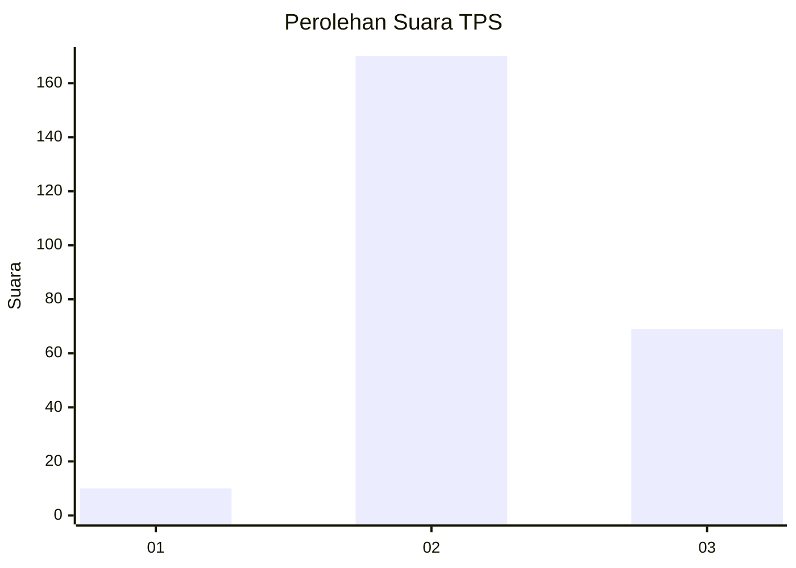
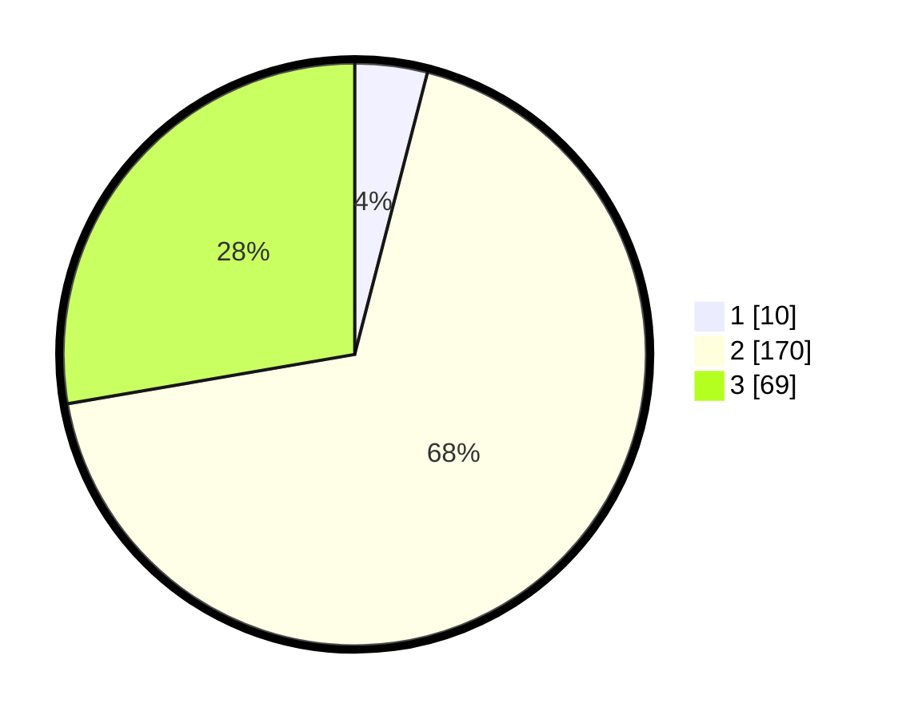

# Hasil

## Grafik

## Tabel

| No. | Nama Paslon    | Suara | Suara (raw) | Persentase |
|:--- |:-------------- | -----:| -----------:| ----------:|
| 1   | ANIES MUHAIMIN | 10    | [10][p-1]   | 4,02       |
| 2   | PRABOWO GIBRAN | 170   | [170][p-2]  | 68,27      |
| 3   | GANJAR MAHFUD  | 69    | [69][p-3]   | 27,71      |

[p-1]: https://github.com/gigit-pemilu/pemilu-2024-35-jawa-timur/blob/main/pilpres/hitung-suara/sub/35-jawa-timur/sub/04-tulungagung/sub/02-boyolangu/sub/2007-bono/sub/002-tps/sub/paslon-1.txt
[p-2]: https://github.com/gigit-pemilu/pemilu-2024-35-jawa-timur/blob/main/pilpres/hitung-suara/sub/35-jawa-timur/sub/04-tulungagung/sub/02-boyolangu/sub/2007-bono/sub/002-tps/sub/paslon-2.txt
[p-3]: https://github.com/gigit-pemilu/pemilu-2024-35-jawa-timur/blob/main/pilpres/hitung-suara/sub/35-jawa-timur/sub/04-tulungagung/sub/02-boyolangu/sub/2007-bono/sub/002-tps/sub/paslon-3.txt

## Foto C Plano

https://sirekap-obj-formc.kpu.go.id/05c1/pemilu/ppwp/35/04/02/20/07/3504022007002-20240218-060013--3bbf9813-94bf-4e97-9e7d-c5be22fe00d3.jpg

https://sirekap-obj-formc.kpu.go.id/05c1/pemilu/ppwp/35/04/02/20/07/3504022007002-20240218-062011--e318e66f-32fe-4784-be89-97d10468750d.jpg

https://sirekap-obj-formc.kpu.go.id/05c1/pemilu/ppwp/35/04/02/20/07/3504022007002-20240218-060815--15376a88-d28c-4dcb-aa72-0087c1bc8fd0.jpg

## Metadata

| Key        | Value               |
| ---------- | ------------------- |
| Time Stamp | 2024-02-25 21:00:00 |

