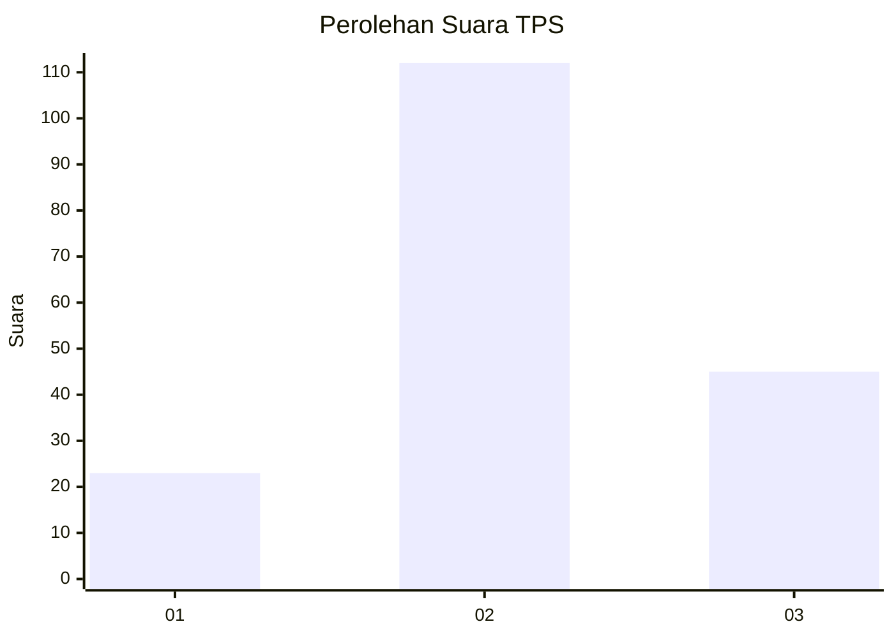
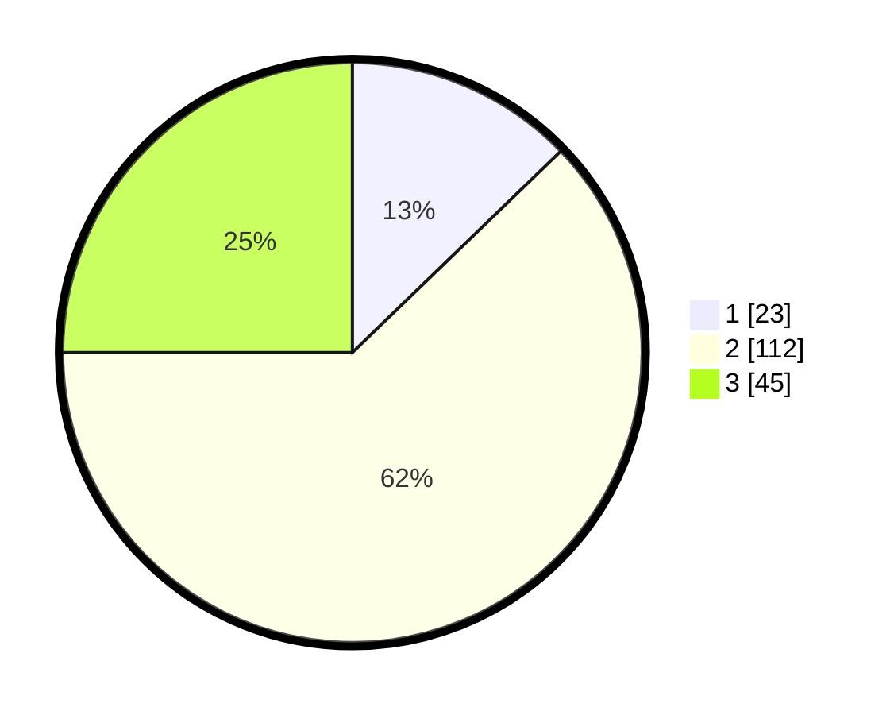

# Hasil

## Grafik

## Tabel

| No. | Nama Paslon    | Suara | Suara (raw) | Persentase |
|:--- |:-------------- | -----:| -----------:| ----------:|
| 1   | ANIES MUHAIMIN | 23    | [23][p-1]   | 12,78      |
| 2   | PRABOWO GIBRAN | 112   | [112][p-2]  | 62,22      |
| 3   | GANJAR MAHFUD  | 45    | [45][p-3]   | 25,00      |

[p-1]: https://github.com/gigit-pemilu/pemilu-2024-35-jawa-timur/blob/main/pilpres/hitung-suara/sub/35-jawa-timur/sub/04-tulungagung/sub/02-boyolangu/sub/2007-bono/sub/014-tps/sub/paslon-1.txt
[p-2]: https://github.com/gigit-pemilu/pemilu-2024-35-jawa-timur/blob/main/pilpres/hitung-suara/sub/35-jawa-timur/sub/04-tulungagung/sub/02-boyolangu/sub/2007-bono/sub/014-tps/sub/paslon-2.txt
[p-3]: https://github.com/gigit-pemilu/pemilu-2024-35-jawa-timur/blob/main/pilpres/hitung-suara/sub/35-jawa-timur/sub/04-tulungagung/sub/02-boyolangu/sub/2007-bono/sub/014-tps/sub/paslon-3.txt

## Foto C Plano

https://sirekap-obj-formc.kpu.go.id/17ef/pemilu/ppwp/35/04/02/20/07/3504022007014-20240214-213450--99b26488-76b3-4085-8fd4-16fb9f8fa2be.jpg

https://sirekap-obj-formc.kpu.go.id/17ef/pemilu/ppwp/35/04/02/20/07/3504022007014-20240219-142416--61a71795-7414-4150-b5c0-c204a2f1a167.jpg

https://sirekap-obj-formc.kpu.go.id/17ef/pemilu/ppwp/35/04/02/20/07/3504022007014-20240214-214826--09294f3b-e324-4398-9ede-e4a44e12df01.jpg

## Metadata

| Key        | Value               |
| ---------- | ------------------- |
| Time Stamp | 2024-02-24 22:31:28 |

