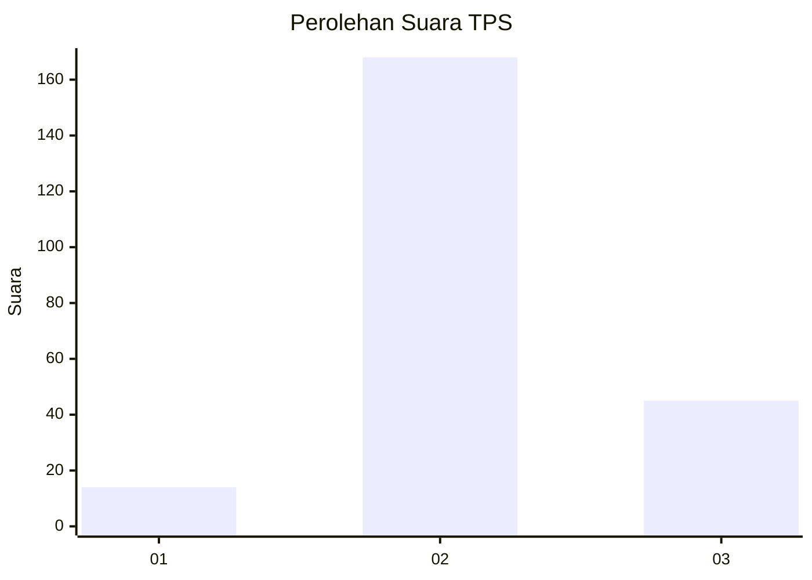

# Hasil

## Grafik

## Tabel

| No. | Nama Paslon    | Suara | Suara (raw) | Persentase |
|:--- |:-------------- | -----:| -----------:| ----------:|
| 1   | ANIES MUHAIMIN | 14    | [14][p-1]   | 6,17       |
| 2   | PRABOWO GIBRAN | 168   | [168][p-2]  | 74,01      |
| 3   | GANJAR MAHFUD  | 45    | [45][p-3]   | 19,82      |

[p-1]: https://github.com/gigit-pemilu/pemilu-2024-35-jawa-timur/blob/main/pilpres/hitung-suara/sub/35-jawa-timur/sub/04-tulungagung/sub/02-boyolangu/sub/2008-waung/sub/007-tps/sub/paslon-1.txt
[p-2]: https://github.com/gigit-pemilu/pemilu-2024-35-jawa-timur/blob/main/pilpres/hitung-suara/sub/35-jawa-timur/sub/04-tulungagung/sub/02-boyolangu/sub/2008-waung/sub/007-tps/sub/paslon-2.txt
[p-3]: https://github.com/gigit-pemilu/pemilu-2024-35-jawa-timur/blob/main/pilpres/hitung-suara/sub/35-jawa-timur/sub/04-tulungagung/sub/02-boyolangu/sub/2008-waung/sub/007-tps/sub/paslon-3.txt

## Foto C Plano

https://sirekap-obj-formc.kpu.go.id/cb3d/pemilu/ppwp/35/04/02/20/08/3504022008007-20240214-222638--a2ce4251-3d94-4ee6-8b4e-39d78bad4e54.jpg

https://sirekap-obj-formc.kpu.go.id/cb3d/pemilu/ppwp/35/04/02/20/08/3504022008007-20240214-223011--f7d1fea3-b7e0-4b65-8333-95846b3d390e.jpg

https://sirekap-obj-formc.kpu.go.id/cb3d/pemilu/ppwp/35/04/02/20/08/3504022008007-20240214-223130--f04b86a7-e2a3-416a-aff8-b46c2091f5a5.jpg

## Metadata

| Key        | Value               |
| ---------- | ------------------- |
| Time Stamp | 2024-02-24 22:31:28 |

