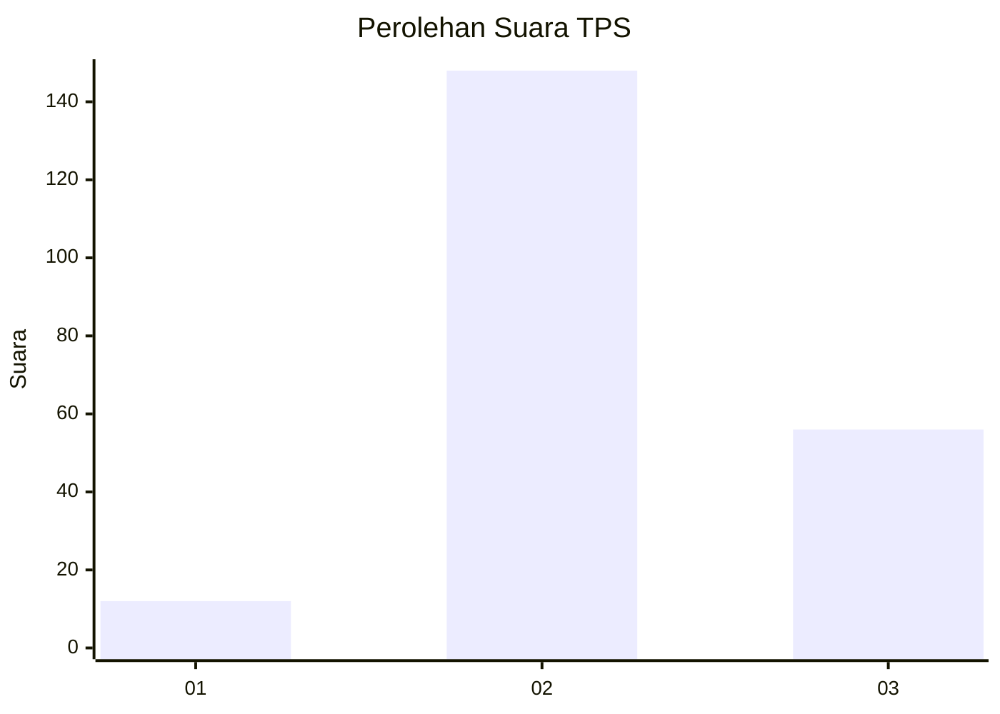

# Hasil

## Grafik

## Tabel

| No. | Nama Paslon    | Suara | Suara (raw) | Persentase |
|:--- |:-------------- | -----:| -----------:| ----------:|
| 1   | ANIES MUHAIMIN | 12    | [12][p-1]   | 5,56       |
| 2   | PRABOWO GIBRAN | 148   | [148][p-2]  | 68,52      |
| 3   | GANJAR MAHFUD  | 56    | [56][p-3]   | 25,93      |

[p-1]: https://github.com/gigit-pemilu/pemilu-2024-35-jawa-timur/blob/main/pilpres/hitung-suara/sub/35-jawa-timur/sub/04-tulungagung/sub/02-boyolangu/sub/2008-waung/sub/008-tps/sub/paslon-1.txt
[p-2]: https://github.com/gigit-pemilu/pemilu-2024-35-jawa-timur/blob/main/pilpres/hitung-suara/sub/35-jawa-timur/sub/04-tulungagung/sub/02-boyolangu/sub/2008-waung/sub/008-tps/sub/paslon-2.txt
[p-3]: https://github.com/gigit-pemilu/pemilu-2024-35-jawa-timur/blob/main/pilpres/hitung-suara/sub/35-jawa-timur/sub/04-tulungagung/sub/02-boyolangu/sub/2008-waung/sub/008-tps/sub/paslon-3.txt

## Foto C Plano

https://sirekap-obj-formc.kpu.go.id/6bff/pemilu/ppwp/35/04/02/20/08/3504022008008-20240214-224017--8fa91473-37b2-4435-80aa-3b2181274057.jpg

https://sirekap-obj-formc.kpu.go.id/6bff/pemilu/ppwp/35/04/02/20/08/3504022008008-20240214-224432--fb8a3928-9022-467c-b720-e7c7f8c9c971.jpg

https://sirekap-obj-formc.kpu.go.id/6bff/pemilu/ppwp/35/04/02/20/08/3504022008008-20240214-224620--528b682e-6f97-446a-af57-0bd4ca4566ac.jpg

## Metadata

| Key        | Value               |
| ---------- | ------------------- |
| Time Stamp | 2024-02-25 21:00:00 |

