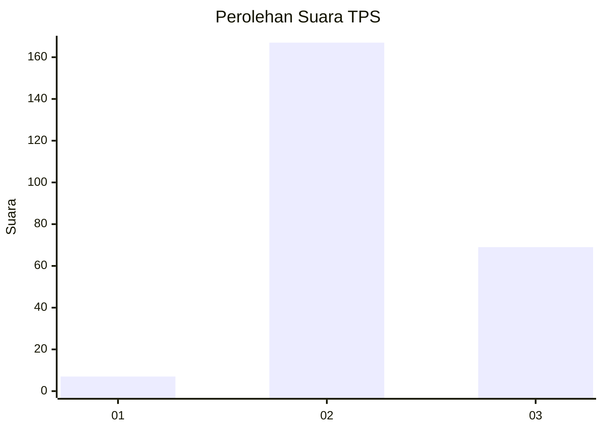
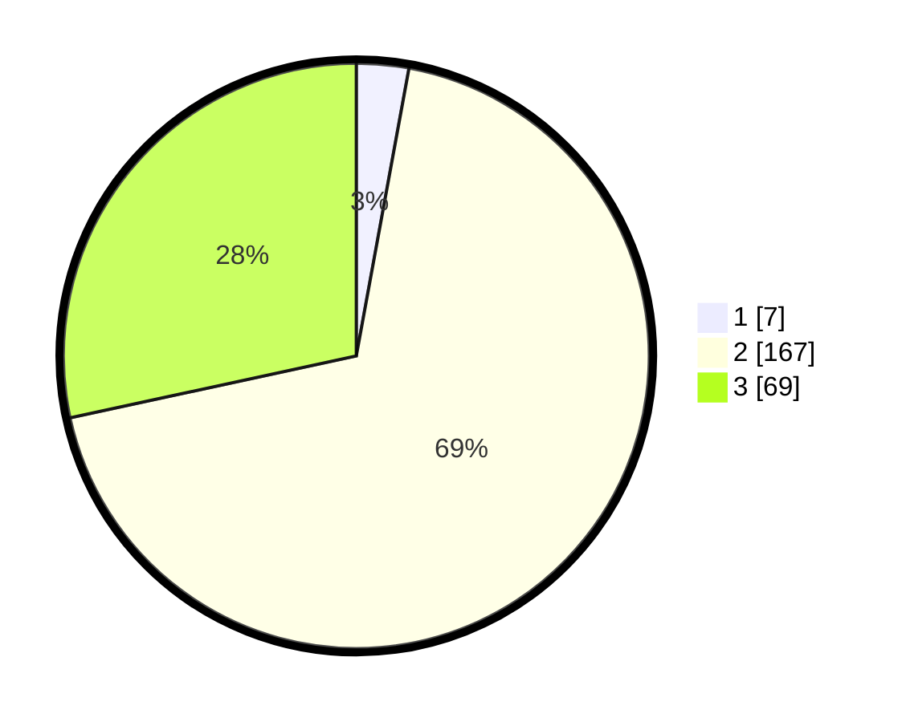

# Hasil

## Grafik

## Tabel

| No. | Nama Paslon    | Suara | Suara (raw) | Persentase |
|:--- |:-------------- | -----:| -----------:| ----------:|
| 1   | ANIES MUHAIMIN | 7     | [7][p-1]    | 2,88       |
| 2   | PRABOWO GIBRAN | 167   | [167][p-2]  | 68,72      |
| 3   | GANJAR MAHFUD  | 69    | [69][p-3]   | 28,40      |

[p-1]: https://github.com/gigit-pemilu/pemilu-2024-35-jawa-timur/blob/main/pilpres/hitung-suara/sub/35-jawa-timur/sub/04-tulungagung/sub/02-boyolangu/sub/2008-waung/sub/014-tps/sub/paslon-1.txt
[p-2]: https://github.com/gigit-pemilu/pemilu-2024-35-jawa-timur/blob/main/pilpres/hitung-suara/sub/35-jawa-timur/sub/04-tulungagung/sub/02-boyolangu/sub/2008-waung/sub/014-tps/sub/paslon-2.txt
[p-3]: https://github.com/gigit-pemilu/pemilu-2024-35-jawa-timur/blob/main/pilpres/hitung-suara/sub/35-jawa-timur/sub/04-tulungagung/sub/02-boyolangu/sub/2008-waung/sub/014-tps/sub/paslon-3.txt

## Foto C Plano

https://sirekap-obj-formc.kpu.go.id/3096/pemilu/ppwp/35/04/02/20/08/3504022008014-20240214-233029--e736138e-8499-48d8-921d-b88d5f2598e2.jpg

https://sirekap-obj-formc.kpu.go.id/3096/pemilu/ppwp/35/04/02/20/08/3504022008014-20240214-233234--8a2fce02-bbe8-4024-aa6b-8f55660939f1.jpg

https://sirekap-obj-formc.kpu.go.id/3096/pemilu/ppwp/35/04/02/20/08/3504022008014-20240214-233450--fe38ec56-085f-4b85-9e7d-0b896d3dc0cd.jpg

## Metadata

| Key        | Value               |
| ---------- | ------------------- |
| Time Stamp | 2024-02-24 22:31:28 |

