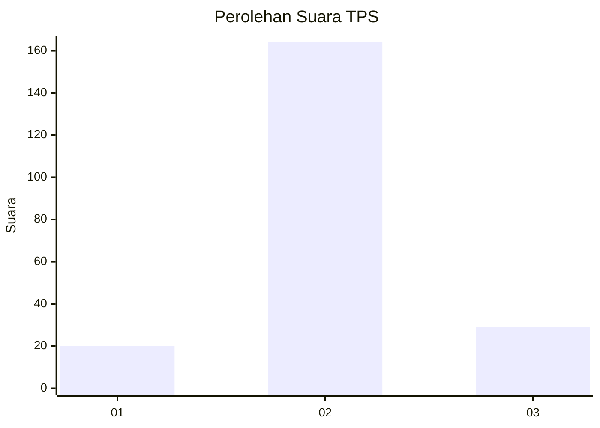
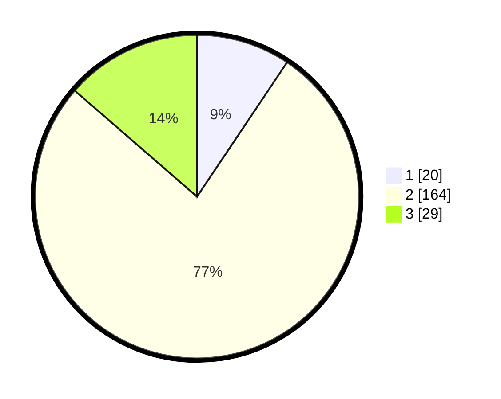

# Hasil

## Grafik

## Tabel

| No. | Nama Paslon    | Suara | Suara (raw) | Persentase |
|:--- |:-------------- | -----:| -----------:| ----------:|
| 1   | ANIES MUHAIMIN | 20    | [20][p-1]   | 9,39       |
| 2   | PRABOWO GIBRAN | 164   | [164][p-2]  | 77,00      |
| 3   | GANJAR MAHFUD  | 29    | [29][p-3]   | 13,62      |

[p-1]: https://github.com/gigit-pemilu/pemilu-2024-35-jawa-timur/blob/main/pilpres/hitung-suara/sub/35-jawa-timur/sub/04-tulungagung/sub/02-boyolangu/sub/2011-karangrejo/sub/006-tps/sub/paslon-1.txt
[p-2]: https://github.com/gigit-pemilu/pemilu-2024-35-jawa-timur/blob/main/pilpres/hitung-suara/sub/35-jawa-timur/sub/04-tulungagung/sub/02-boyolangu/sub/2011-karangrejo/sub/006-tps/sub/paslon-2.txt
[p-3]: https://github.com/gigit-pemilu/pemilu-2024-35-jawa-timur/blob/main/pilpres/hitung-suara/sub/35-jawa-timur/sub/04-tulungagung/sub/02-boyolangu/sub/2011-karangrejo/sub/006-tps/sub/paslon-3.txt

## Foto C Plano

https://sirekap-obj-formc.kpu.go.id/9fff/pemilu/ppwp/35/04/02/20/11/3504022011006-20240214-193028--a3d9ac85-7ecc-40f0-8f91-4cf42c68e6a1.jpg

https://sirekap-obj-formc.kpu.go.id/9fff/pemilu/ppwp/35/04/02/20/11/3504022011006-20240214-192913--c8a12f69-a4f8-44e7-88ec-d7c5109a320a.jpg

https://sirekap-obj-formc.kpu.go.id/9fff/pemilu/ppwp/35/04/02/20/11/3504022011006-20240214-193123--3bcf7669-b397-49de-b88c-a013495cb47f.jpg

## Metadata

| Key        | Value               |
| ---------- | ------------------- |
| Time Stamp | 2024-02-25 22:00:00 |

