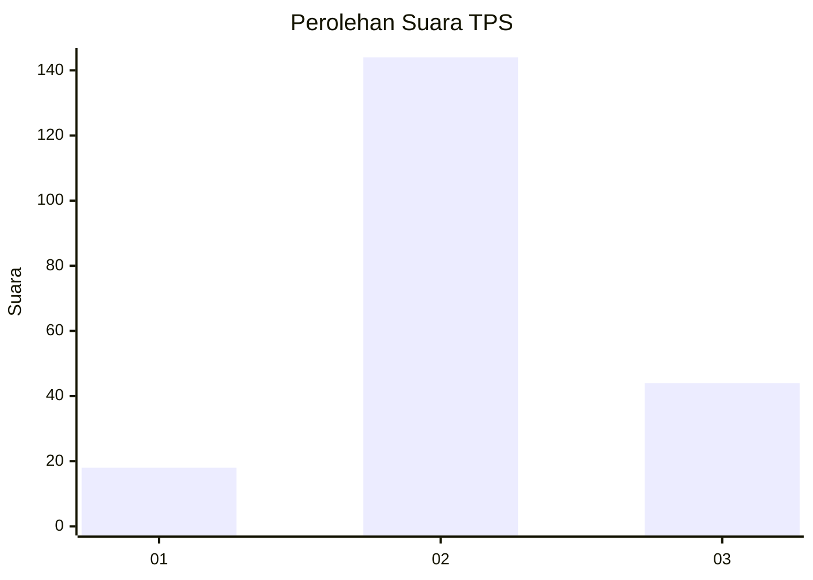
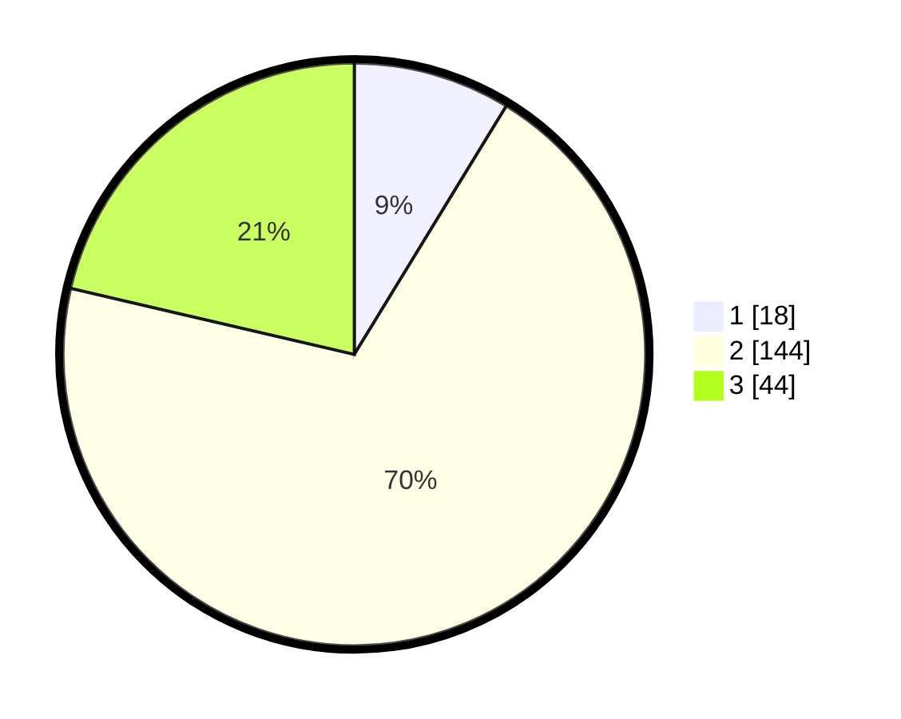

# Hasil

## Grafik

## Tabel

| No. | Nama Paslon    | Suara | Suara (raw) | Persentase |
|:--- |:-------------- | -----:| -----------:| ----------:|
| 1   | ANIES MUHAIMIN | 18    | [18][p-1]   | 8,74       |
| 2   | PRABOWO GIBRAN | 144   | [144][p-2]  | 69,90      |
| 3   | GANJAR MAHFUD  | 44    | [44][p-3]   | 21,36      |

[p-1]: https://github.com/gigit-pemilu/pemilu-2024/blob/main/pilpres/hitung-suara/sub/35-jawa-timur/sub/04-tulungagung/sub/02-boyolangu/sub/2014-serut/sub/011-tps/sub/paslon-1.txt
[p-2]: https://github.com/gigit-pemilu/pemilu-2024/blob/main/pilpres/hitung-suara/sub/35-jawa-timur/sub/04-tulungagung/sub/02-boyolangu/sub/2014-serut/sub/011-tps/sub/paslon-2.txt
[p-3]: https://github.com/gigit-pemilu/pemilu-2024/blob/main/pilpres/hitung-suara/sub/35-jawa-timur/sub/04-tulungagung/sub/02-boyolangu/sub/2014-serut/sub/011-tps/sub/paslon-3.txt

## Foto C Plano

https://sirekap-obj-formc.kpu.go.id/fdb9/pemilu/ppwp/35/04/02/20/14/3504022014011-20240214-235844--e486da64-0f07-4af7-abe3-02369bc0b392.jpg

https://sirekap-obj-formc.kpu.go.id/fdb9/pemilu/ppwp/35/04/02/20/14/3504022014011-20240215-000045--32c99b26-a303-46f4-a8ad-01d6f3cbb6a8.jpg

https://sirekap-obj-formc.kpu.go.id/fdb9/pemilu/ppwp/35/04/02/20/14/3504022014011-20240215-000302--ad35d10f-0eed-455a-8894-4f4e27c1505b.jpg

## Metadata

| Key        | Value               |
| ---------- | ------------------- |
| Time Stamp | 2024-02-24 22:31:28 |

