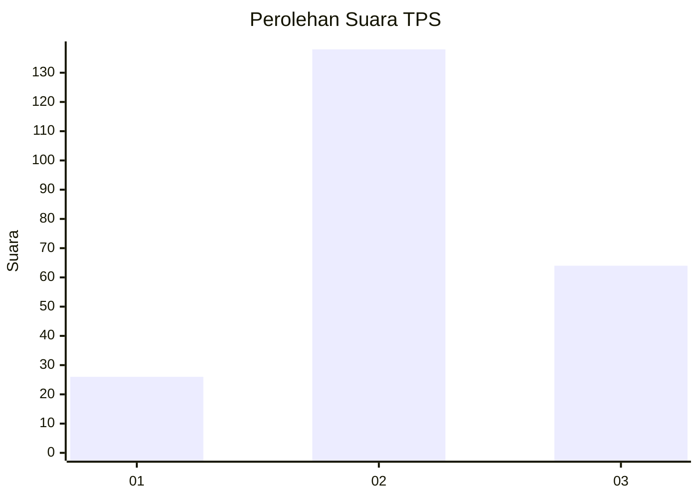
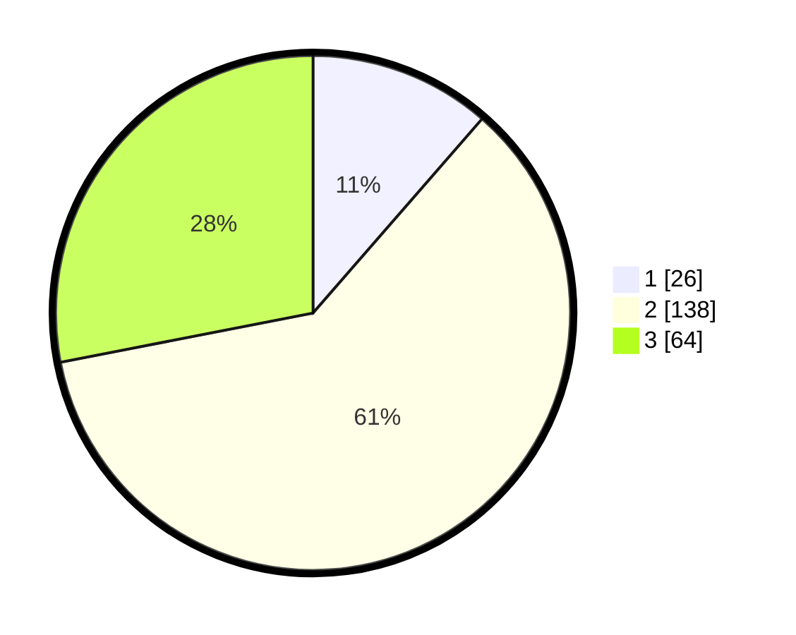

# Hasil

## Grafik

## Tabel

| No. | Nama Paslon    | Suara | Suara (raw) | Persentase |
|:--- |:-------------- | -----:| -----------:| ----------:|
| 1   | ANIES MUHAIMIN | 26    | [26][p-1]   | 11,40      |
| 2   | PRABOWO GIBRAN | 138   | [138][p-2]  | 60,53      |
| 3   | GANJAR MAHFUD  | 64    | [64][p-3]   | 28,07      |

[p-1]: https://github.com/gigit-pemilu/pemilu-2024-35-jawa-timur/blob/main/pilpres/hitung-suara/sub/35-jawa-timur/sub/04-tulungagung/sub/02-boyolangu/sub/2015-beji/sub/012-tps/sub/paslon-1.txt
[p-2]: https://github.com/gigit-pemilu/pemilu-2024-35-jawa-timur/blob/main/pilpres/hitung-suara/sub/35-jawa-timur/sub/04-tulungagung/sub/02-boyolangu/sub/2015-beji/sub/012-tps/sub/paslon-2.txt
[p-3]: https://github.com/gigit-pemilu/pemilu-2024-35-jawa-timur/blob/main/pilpres/hitung-suara/sub/35-jawa-timur/sub/04-tulungagung/sub/02-boyolangu/sub/2015-beji/sub/012-tps/sub/paslon-3.txt

## Foto C Plano

https://sirekap-obj-formc.kpu.go.id/67f2/pemilu/ppwp/35/04/02/20/15/3504022015012-20240214-230203--5e18ddb9-d71b-4544-8ce1-ef521144a3e1.jpg

https://sirekap-obj-formc.kpu.go.id/67f2/pemilu/ppwp/35/04/02/20/15/3504022015012-20240214-230338--b6051529-4812-44ef-af7a-b524015e3ab7.jpg

https://sirekap-obj-formc.kpu.go.id/67f2/pemilu/ppwp/35/04/02/20/15/3504022015012-20240214-230508--1ca3a684-e3f0-41eb-a871-4b9091f0aac9.jpg

## Metadata

| Key        | Value               |
| ---------- | ------------------- |
| Time Stamp | 2024-02-24 22:31:28 |

