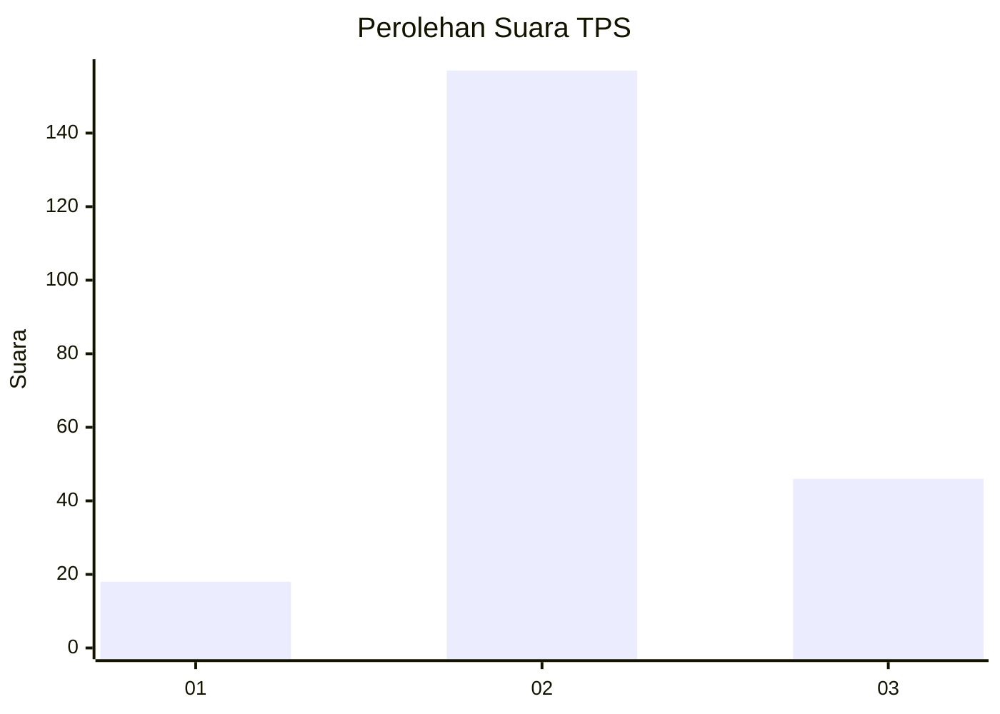
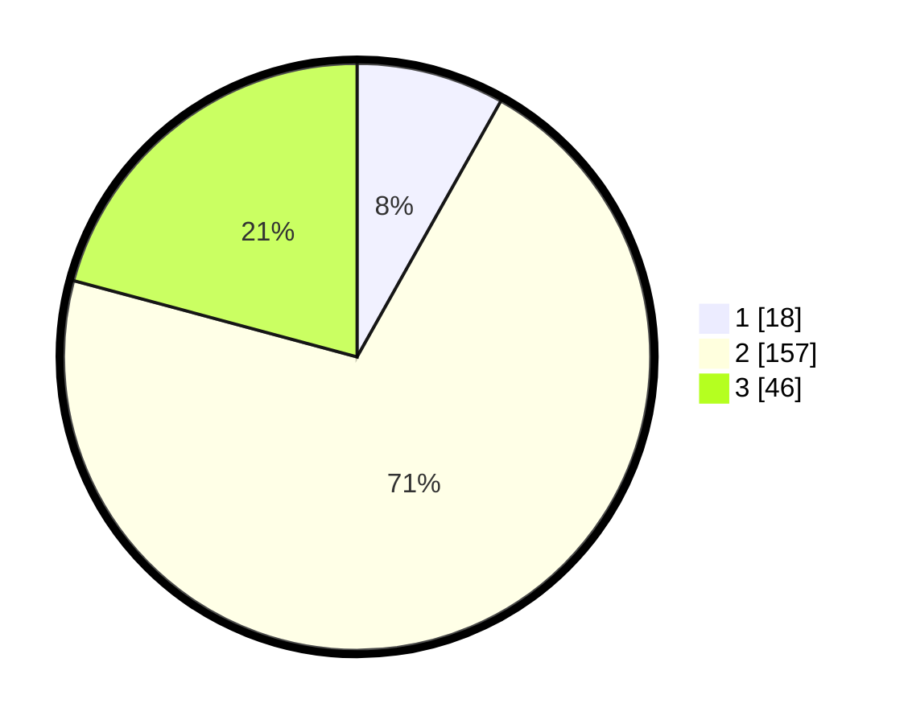

# Hasil

## Grafik

## Tabel

| No. | Nama Paslon    | Suara | Suara (raw) | Persentase |
|:--- |:-------------- | -----:| -----------:| ----------:|
| 1   | ANIES MUHAIMIN | 18    | [18][p-1]   | 8,14       |
| 2   | PRABOWO GIBRAN | 157   | [157][p-2]  | 71,04      |
| 3   | GANJAR MAHFUD  | 46    | [46][p-3]   | 20,81      |

[p-1]: https://github.com/gigit-pemilu/pemilu-2024-35-jawa-timur/blob/main/pilpres/hitung-suara/sub/35-jawa-timur/sub/04-tulungagung/sub/02-boyolangu/sub/2016-sobontoro/sub/015-tps/sub/paslon-1.txt
[p-2]: https://github.com/gigit-pemilu/pemilu-2024-35-jawa-timur/blob/main/pilpres/hitung-suara/sub/35-jawa-timur/sub/04-tulungagung/sub/02-boyolangu/sub/2016-sobontoro/sub/015-tps/sub/paslon-2.txt
[p-3]: https://github.com/gigit-pemilu/pemilu-2024-35-jawa-timur/blob/main/pilpres/hitung-suara/sub/35-jawa-timur/sub/04-tulungagung/sub/02-boyolangu/sub/2016-sobontoro/sub/015-tps/sub/paslon-3.txt

## Foto C Plano

https://sirekap-obj-formc.kpu.go.id/8fc5/pemilu/ppwp/35/04/02/20/16/3504022016015-20240214-234733--7326f630-9aee-4edf-9b5e-0f4928dad486.jpg

https://sirekap-obj-formc.kpu.go.id/8fc5/pemilu/ppwp/35/04/02/20/16/3504022016015-20240216-084349--38367795-6472-436d-9c3e-08a0ee964c04.jpg

https://sirekap-obj-formc.kpu.go.id/8fc5/pemilu/ppwp/35/04/02/20/16/3504022016015-20240216-084347--a5038623-999a-41a4-8a1d-ab65d777db31.jpg

## Metadata

| Key        | Value               |
| ---------- | ------------------- |
| Time Stamp | 2024-02-16 23:30:00 |

