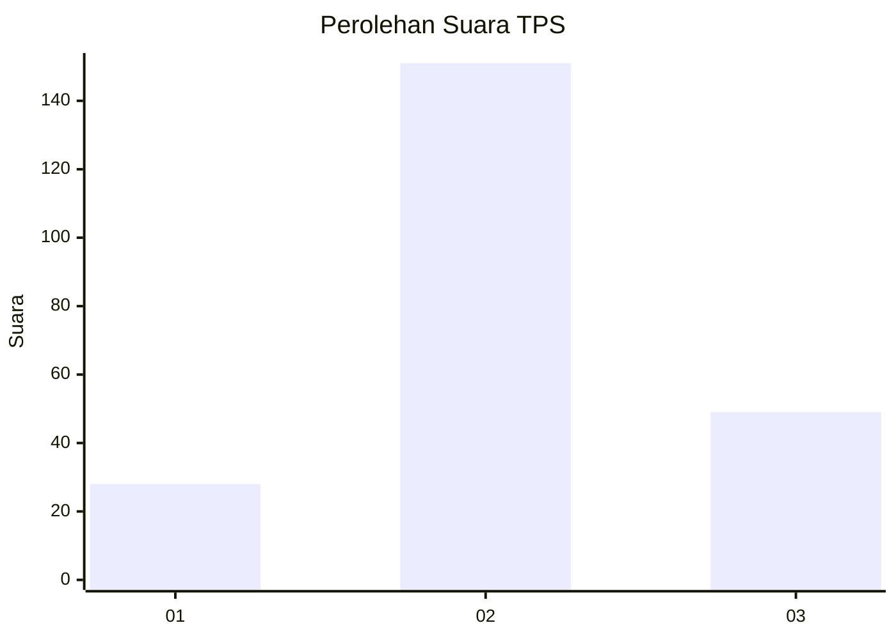
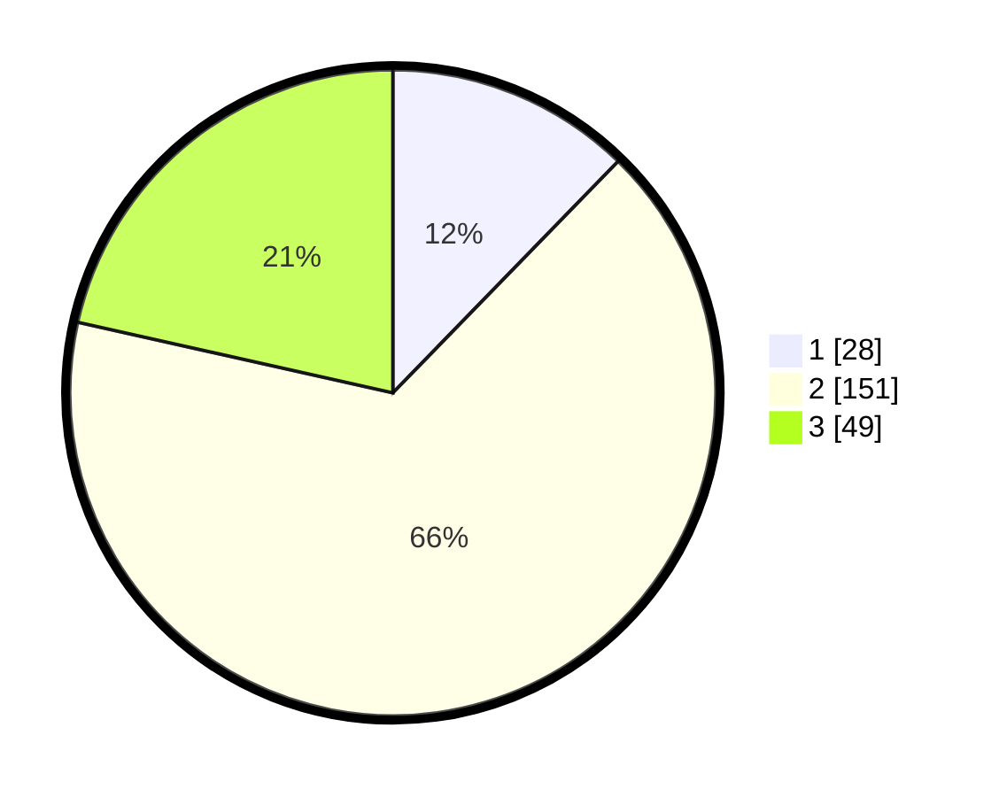

# Hasil

## Grafik

## Tabel

| No. | Nama Paslon    | Suara | Suara (raw) | Persentase |
|:--- |:-------------- | -----:| -----------:| ----------:|
| 1   | ANIES MUHAIMIN | 28    | [28][p-1]   | 12,28      |
| 2   | PRABOWO GIBRAN | 151   | [151][p-2]  | 66,23      |
| 3   | GANJAR MAHFUD  | 49    | [49][p-3]   | 21,49      |

[p-1]: https://github.com/gigit-pemilu/pemilu-2024-35-jawa-timur/blob/main/pilpres/hitung-suara/sub/35-jawa-timur/sub/04-tulungagung/sub/02-boyolangu/sub/2017-gedangsewu/sub/002-tps/sub/paslon-1.txt
[p-2]: https://github.com/gigit-pemilu/pemilu-2024-35-jawa-timur/blob/main/pilpres/hitung-suara/sub/35-jawa-timur/sub/04-tulungagung/sub/02-boyolangu/sub/2017-gedangsewu/sub/002-tps/sub/paslon-2.txt
[p-3]: https://github.com/gigit-pemilu/pemilu-2024-35-jawa-timur/blob/main/pilpres/hitung-suara/sub/35-jawa-timur/sub/04-tulungagung/sub/02-boyolangu/sub/2017-gedangsewu/sub/002-tps/sub/paslon-3.txt

## Foto C Plano

https://sirekap-obj-formc.kpu.go.id/0d8e/pemilu/ppwp/35/04/02/20/17/3504022017002-20240214-204349--0b02e2d7-d53e-439d-8edb-9871afe5e17e.jpg

https://sirekap-obj-formc.kpu.go.id/0d8e/pemilu/ppwp/35/04/02/20/17/3504022017002-20240214-204659--f62486f5-9248-4218-b7e4-dfb1e45efc60.jpg

https://sirekap-obj-formc.kpu.go.id/0d8e/pemilu/ppwp/35/04/02/20/17/3504022017002-20240214-204844--400dee5a-9a0d-4c23-831d-68330d3c619e.jpg

## Metadata

| Key        | Value               |
| ---------- | ------------------- |
| Time Stamp | 2024-02-15 23:29:50 |

