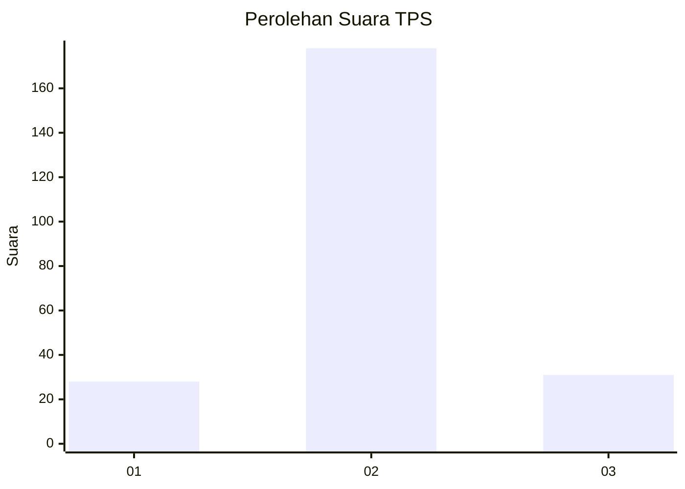
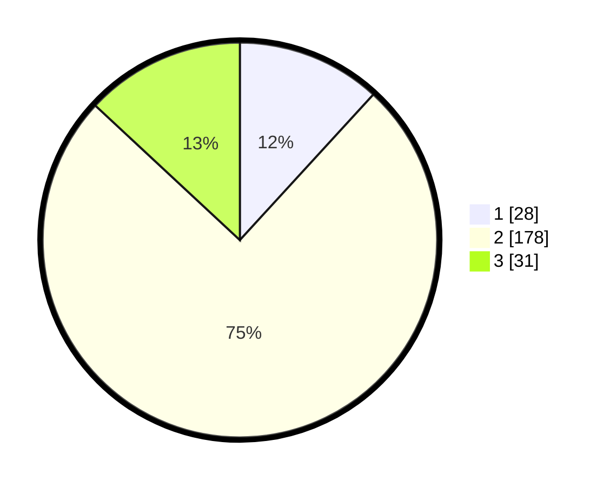

# Hasil

## Grafik

## Tabel

| No. | Nama Paslon    | Suara | Suara (raw) | Persentase |
|:--- |:-------------- | -----:| -----------:| ----------:|
| 1   | ANIES MUHAIMIN | 28    | [28][p-1]   | 11,81      |
| 2   | PRABOWO GIBRAN | 178   | [178][p-2]  | 75,11      |
| 3   | GANJAR MAHFUD  | 31    | [31][p-3]   | 13,08      |

[p-1]: https://github.com/gigit-pemilu/pemilu-2024-35-jawa-timur/blob/main/pilpres/hitung-suara/sub/35-jawa-timur/sub/04-tulungagung/sub/02-boyolangu/sub/2017-gedangsewu/sub/007-tps/sub/paslon-1.txt
[p-2]: https://github.com/gigit-pemilu/pemilu-2024-35-jawa-timur/blob/main/pilpres/hitung-suara/sub/35-jawa-timur/sub/04-tulungagung/sub/02-boyolangu/sub/2017-gedangsewu/sub/007-tps/sub/paslon-2.txt
[p-3]: https://github.com/gigit-pemilu/pemilu-2024-35-jawa-timur/blob/main/pilpres/hitung-suara/sub/35-jawa-timur/sub/04-tulungagung/sub/02-boyolangu/sub/2017-gedangsewu/sub/007-tps/sub/paslon-3.txt

## Foto C Plano

https://sirekap-obj-formc.kpu.go.id/2bcc/pemilu/ppwp/35/04/02/20/17/3504022017007-20240214-232435--4f9edc7f-2e02-4d1a-91a8-3a79a34519f4.jpg

https://sirekap-obj-formc.kpu.go.id/2bcc/pemilu/ppwp/35/04/02/20/17/3504022017007-20240214-232546--815a163b-0a91-4f8c-b3de-fd0e3c8da3fb.jpg

https://sirekap-obj-formc.kpu.go.id/2bcc/pemilu/ppwp/35/04/02/20/17/3504022017007-20240214-232638--e26a0e48-dcad-400f-ad62-ff16809cd2be.jpg

## Metadata

| Key        | Value               |
| ---------- | ------------------- |
| Time Stamp | 2024-02-25 21:00:00 |

