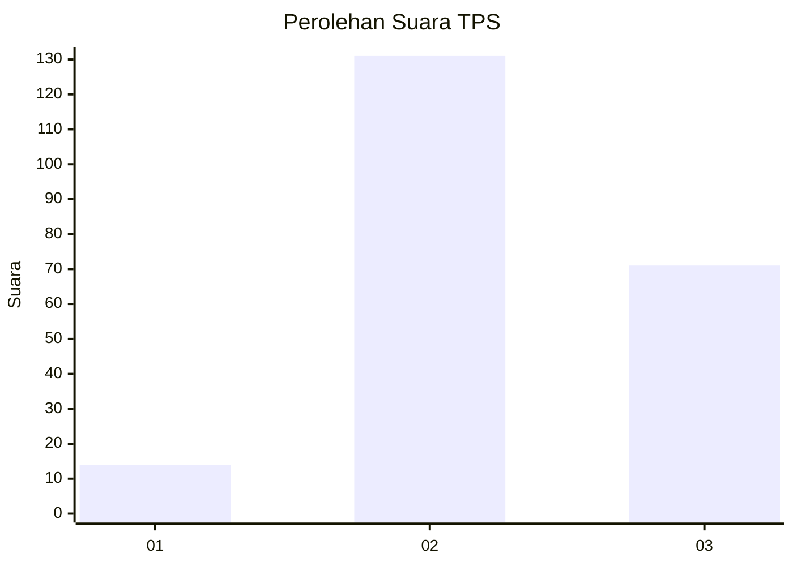
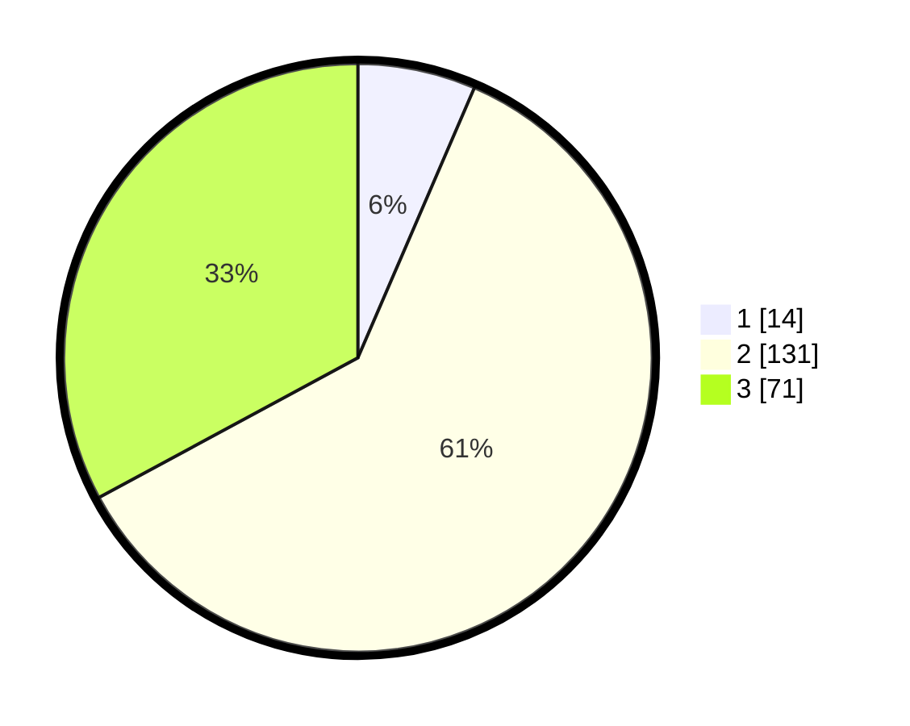

# Hasil

## Grafik

## Tabel

| No. | Nama Paslon    | Suara | Suara (raw) | Persentase |
|:--- |:-------------- | -----:| -----------:| ----------:|
| 1   | ANIES MUHAIMIN | 14    | [14][p-1]   | 6,48       |
| 2   | PRABOWO GIBRAN | 131   | [131][p-2]  | 60,65      |
| 3   | GANJAR MAHFUD  | 71    | [71][p-3]   | 32,87      |

[p-1]: https://github.com/gigit-pemilu/pemilu-2024/blob/main/pilpres/hitung-suara/sub/35-jawa-timur/sub/04-tulungagung/sub/03-kedungwaru/sub/2001-plosokandang/sub/003-tps/sub/paslon-1.txt
[p-2]: https://github.com/gigit-pemilu/pemilu-2024/blob/main/pilpres/hitung-suara/sub/35-jawa-timur/sub/04-tulungagung/sub/03-kedungwaru/sub/2001-plosokandang/sub/003-tps/sub/paslon-2.txt
[p-3]: https://github.com/gigit-pemilu/pemilu-2024/blob/main/pilpres/hitung-suara/sub/35-jawa-timur/sub/04-tulungagung/sub/03-kedungwaru/sub/2001-plosokandang/sub/003-tps/sub/paslon-3.txt

## Foto C Plano

https://sirekap-obj-formc.kpu.go.id/48ec/pemilu/ppwp/35/04/03/20/01/3504032001003-20240214-211335--dae4c42d-e4e6-432a-a044-f61118fb29ec.jpg

https://sirekap-obj-formc.kpu.go.id/48ec/pemilu/ppwp/35/04/03/20/01/3504032001003-20240216-143944--3ae96a37-e307-4b9a-bf25-98de70cb77e9.jpg

https://sirekap-obj-formc.kpu.go.id/48ec/pemilu/ppwp/35/04/03/20/01/3504032001003-20240214-211633--da9c37e8-5137-4743-b0eb-3b2d5cabf0c6.jpg

## Metadata

| Key        | Value               |
| ---------- | ------------------- |
| Time Stamp | 2024-02-24 22:31:28 |

## DATA PEMILIH TETAP

Jumlah pemilih dalam DPT: **280**.
 * L: **148**.
 * P: **132**.

## DATA PENGGUNA HAK PILIH

Jumlah pengguna hak pilih dalam DPT: **216**.
 * L: **112**.
 * P: **104**.

Jumlah pengguna hak pilih dalam DPTb: **5**.
 * L: **2**.
 * P: **3**.

Jumlah pengguna hak pilih dalam DPK: **0**.
 * L: **0**.
 * P: **0**.

Jumlah pengguna hak pilih: **221**.
 * L: **114**.
 * P: **107**.

## JUMLAH SUARA SAH DAN TIDAK SAH

JUMLAH SELURUH SUARA SAH: **216**.

JUMLAH SUARA TIDAK SAH: **5**.

JUMLAH SELURUH SUARA SAH DAN SUARA TIDAK SAH: **221**.

