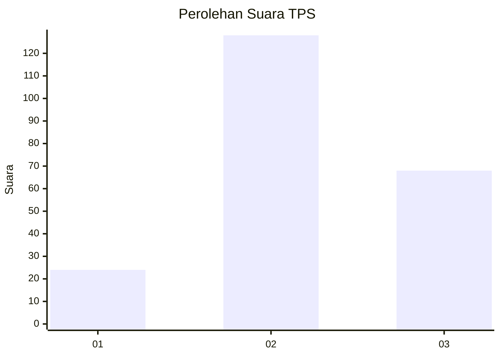
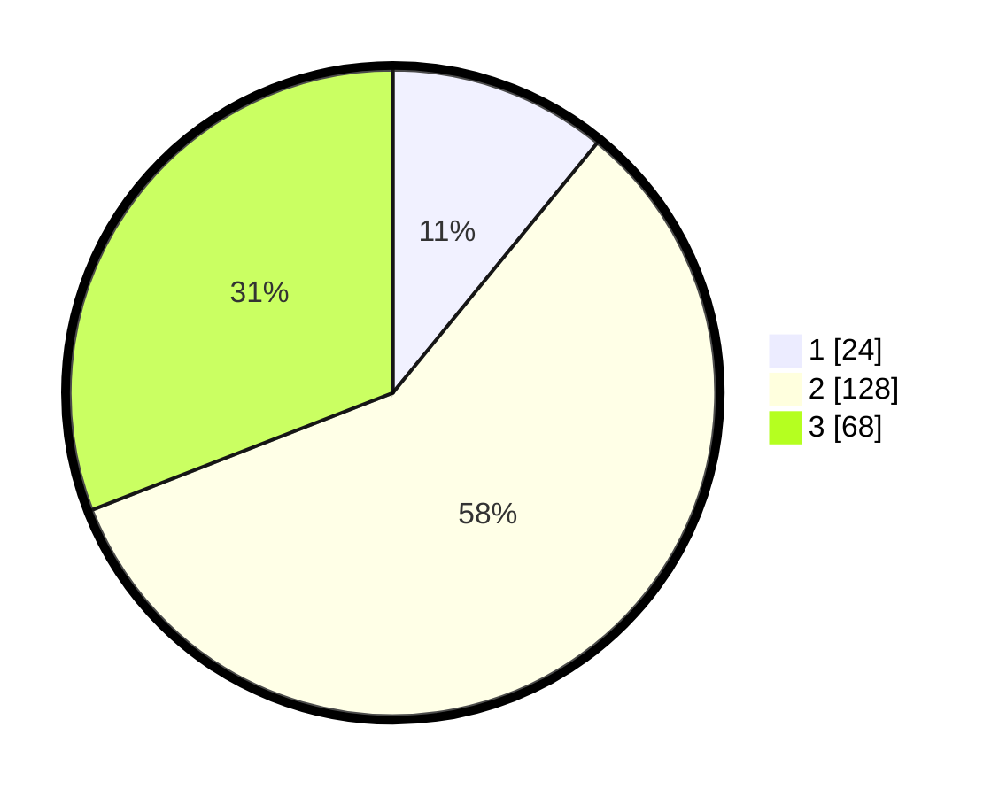

# Hasil

## Grafik

## Tabel

| No. | Nama Paslon    | Suara | Suara (raw) | Persentase |
|:--- |:-------------- | -----:| -----------:| ----------:|
| 1   | ANIES MUHAIMIN | 24    | [24][p-1]   | 10,91      |
| 2   | PRABOWO GIBRAN | 128   | [128][p-2]  | 58,18      |
| 3   | GANJAR MAHFUD  | 68    | [68][p-3]   | 30,91      |

[p-1]: https://github.com/gigit-pemilu/pemilu-2024/blob/main/pilpres/hitung-suara/sub/35-jawa-timur/sub/04-tulungagung/sub/03-kedungwaru/sub/2001-plosokandang/sub/004-tps/sub/paslon-1.txt
[p-2]: https://github.com/gigit-pemilu/pemilu-2024/blob/main/pilpres/hitung-suara/sub/35-jawa-timur/sub/04-tulungagung/sub/03-kedungwaru/sub/2001-plosokandang/sub/004-tps/sub/paslon-2.txt
[p-3]: https://github.com/gigit-pemilu/pemilu-2024/blob/main/pilpres/hitung-suara/sub/35-jawa-timur/sub/04-tulungagung/sub/03-kedungwaru/sub/2001-plosokandang/sub/004-tps/sub/paslon-3.txt

## Foto C Plano

https://sirekap-obj-formc.kpu.go.id/a9a8/pemilu/ppwp/35/04/03/20/01/3504032001004-20240215-031727--ffd1fae8-8f70-4fa3-a23d-383e48fe97e9.jpg

https://sirekap-obj-formc.kpu.go.id/a9a8/pemilu/ppwp/35/04/03/20/01/3504032001004-20240215-031950--17a39885-1927-4992-a9af-31086a095417.jpg

https://sirekap-obj-formc.kpu.go.id/a9a8/pemilu/ppwp/35/04/03/20/01/3504032001004-20240215-040057--cb098f59-efd7-46e9-9aa2-f325ed648280.jpg

## Metadata

| Key        | Value               |
| ---------- | ------------------- |
| Time Stamp | 2024-02-25 14:00:00 |

