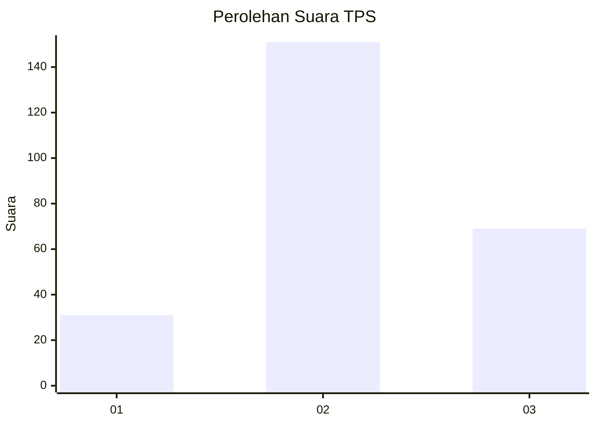
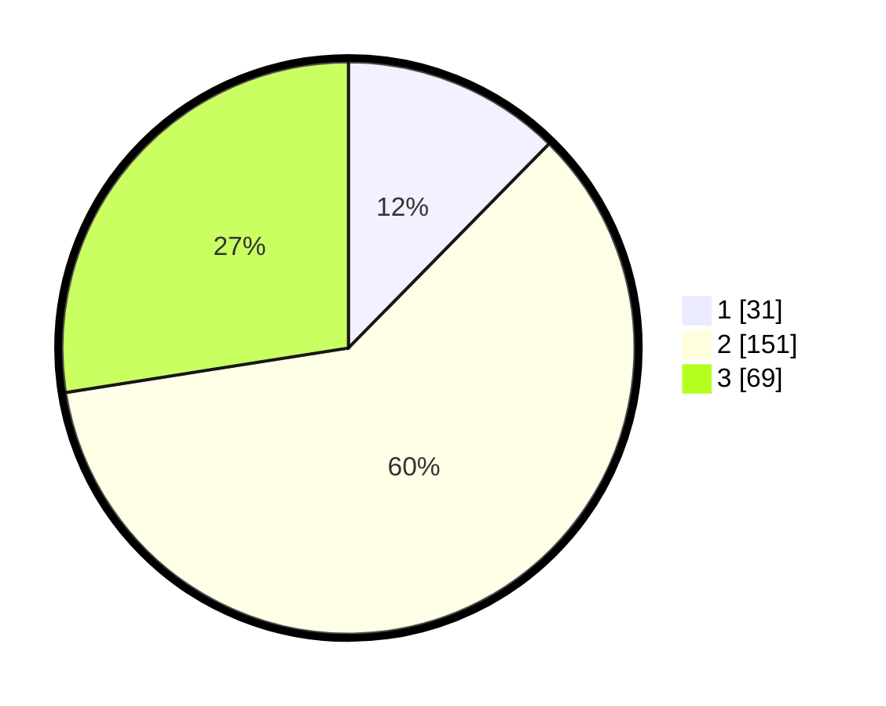

# Hasil

## Grafik

## Tabel

| No. | Nama Paslon    | Suara | Suara (raw) | Persentase |
|:--- |:-------------- | -----:| -----------:| ----------:|
| 1   | ANIES MUHAIMIN | 31    | [31][p-1]   | 12,35      |
| 2   | PRABOWO GIBRAN | 151   | [151][p-2]  | 60,16      |
| 3   | GANJAR MAHFUD  | 69    | [69][p-3]   | 27,49      |

[p-1]: https://github.com/gigit-pemilu/pemilu-2024-35-jawa-timur/blob/main/pilpres/hitung-suara/sub/35-jawa-timur/sub/04-tulungagung/sub/03-kedungwaru/sub/2001-plosokandang/sub/017-tps/sub/paslon-1.txt
[p-2]: https://github.com/gigit-pemilu/pemilu-2024-35-jawa-timur/blob/main/pilpres/hitung-suara/sub/35-jawa-timur/sub/04-tulungagung/sub/03-kedungwaru/sub/2001-plosokandang/sub/017-tps/sub/paslon-2.txt
[p-3]: https://github.com/gigit-pemilu/pemilu-2024-35-jawa-timur/blob/main/pilpres/hitung-suara/sub/35-jawa-timur/sub/04-tulungagung/sub/03-kedungwaru/sub/2001-plosokandang/sub/017-tps/sub/paslon-3.txt

## Foto C Plano

https://sirekap-obj-formc.kpu.go.id/3bdc/pemilu/ppwp/35/04/03/20/01/3504032001017-20240215-023625--2b12a9fa-6b03-4fd5-996c-3ff1f012dc56.jpg

https://sirekap-obj-formc.kpu.go.id/3bdc/pemilu/ppwp/35/04/03/20/01/3504032001017-20240215-023814--d555f472-8f8e-48ca-bf03-464a8b3c9508.jpg

https://sirekap-obj-formc.kpu.go.id/3bdc/pemilu/ppwp/35/04/03/20/01/3504032001017-20240215-024100--83ba0a2b-1922-4164-ade4-88dd3ce3e759.jpg

## Metadata

| Key        | Value               |
| ---------- | ------------------- |
| Time Stamp | 2024-02-15 12:00:28 |

