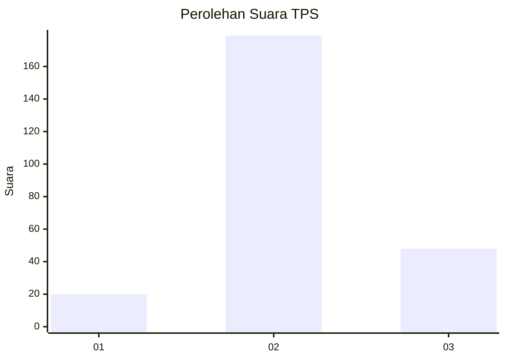
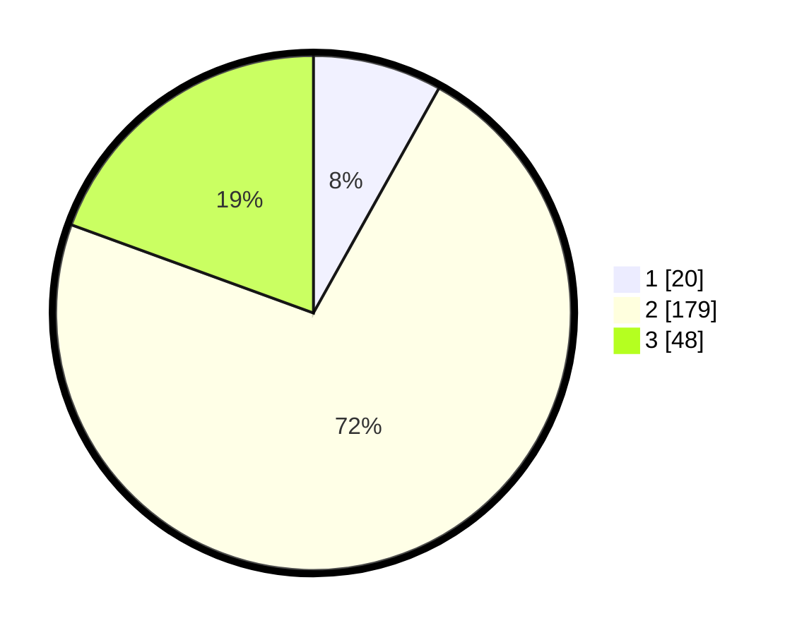

# Hasil

## Grafik

## Tabel

| No. | Nama Paslon    | Suara | Suara (raw) | Persentase |
|:--- |:-------------- | -----:| -----------:| ----------:|
| 1   | ANIES MUHAIMIN | 20    | [20][p-1]   | 8,10       |
| 2   | PRABOWO GIBRAN | 179   | [179][p-2]  | 72,47      |
| 3   | GANJAR MAHFUD  | 48    | [48][p-3]   | 19,43      |

[p-1]: https://github.com/gigit-pemilu/pemilu-2024/blob/main/pilpres/hitung-suara/sub/35-jawa-timur/sub/04-tulungagung/sub/03-kedungwaru/sub/2002-tunggulsari/sub/016-tps/sub/paslon-1.txt
[p-2]: https://github.com/gigit-pemilu/pemilu-2024/blob/main/pilpres/hitung-suara/sub/35-jawa-timur/sub/04-tulungagung/sub/03-kedungwaru/sub/2002-tunggulsari/sub/016-tps/sub/paslon-2.txt
[p-3]: https://github.com/gigit-pemilu/pemilu-2024/blob/main/pilpres/hitung-suara/sub/35-jawa-timur/sub/04-tulungagung/sub/03-kedungwaru/sub/2002-tunggulsari/sub/016-tps/sub/paslon-3.txt

## Foto C Plano

https://sirekap-obj-formc.kpu.go.id/50d1/pemilu/ppwp/35/04/03/20/02/3504032002016-20240216-145416--2e92e082-b224-41a7-9841-cf4817dee672.jpg

https://sirekap-obj-formc.kpu.go.id/50d1/pemilu/ppwp/35/04/03/20/02/3504032002016-20240216-161240--a41f6636-9abd-44c9-a179-d20948196435.jpg

https://sirekap-obj-formc.kpu.go.id/50d1/pemilu/ppwp/35/04/03/20/02/3504032002016-20240216-144952--d863b53a-a12b-49d8-b8a3-b5b411f26d53.jpg

## Metadata

| Key        | Value               |
| ---------- | ------------------- |
| Time Stamp | 2024-02-21 20:00:00 |

