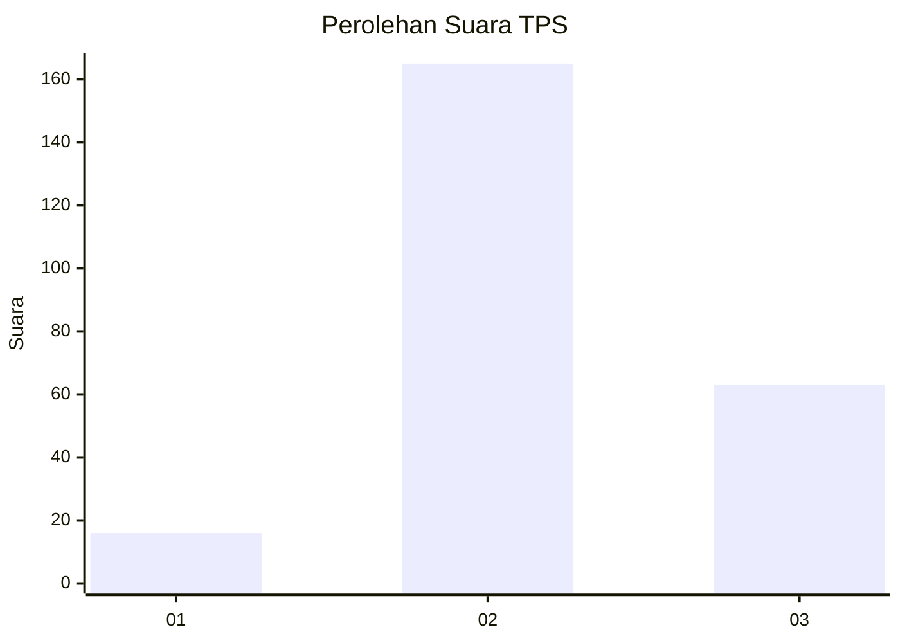

# Hasil

## Grafik

## Tabel

| No. | Nama Paslon    | Suara | Suara (raw) | Persentase |
|:--- |:-------------- | -----:| -----------:| ----------:|
| 1   | ANIES MUHAIMIN | 16    | [16][p-1]   | 6,56       |
| 2   | PRABOWO GIBRAN | 165   | [165][p-2]  | 67,62      |
| 3   | GANJAR MAHFUD  | 63    | [63][p-3]   | 25,82      |

[p-1]: https://github.com/gigit-pemilu/pemilu-2024-35-jawa-timur/blob/main/pilpres/hitung-suara/sub/35-jawa-timur/sub/04-tulungagung/sub/03-kedungwaru/sub/2003-ringinpitu/sub/001-tps/sub/paslon-1.txt
[p-2]: https://github.com/gigit-pemilu/pemilu-2024-35-jawa-timur/blob/main/pilpres/hitung-suara/sub/35-jawa-timur/sub/04-tulungagung/sub/03-kedungwaru/sub/2003-ringinpitu/sub/001-tps/sub/paslon-2.txt
[p-3]: https://github.com/gigit-pemilu/pemilu-2024-35-jawa-timur/blob/main/pilpres/hitung-suara/sub/35-jawa-timur/sub/04-tulungagung/sub/03-kedungwaru/sub/2003-ringinpitu/sub/001-tps/sub/paslon-3.txt

## Foto C Plano

https://sirekap-obj-formc.kpu.go.id/f7d9/pemilu/ppwp/35/04/03/20/03/3504032003001-20240214-234151--ed72c629-1926-492e-8004-f4557cfe5bbf.jpg

https://sirekap-obj-formc.kpu.go.id/f7d9/pemilu/ppwp/35/04/03/20/03/3504032003001-20240215-004319--4f8062e7-ce10-48aa-8099-4027a5b6534c.jpg

https://sirekap-obj-formc.kpu.go.id/f7d9/pemilu/ppwp/35/04/03/20/03/3504032003001-20240214-234343--aa38e31d-f716-43cc-ac65-ab6f03e17d88.jpg

## Metadata

| Key        | Value               |
| ---------- | ------------------- |
| Time Stamp | 2024-02-24 22:31:28 |

