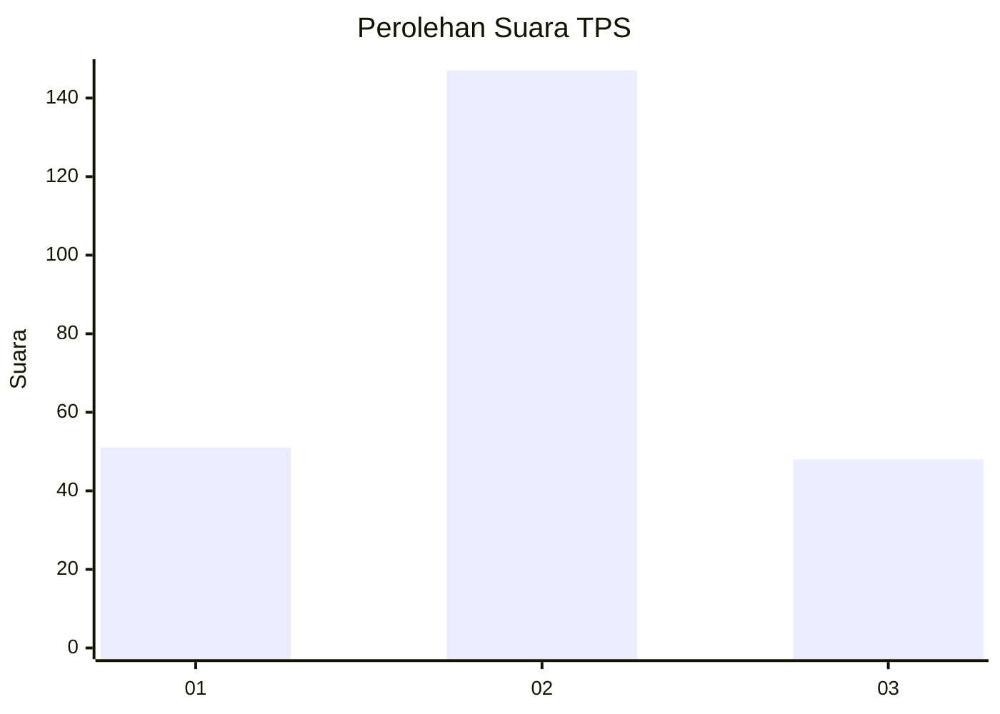
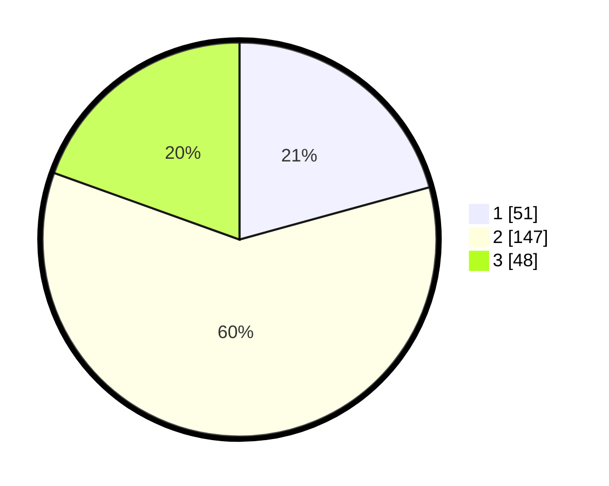

# Hasil

## Grafik

## Tabel

| No. | Nama Paslon    | Suara | Suara (raw) | Persentase |
|:--- |:-------------- | -----:| -----------:| ----------:|
| 1   | ANIES MUHAIMIN | 51    | [51][p-1]   | 20,73      |
| 2   | PRABOWO GIBRAN | 147   | [147][p-2]  | 59,76      |
| 3   | GANJAR MAHFUD  | 48    | [48][p-3]   | 19,51      |

[p-1]: https://github.com/gigit-pemilu/pemilu-2024/blob/main/pilpres/hitung-suara/sub/35-jawa-timur/sub/04-tulungagung/sub/03-kedungwaru/sub/2003-ringinpitu/sub/004-tps/sub/paslon-1.txt
[p-2]: https://github.com/gigit-pemilu/pemilu-2024/blob/main/pilpres/hitung-suara/sub/35-jawa-timur/sub/04-tulungagung/sub/03-kedungwaru/sub/2003-ringinpitu/sub/004-tps/sub/paslon-2.txt
[p-3]: https://github.com/gigit-pemilu/pemilu-2024/blob/main/pilpres/hitung-suara/sub/35-jawa-timur/sub/04-tulungagung/sub/03-kedungwaru/sub/2003-ringinpitu/sub/004-tps/sub/paslon-3.txt

## Foto C Plano

https://sirekap-obj-formc.kpu.go.id/8bd8/pemilu/ppwp/35/04/03/20/03/3504032003004-20240214-232827--48b4bc61-3621-4bdb-88bc-f70fe334aecc.jpg

https://sirekap-obj-formc.kpu.go.id/8bd8/pemilu/ppwp/35/04/03/20/03/3504032003004-20240214-233049--09d38d01-1b5a-4682-8d59-a182e2a795f8.jpg

https://sirekap-obj-formc.kpu.go.id/8bd8/pemilu/ppwp/35/04/03/20/03/3504032003004-20240214-233521--889afaf3-ea3d-4c3a-b0a4-ecc46920354d.jpg

## Metadata

| Key        | Value               |
| ---------- | ------------------- |
| Time Stamp | 2024-02-16 00:30:27 |

