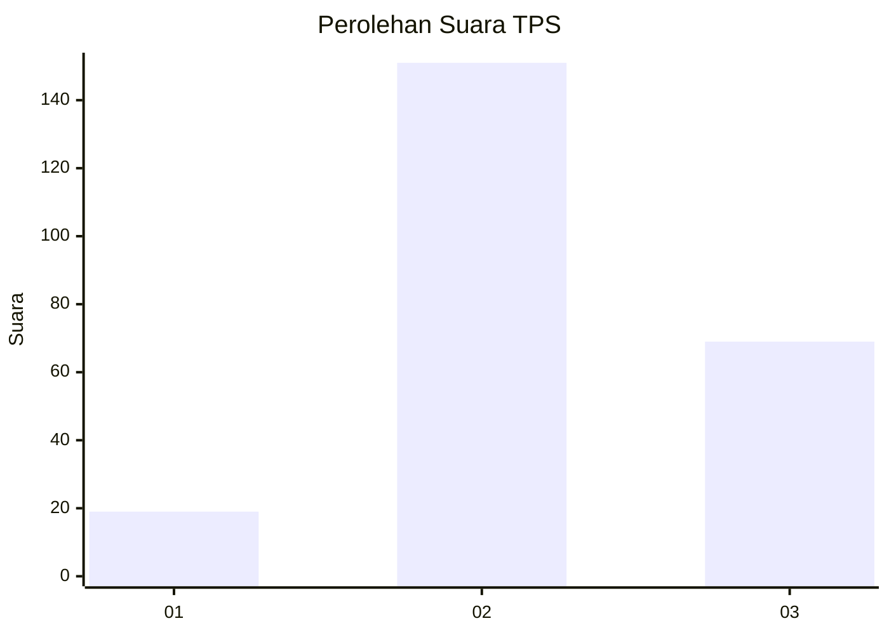
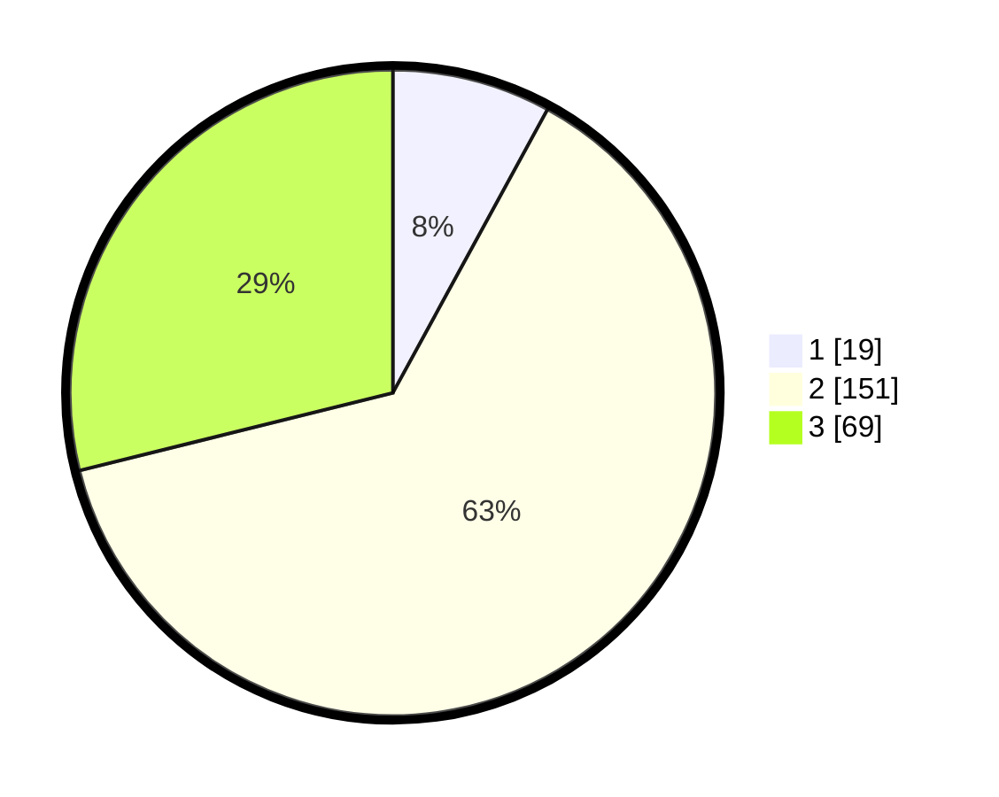

# Hasil

## Grafik

## Tabel

| No. | Nama Paslon    | Suara | Suara (raw) | Persentase |
|:--- |:-------------- | -----:| -----------:| ----------:|
| 1   | ANIES MUHAIMIN | 19    | [19][p-1]   | 7,95       |
| 2   | PRABOWO GIBRAN | 151   | [151][p-2]  | 63,18      |
| 3   | GANJAR MAHFUD  | 69    | [69][p-3]   | 28,87      |

[p-1]: https://github.com/gigit-pemilu/pemilu-2024-35-jawa-timur/blob/main/pilpres/hitung-suara/sub/35-jawa-timur/sub/04-tulungagung/sub/03-kedungwaru/sub/2003-ringinpitu/sub/006-tps/sub/paslon-1.txt
[p-2]: https://github.com/gigit-pemilu/pemilu-2024-35-jawa-timur/blob/main/pilpres/hitung-suara/sub/35-jawa-timur/sub/04-tulungagung/sub/03-kedungwaru/sub/2003-ringinpitu/sub/006-tps/sub/paslon-2.txt
[p-3]: https://github.com/gigit-pemilu/pemilu-2024-35-jawa-timur/blob/main/pilpres/hitung-suara/sub/35-jawa-timur/sub/04-tulungagung/sub/03-kedungwaru/sub/2003-ringinpitu/sub/006-tps/sub/paslon-3.txt

## Foto C Plano

https://sirekap-obj-formc.kpu.go.id/4bba/pemilu/ppwp/35/04/03/20/03/3504032003006-20240215-001704--355ab641-f1ae-4d0b-b322-2cc7e65fc603.jpg

https://sirekap-obj-formc.kpu.go.id/4bba/pemilu/ppwp/35/04/03/20/03/3504032003006-20240215-001805--6d13b0bc-7c08-4704-8e6e-ac6f9a4603ba.jpg

https://sirekap-obj-formc.kpu.go.id/4bba/pemilu/ppwp/35/04/03/20/03/3504032003006-20240215-001850--5b403068-8063-4e31-b73b-55c64b3c29ee.jpg

## Metadata

| Key        | Value               |
| ---------- | ------------------- |
| Time Stamp | 2024-02-25 15:00:00 |

