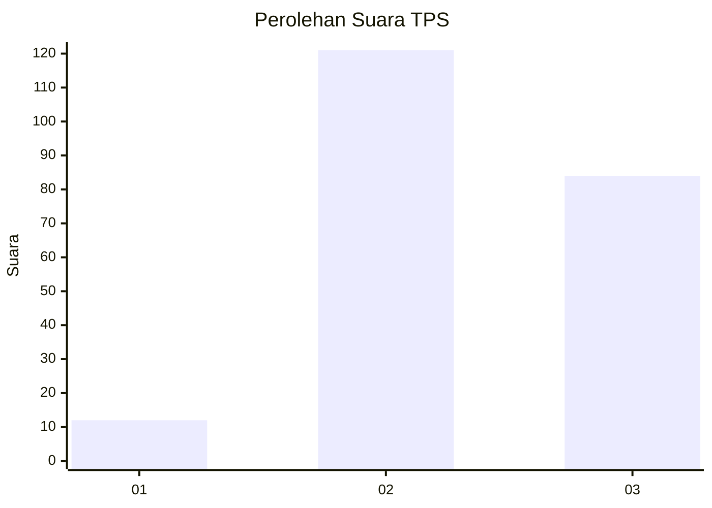
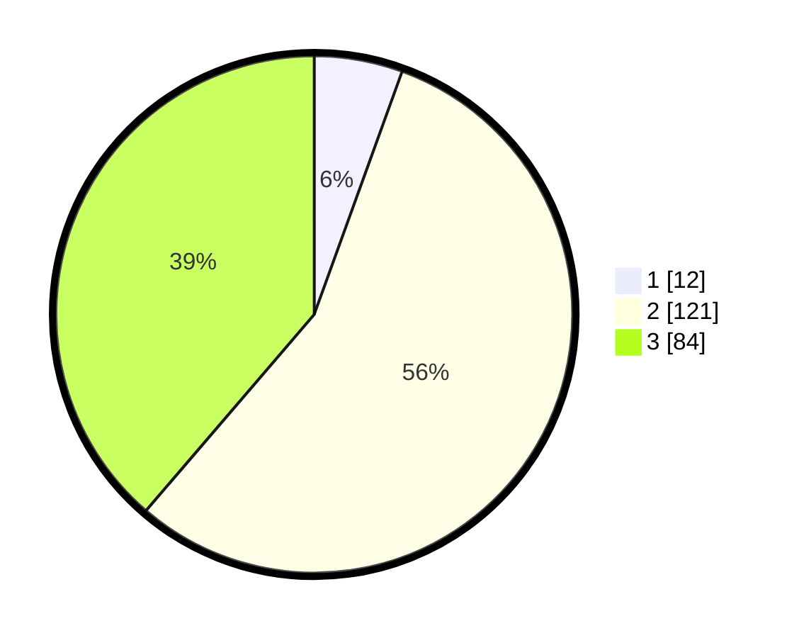

# Hasil

## Grafik

## Tabel

| No. | Nama Paslon    | Suara | Suara (raw) | Persentase |
|:--- |:-------------- | -----:| -----------:| ----------:|
| 1   | ANIES MUHAIMIN | 12    | [12][p-1]   | 5,53       |
| 2   | PRABOWO GIBRAN | 121   | [121][p-2]  | 55,76      |
| 3   | GANJAR MAHFUD  | 84    | [84][p-3]   | 38,71      |

[p-1]: https://github.com/gigit-pemilu/pemilu-2024-35-jawa-timur/blob/main/pilpres/hitung-suara/sub/35-jawa-timur/sub/04-tulungagung/sub/03-kedungwaru/sub/2003-ringinpitu/sub/016-tps/sub/paslon-1.txt
[p-2]: https://github.com/gigit-pemilu/pemilu-2024-35-jawa-timur/blob/main/pilpres/hitung-suara/sub/35-jawa-timur/sub/04-tulungagung/sub/03-kedungwaru/sub/2003-ringinpitu/sub/016-tps/sub/paslon-2.txt
[p-3]: https://github.com/gigit-pemilu/pemilu-2024-35-jawa-timur/blob/main/pilpres/hitung-suara/sub/35-jawa-timur/sub/04-tulungagung/sub/03-kedungwaru/sub/2003-ringinpitu/sub/016-tps/sub/paslon-3.txt

## Foto C Plano

https://sirekap-obj-formc.kpu.go.id/f8b7/pemilu/ppwp/35/04/03/20/03/3504032003016-20240215-011656--3affa0b8-841e-46fc-890c-5ec262faf0ab.jpg

https://sirekap-obj-formc.kpu.go.id/f8b7/pemilu/ppwp/35/04/03/20/03/3504032003016-20240215-011732--7b400adf-cd05-41be-b4b7-d1b547c3e059.jpg

https://sirekap-obj-formc.kpu.go.id/f8b7/pemilu/ppwp/35/04/03/20/03/3504032003016-20240215-011812--12ad8d34-776d-426c-af82-5bae82af6dfb.jpg

## Metadata

| Key        | Value               |
| ---------- | ------------------- |
| Time Stamp | 2024-02-25 08:00:00 |

