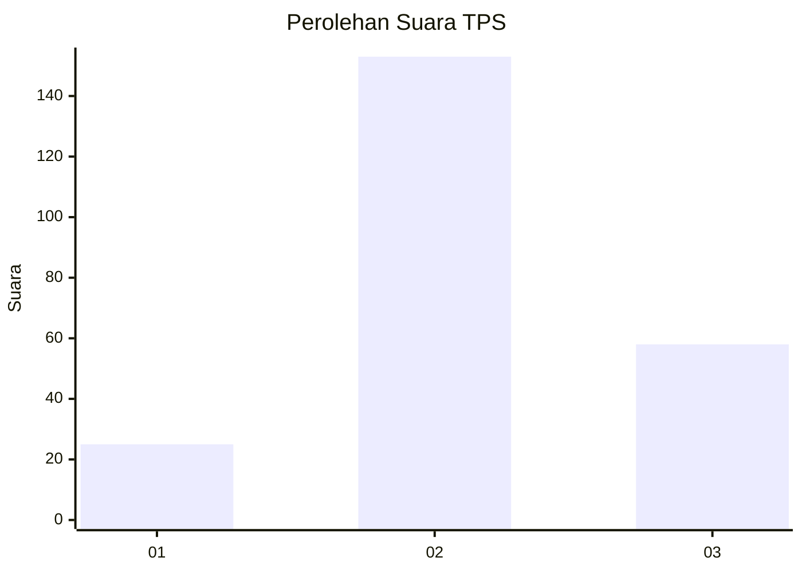
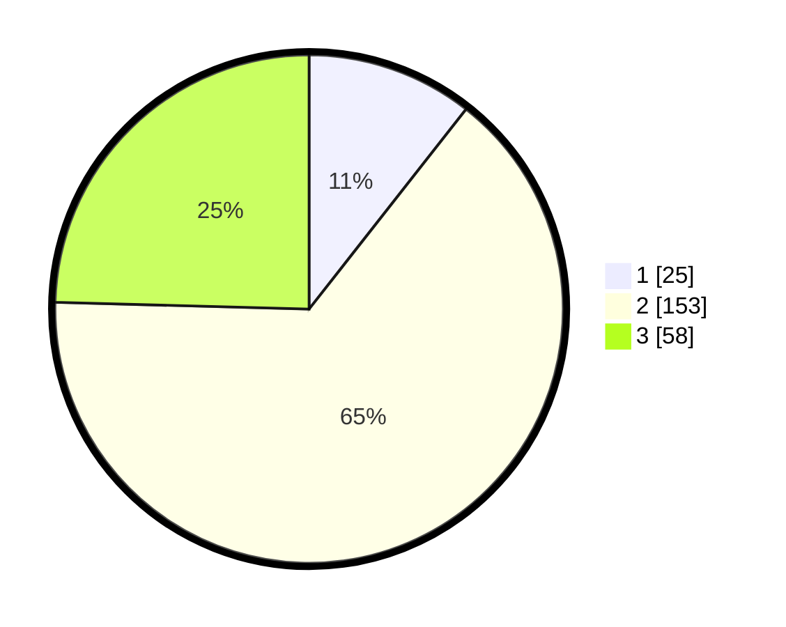

# Hasil

## Grafik

## Tabel

| No. | Nama Paslon    | Suara | Suara (raw) | Persentase |
|:--- |:-------------- | -----:| -----------:| ----------:|
| 1   | ANIES MUHAIMIN | 25    | [25][p-1]   | 10,59      |
| 2   | PRABOWO GIBRAN | 153   | [153][p-2]  | 64,83      |
| 3   | GANJAR MAHFUD  | 58    | [58][p-3]   | 24,58      |

[p-1]: https://github.com/gigit-pemilu/pemilu-2024-35-jawa-timur/blob/main/pilpres/hitung-suara/sub/35-jawa-timur/sub/04-tulungagung/sub/03-kedungwaru/sub/2003-ringinpitu/sub/019-tps/sub/paslon-1.txt
[p-2]: https://github.com/gigit-pemilu/pemilu-2024-35-jawa-timur/blob/main/pilpres/hitung-suara/sub/35-jawa-timur/sub/04-tulungagung/sub/03-kedungwaru/sub/2003-ringinpitu/sub/019-tps/sub/paslon-2.txt
[p-3]: https://github.com/gigit-pemilu/pemilu-2024-35-jawa-timur/blob/main/pilpres/hitung-suara/sub/35-jawa-timur/sub/04-tulungagung/sub/03-kedungwaru/sub/2003-ringinpitu/sub/019-tps/sub/paslon-3.txt

## Foto C Plano

https://sirekap-obj-formc.kpu.go.id/22b4/pemilu/ppwp/35/04/03/20/03/3504032003019-20240214-222511--bd157388-433c-4d8b-89c1-4015630a041c.jpg

https://sirekap-obj-formc.kpu.go.id/22b4/pemilu/ppwp/35/04/03/20/03/3504032003019-20240214-223006--22e6519c-fefb-4909-9102-584ebc7e9782.jpg

https://sirekap-obj-formc.kpu.go.id/22b4/pemilu/ppwp/35/04/03/20/03/3504032003019-20240214-223456--bbf721cb-035a-41ca-be2d-ce8ea6a0dc70.jpg

## Metadata

| Key        | Value               |
| ---------- | ------------------- |
| Time Stamp | 2024-02-24 22:31:28 |

