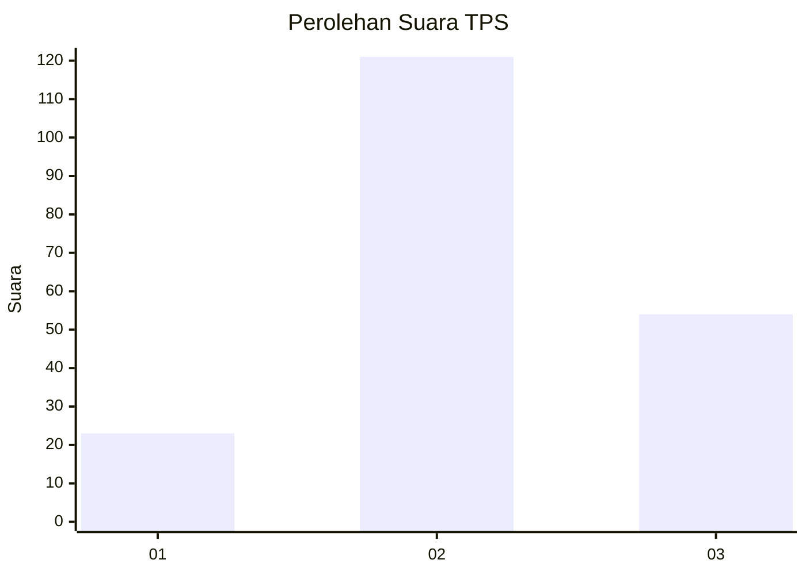
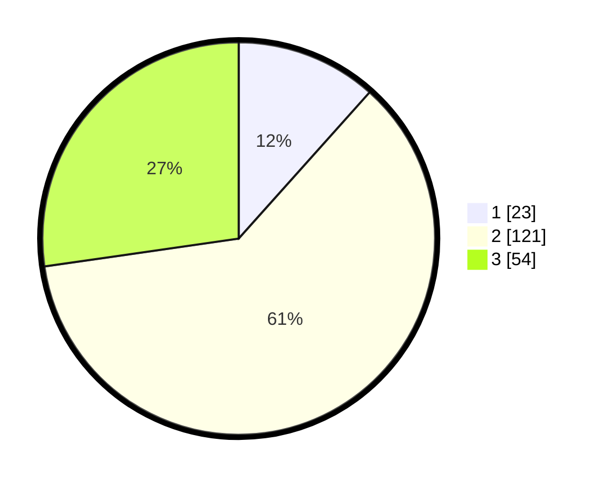

# Hasil

## Grafik

## Tabel

| No. | Nama Paslon    | Suara | Suara (raw) | Persentase |
|:--- |:-------------- | -----:| -----------:| ----------:|
| 1   | ANIES MUHAIMIN | 23    | [23][p-1]   | 11,62      |
| 2   | PRABOWO GIBRAN | 121   | [121][p-2]  | 61,11      |
| 3   | GANJAR MAHFUD  | 54    | [54][p-3]   | 27,27      |

[p-1]: https://github.com/gigit-pemilu/pemilu-2024-35-jawa-timur/blob/main/pilpres/hitung-suara/sub/35-jawa-timur/sub/04-tulungagung/sub/03-kedungwaru/sub/2003-ringinpitu/sub/023-tps/sub/paslon-1.txt
[p-2]: https://github.com/gigit-pemilu/pemilu-2024-35-jawa-timur/blob/main/pilpres/hitung-suara/sub/35-jawa-timur/sub/04-tulungagung/sub/03-kedungwaru/sub/2003-ringinpitu/sub/023-tps/sub/paslon-2.txt
[p-3]: https://github.com/gigit-pemilu/pemilu-2024-35-jawa-timur/blob/main/pilpres/hitung-suara/sub/35-jawa-timur/sub/04-tulungagung/sub/03-kedungwaru/sub/2003-ringinpitu/sub/023-tps/sub/paslon-3.txt

## Foto C Plano

https://sirekap-obj-formc.kpu.go.id/8512/pemilu/ppwp/35/04/03/20/03/3504032003023-20240215-002127--d2ee87f0-e0d9-4fba-bd73-425e95c14aaf.jpg

https://sirekap-obj-formc.kpu.go.id/8512/pemilu/ppwp/35/04/03/20/03/3504032003023-20240215-002654--026dc380-a04e-48a5-a7c1-329508edf87a.jpg

https://sirekap-obj-formc.kpu.go.id/8512/pemilu/ppwp/35/04/03/20/03/3504032003023-20240215-002855--85ce3ada-3b5a-47cb-bc6d-2362b672bfcf.jpg

## Metadata

| Key        | Value               |
| ---------- | ------------------- |
| Time Stamp | 2024-02-25 12:00:00 |

