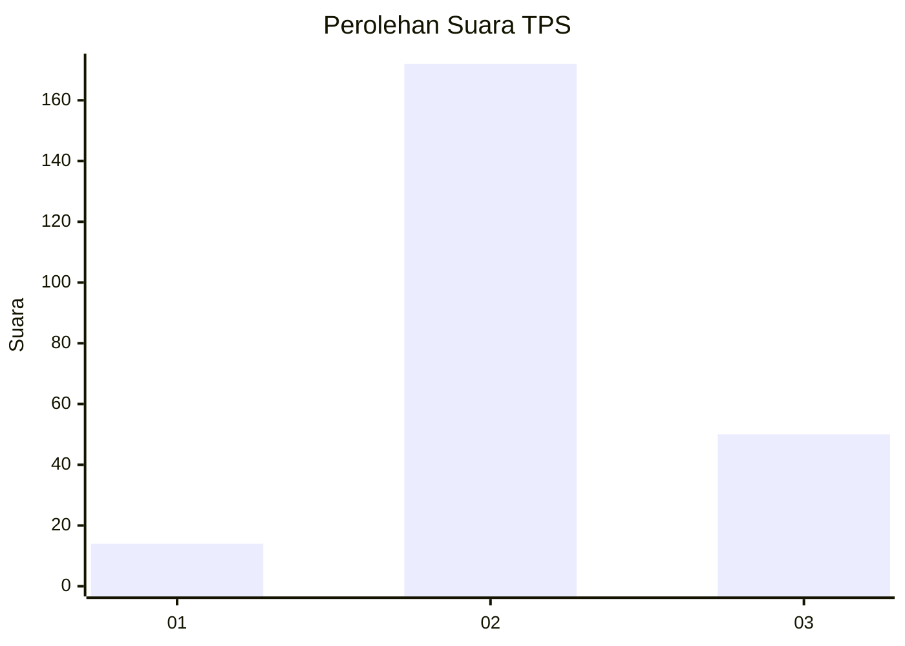

# Hasil

## Grafik

## Tabel

| No. | Nama Paslon    | Suara | Suara (raw) | Persentase |
|:--- |:-------------- | -----:| -----------:| ----------:|
| 1   | ANIES MUHAIMIN | 14    | [14][p-1]   | 5,93       |
| 2   | PRABOWO GIBRAN | 172   | [172][p-2]  | 72,88      |
| 3   | GANJAR MAHFUD  | 50    | [50][p-3]   | 21,19      |

[p-1]: https://github.com/gigit-pemilu/pemilu-2024/blob/main/pilpres/hitung-suara/sub/35-jawa-timur/sub/04-tulungagung/sub/03-kedungwaru/sub/2006-bangoan/sub/005-tps/sub/paslon-1.txt
[p-2]: https://github.com/gigit-pemilu/pemilu-2024/blob/main/pilpres/hitung-suara/sub/35-jawa-timur/sub/04-tulungagung/sub/03-kedungwaru/sub/2006-bangoan/sub/005-tps/sub/paslon-2.txt
[p-3]: https://github.com/gigit-pemilu/pemilu-2024/blob/main/pilpres/hitung-suara/sub/35-jawa-timur/sub/04-tulungagung/sub/03-kedungwaru/sub/2006-bangoan/sub/005-tps/sub/paslon-3.txt

## Foto C Plano

https://sirekap-obj-formc.kpu.go.id/448b/pemilu/ppwp/35/04/03/20/06/3504032006005-20240214-234416--5a4450a3-01d6-4b90-bd77-6d7a6786dc98.jpg

https://sirekap-obj-formc.kpu.go.id/448b/pemilu/ppwp/35/04/03/20/06/3504032006005-20240214-233802--74732a02-cd10-4eb2-9b10-01c8515c2d50.jpg

https://sirekap-obj-formc.kpu.go.id/448b/pemilu/ppwp/35/04/03/20/06/3504032006005-20240214-234000--1039064a-46d0-4de1-baed-9826fd6d2995.jpg

## Metadata

| Key        | Value               |
| ---------- | ------------------- |
| Time Stamp | 2024-02-24 22:31:28 |

