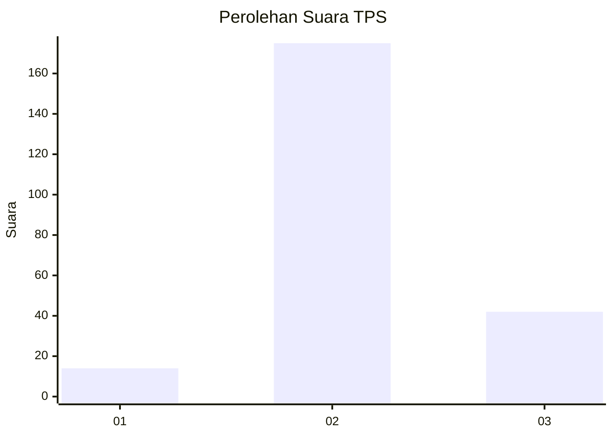
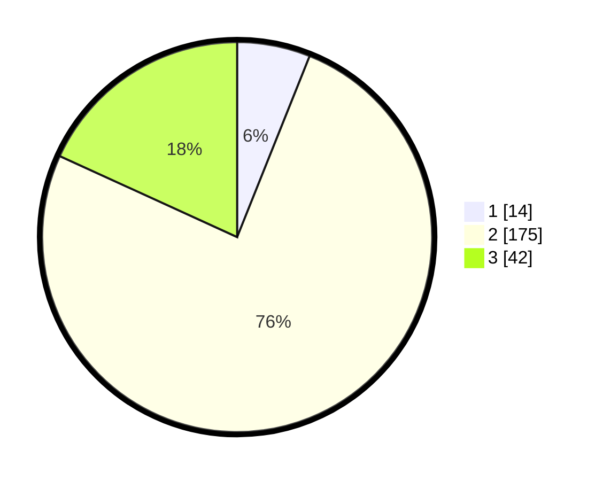

# Hasil

## Grafik

## Tabel

| No. | Nama Paslon    | Suara | Suara (raw) | Persentase |
|:--- |:-------------- | -----:| -----------:| ----------:|
| 1   | ANIES MUHAIMIN | 14    | [14][p-1]   | 6,06       |
| 2   | PRABOWO GIBRAN | 175   | [175][p-2]  | 75,76      |
| 3   | GANJAR MAHFUD  | 42    | [42][p-3]   | 18,18      |

[p-1]: https://github.com/gigit-pemilu/pemilu-2024-35-jawa-timur/blob/main/pilpres/hitung-suara/sub/35-jawa-timur/sub/04-tulungagung/sub/03-kedungwaru/sub/2008-tapan/sub/001-tps/sub/paslon-1.txt
[p-2]: https://github.com/gigit-pemilu/pemilu-2024-35-jawa-timur/blob/main/pilpres/hitung-suara/sub/35-jawa-timur/sub/04-tulungagung/sub/03-kedungwaru/sub/2008-tapan/sub/001-tps/sub/paslon-2.txt
[p-3]: https://github.com/gigit-pemilu/pemilu-2024-35-jawa-timur/blob/main/pilpres/hitung-suara/sub/35-jawa-timur/sub/04-tulungagung/sub/03-kedungwaru/sub/2008-tapan/sub/001-tps/sub/paslon-3.txt

## Foto C Plano

https://sirekap-obj-formc.kpu.go.id/b58e/pemilu/ppwp/35/04/03/20/08/3504032008001-20240217-094524--1642e1bc-101d-4d14-a8c6-63c12fd0ef72.jpg

https://sirekap-obj-formc.kpu.go.id/b58e/pemilu/ppwp/35/04/03/20/08/3504032008001-20240217-094818--3a11f99d-e9ec-4dd5-965a-d37d4f519346.jpg

https://sirekap-obj-formc.kpu.go.id/b58e/pemilu/ppwp/35/04/03/20/08/3504032008001-20240217-094656--40ed6a37-eb40-4484-bd11-f467fd64a9e4.jpg

## Metadata

| Key        | Value               |
| ---------- | ------------------- |
| Time Stamp | 2024-02-25 02:00:00 |

