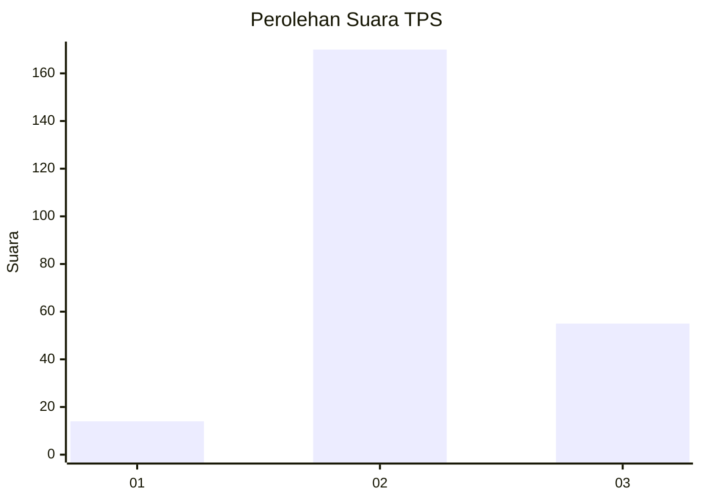
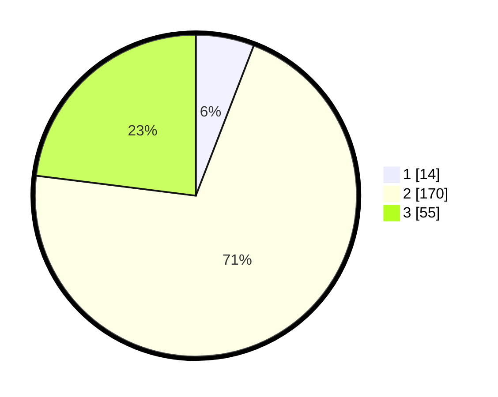

# Hasil

## Grafik

## Tabel

| No. | Nama Paslon    | Suara | Suara (raw) | Persentase |
|:--- |:-------------- | -----:| -----------:| ----------:|
| 1   | ANIES MUHAIMIN | 14    | [14][p-1]   | 5,86       |
| 2   | PRABOWO GIBRAN | 170   | [170][p-2]  | 71,13      |
| 3   | GANJAR MAHFUD  | 55    | [55][p-3]   | 23,01      |

[p-1]: https://github.com/gigit-pemilu/pemilu-2024/blob/main/pilpres/hitung-suara/sub/35-jawa-timur/sub/04-tulungagung/sub/03-kedungwaru/sub/2008-tapan/sub/009-tps/sub/paslon-1.txt
[p-2]: https://github.com/gigit-pemilu/pemilu-2024/blob/main/pilpres/hitung-suara/sub/35-jawa-timur/sub/04-tulungagung/sub/03-kedungwaru/sub/2008-tapan/sub/009-tps/sub/paslon-2.txt
[p-3]: https://github.com/gigit-pemilu/pemilu-2024/blob/main/pilpres/hitung-suara/sub/35-jawa-timur/sub/04-tulungagung/sub/03-kedungwaru/sub/2008-tapan/sub/009-tps/sub/paslon-3.txt

## Foto C Plano

https://sirekap-obj-formc.kpu.go.id/b920/pemilu/ppwp/35/04/03/20/08/3504032008009-20240214-214909--96e8d3d3-7138-4c43-9d8a-27be4a363fec.jpg

https://sirekap-obj-formc.kpu.go.id/b920/pemilu/ppwp/35/04/03/20/08/3504032008009-20240214-215346--a09308e3-a5a6-4ac8-b596-cea96f43a5ad.jpg

https://sirekap-obj-formc.kpu.go.id/b920/pemilu/ppwp/35/04/03/20/08/3504032008009-20240214-215659--b267159a-e712-4c1c-b71e-0488af469218.jpg

## Metadata

| Key        | Value               |
| ---------- | ------------------- |
| Time Stamp | 2024-02-15 12:00:28 |

