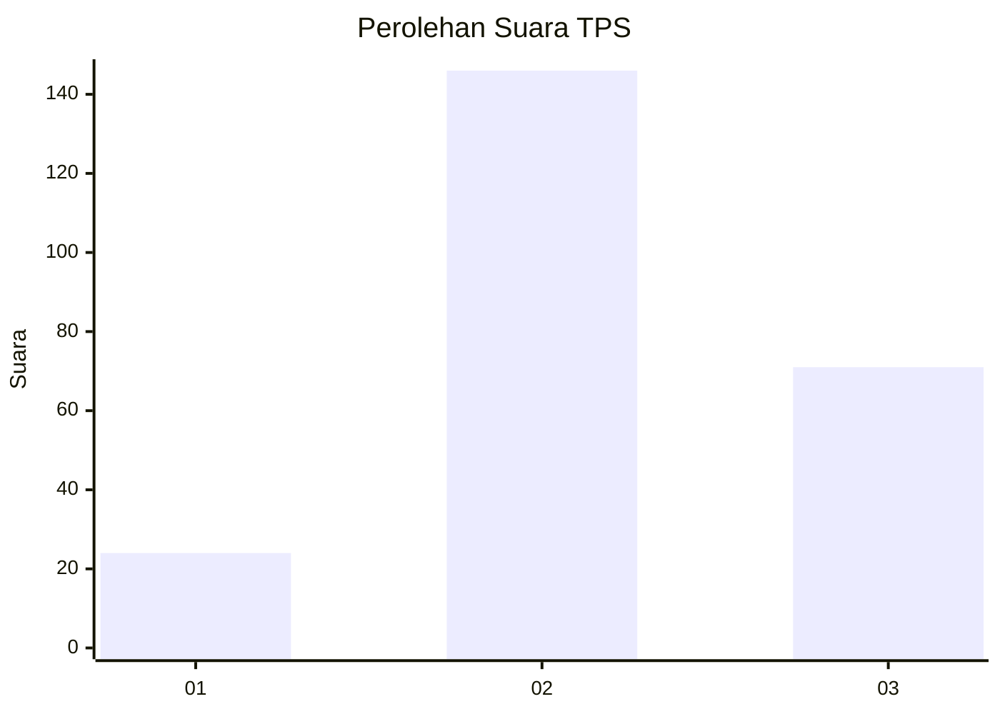
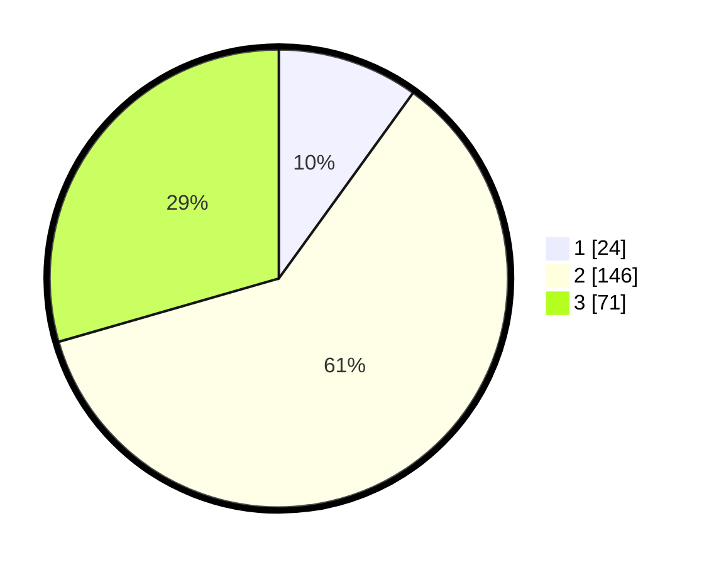

# Hasil

## Grafik

## Tabel

| No. | Nama Paslon    | Suara | Suara (raw) | Persentase |
|:--- |:-------------- | -----:| -----------:| ----------:|
| 1   | ANIES MUHAIMIN | 24    | [24][p-1]   | 9,96       |
| 2   | PRABOWO GIBRAN | 146   | [146][p-2]  | 60,58      |
| 3   | GANJAR MAHFUD  | 71    | [71][p-3]   | 29,46      |

[p-1]: https://github.com/gigit-pemilu/pemilu-2024-35-jawa-timur/blob/main/pilpres/hitung-suara/sub/35-jawa-timur/sub/04-tulungagung/sub/03-kedungwaru/sub/2008-tapan/sub/011-tps/sub/paslon-1.txt
[p-2]: https://github.com/gigit-pemilu/pemilu-2024-35-jawa-timur/blob/main/pilpres/hitung-suara/sub/35-jawa-timur/sub/04-tulungagung/sub/03-kedungwaru/sub/2008-tapan/sub/011-tps/sub/paslon-2.txt
[p-3]: https://github.com/gigit-pemilu/pemilu-2024-35-jawa-timur/blob/main/pilpres/hitung-suara/sub/35-jawa-timur/sub/04-tulungagung/sub/03-kedungwaru/sub/2008-tapan/sub/011-tps/sub/paslon-3.txt

## Foto C Plano

https://sirekap-obj-formc.kpu.go.id/02fb/pemilu/ppwp/35/04/03/20/08/3504032008011-20240214-213804--d144b75c-1d5e-4c13-957c-5648833a4a0e.jpg

https://sirekap-obj-formc.kpu.go.id/02fb/pemilu/ppwp/35/04/03/20/08/3504032008011-20240214-214116--2e0252f1-3006-4829-83bf-9e05c75836f1.jpg

https://sirekap-obj-formc.kpu.go.id/02fb/pemilu/ppwp/35/04/03/20/08/3504032008011-20240214-214044--5430db62-def4-4849-8caf-b432c7cfe42f.jpg

## Metadata

| Key        | Value               |
| ---------- | ------------------- |
| Time Stamp | 2024-02-16 21:01:00 |

