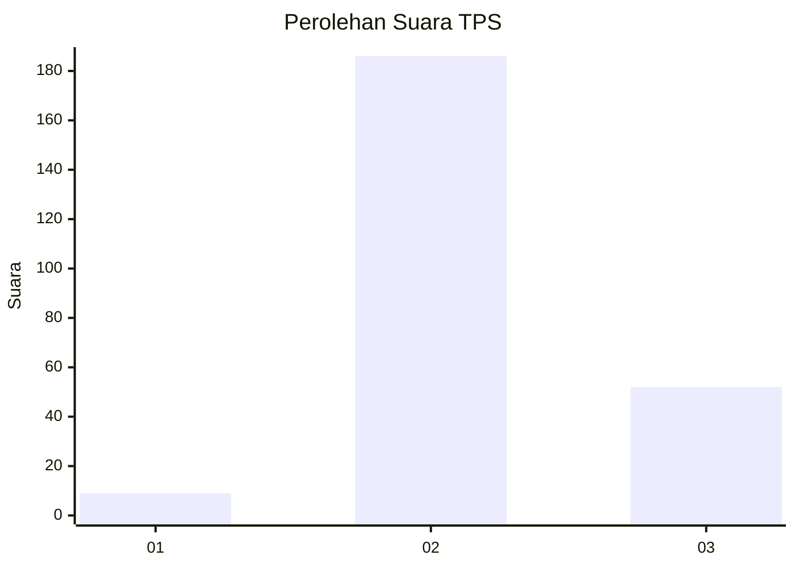

# Hasil

## Grafik

## Tabel

| No. | Nama Paslon    | Suara | Suara (raw) | Persentase |
|:--- |:-------------- | -----:| -----------:| ----------:|
| 1   | ANIES MUHAIMIN | 9     | [9][p-1]    | 3,64       |
| 2   | PRABOWO GIBRAN | 186   | [186][p-2]  | 75,30      |
| 3   | GANJAR MAHFUD  | 52    | [52][p-3]   | 21,05      |

[p-1]: https://github.com/gigit-pemilu/pemilu-2024-35-jawa-timur/blob/main/pilpres/hitung-suara/sub/35-jawa-timur/sub/04-tulungagung/sub/03-kedungwaru/sub/2008-tapan/sub/012-tps/sub/paslon-1.txt
[p-2]: https://github.com/gigit-pemilu/pemilu-2024-35-jawa-timur/blob/main/pilpres/hitung-suara/sub/35-jawa-timur/sub/04-tulungagung/sub/03-kedungwaru/sub/2008-tapan/sub/012-tps/sub/paslon-2.txt
[p-3]: https://github.com/gigit-pemilu/pemilu-2024-35-jawa-timur/blob/main/pilpres/hitung-suara/sub/35-jawa-timur/sub/04-tulungagung/sub/03-kedungwaru/sub/2008-tapan/sub/012-tps/sub/paslon-3.txt

## Foto C Plano

https://sirekap-obj-formc.kpu.go.id/aa8a/pemilu/ppwp/35/04/03/20/08/3504032008012-20240214-203427--2bf21fcc-635d-4efe-9eba-1180f800fb22.jpg

https://sirekap-obj-formc.kpu.go.id/aa8a/pemilu/ppwp/35/04/03/20/08/3504032008012-20240214-203734--1862a46c-8a02-4f05-8d86-1be9c6cb42c7.jpg

https://sirekap-obj-formc.kpu.go.id/aa8a/pemilu/ppwp/35/04/03/20/08/3504032008012-20240214-203910--9586daa7-8018-40f2-8722-425d1d86b467.jpg

## Metadata

| Key        | Value               |
| ---------- | ------------------- |
| Time Stamp | 2024-02-16 21:01:00 |

