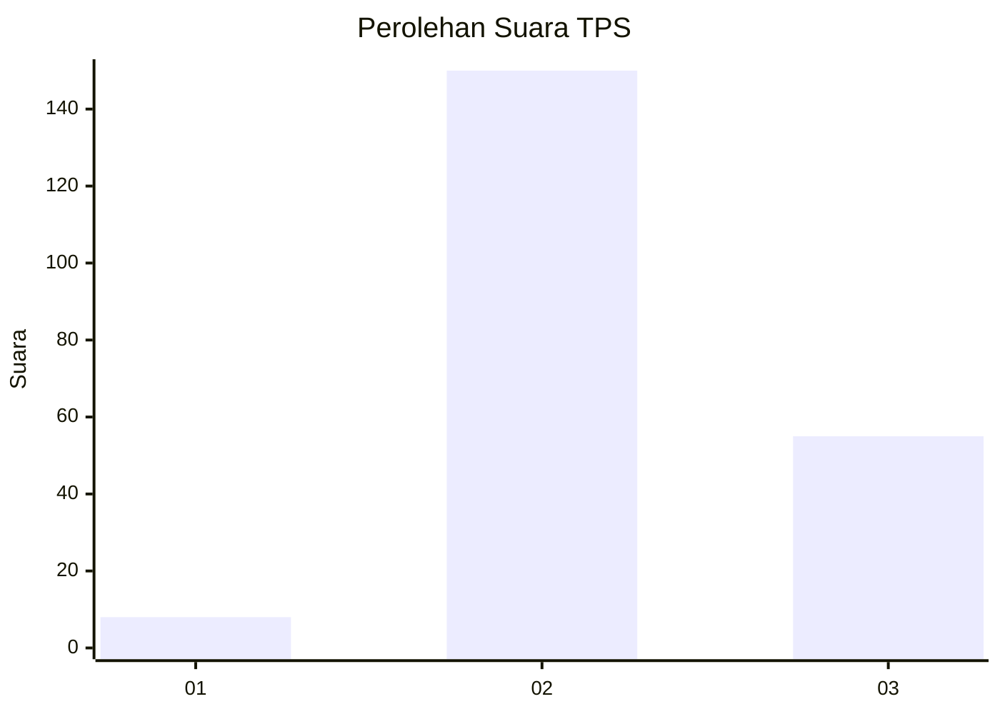
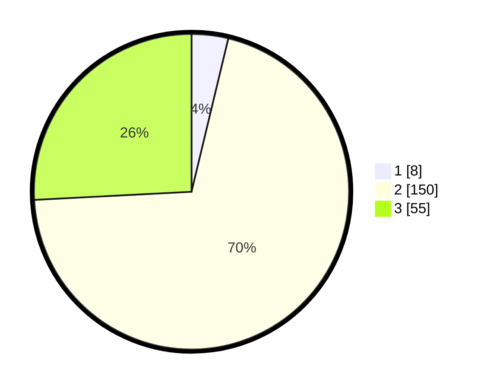

# Hasil

## Grafik

## Tabel

| No. | Nama Paslon    | Suara | Suara (raw) | Persentase |
|:--- |:-------------- | -----:| -----------:| ----------:|
| 1   | ANIES MUHAIMIN | 8     | [8][p-1]    | 3,76       |
| 2   | PRABOWO GIBRAN | 150   | [150][p-2]  | 70,42      |
| 3   | GANJAR MAHFUD  | 55    | [55][p-3]   | 25,82      |

[p-1]: https://github.com/gigit-pemilu/pemilu-2024-35-jawa-timur/blob/main/pilpres/hitung-suara/sub/35-jawa-timur/sub/04-tulungagung/sub/03-kedungwaru/sub/2008-tapan/sub/013-tps/sub/paslon-1.txt
[p-2]: https://github.com/gigit-pemilu/pemilu-2024-35-jawa-timur/blob/main/pilpres/hitung-suara/sub/35-jawa-timur/sub/04-tulungagung/sub/03-kedungwaru/sub/2008-tapan/sub/013-tps/sub/paslon-2.txt
[p-3]: https://github.com/gigit-pemilu/pemilu-2024-35-jawa-timur/blob/main/pilpres/hitung-suara/sub/35-jawa-timur/sub/04-tulungagung/sub/03-kedungwaru/sub/2008-tapan/sub/013-tps/sub/paslon-3.txt

## Foto C Plano

https://sirekap-obj-formc.kpu.go.id/dc36/pemilu/ppwp/35/04/03/20/08/3504032008013-20240214-184803--99e90c37-5e48-40f6-becd-67fef44804c6.jpg

https://sirekap-obj-formc.kpu.go.id/dc36/pemilu/ppwp/35/04/03/20/08/3504032008013-20240214-185056--cab8acc7-6176-4dc7-829c-0d90852478c0.jpg

https://sirekap-obj-formc.kpu.go.id/dc36/pemilu/ppwp/35/04/03/20/08/3504032008013-20240214-185309--523d1181-90a0-4d32-a5b2-0cb1a277ad16.jpg

## Metadata

| Key        | Value               |
| ---------- | ------------------- |
| Time Stamp | 2024-02-24 22:31:28 |

