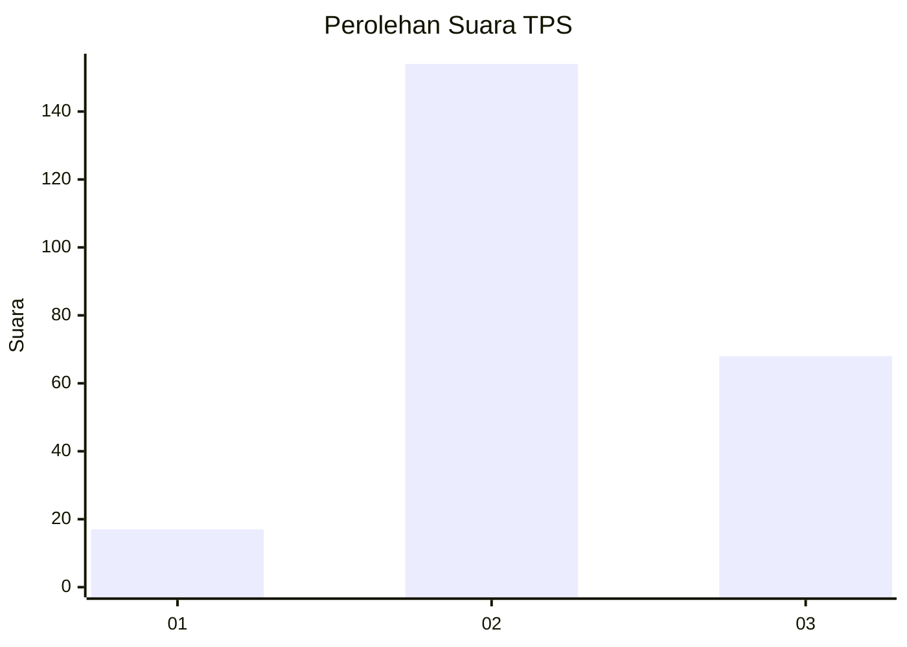
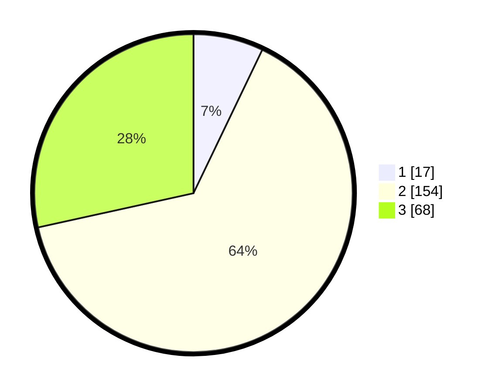

# Hasil

## Grafik

## Tabel

| No. | Nama Paslon    | Suara | Suara (raw) | Persentase |
|:--- |:-------------- | -----:| -----------:| ----------:|
| 1   | ANIES MUHAIMIN | 17    | [17][p-1]   | 7,11       |
| 2   | PRABOWO GIBRAN | 154   | [154][p-2]  | 64,44      |
| 3   | GANJAR MAHFUD  | 68    | [68][p-3]   | 28,45      |

[p-1]: https://github.com/gigit-pemilu/pemilu-2024/blob/main/pilpres/hitung-suara/sub/35-jawa-timur/sub/04-tulungagung/sub/03-kedungwaru/sub/2009-rejoagung/sub/013-tps/sub/paslon-1.txt
[p-2]: https://github.com/gigit-pemilu/pemilu-2024/blob/main/pilpres/hitung-suara/sub/35-jawa-timur/sub/04-tulungagung/sub/03-kedungwaru/sub/2009-rejoagung/sub/013-tps/sub/paslon-2.txt
[p-3]: https://github.com/gigit-pemilu/pemilu-2024/blob/main/pilpres/hitung-suara/sub/35-jawa-timur/sub/04-tulungagung/sub/03-kedungwaru/sub/2009-rejoagung/sub/013-tps/sub/paslon-3.txt

## Foto C Plano

https://sirekap-obj-formc.kpu.go.id/2e6d/pemilu/ppwp/35/04/03/20/09/3504032009013-20240217-194129--02911b3f-5266-48af-a21e-ffb7869e07a9.jpg

https://sirekap-obj-formc.kpu.go.id/2e6d/pemilu/ppwp/35/04/03/20/09/3504032009013-20240217-194527--486f9d12-fef0-44bb-8c28-65520bc7d4f0.jpg

https://sirekap-obj-formc.kpu.go.id/2e6d/pemilu/ppwp/35/04/03/20/09/3504032009013-20240217-194617--6296022f-8287-4738-bfd6-be62b7d99f7a.jpg

## Metadata

| Key        | Value               |
| ---------- | ------------------- |
| Time Stamp | 2024-02-24 22:31:28 |

