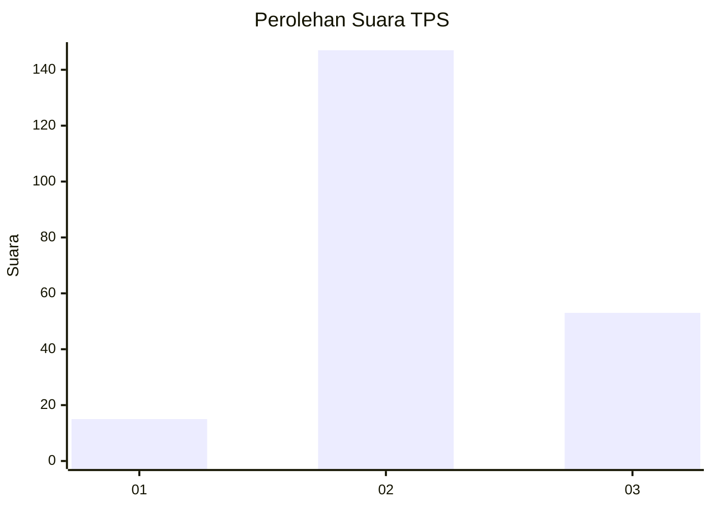
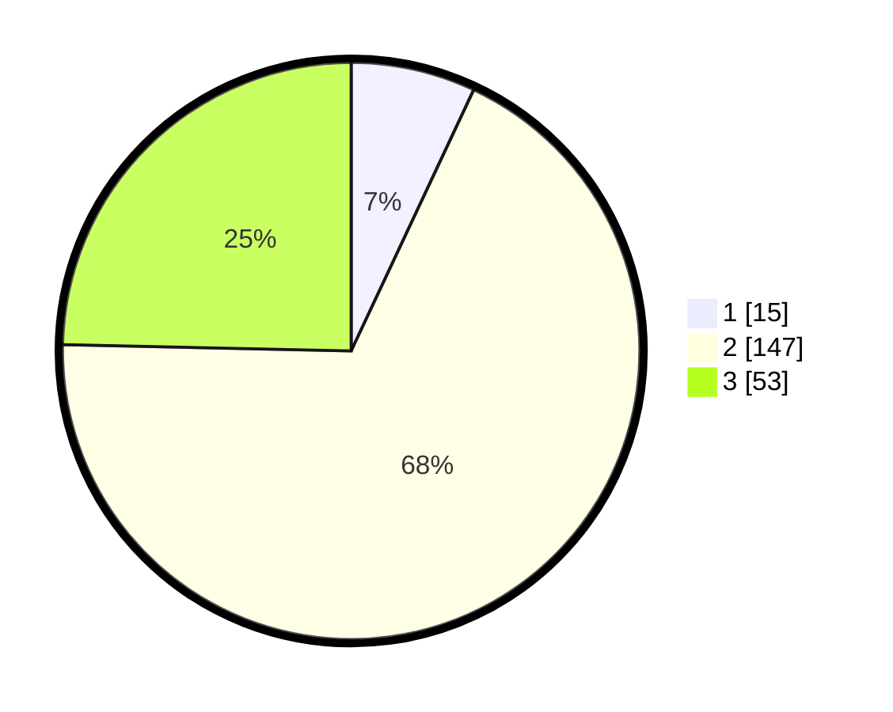

# Hasil

## Grafik

## Tabel

| No. | Nama Paslon    | Suara | Suara (raw) | Persentase |
|:--- |:-------------- | -----:| -----------:| ----------:|
| 1   | ANIES MUHAIMIN | 15    | [15][p-1]   | 6,98       |
| 2   | PRABOWO GIBRAN | 147   | [147][p-2]  | 68,37      |
| 3   | GANJAR MAHFUD  | 53    | [53][p-3]   | 24,65      |

[p-1]: https://github.com/gigit-pemilu/pemilu-2024-35-jawa-timur/blob/main/pilpres/hitung-suara/sub/35-jawa-timur/sub/04-tulungagung/sub/03-kedungwaru/sub/2011-plandaan/sub/004-tps/sub/paslon-1.txt
[p-2]: https://github.com/gigit-pemilu/pemilu-2024-35-jawa-timur/blob/main/pilpres/hitung-suara/sub/35-jawa-timur/sub/04-tulungagung/sub/03-kedungwaru/sub/2011-plandaan/sub/004-tps/sub/paslon-2.txt
[p-3]: https://github.com/gigit-pemilu/pemilu-2024-35-jawa-timur/blob/main/pilpres/hitung-suara/sub/35-jawa-timur/sub/04-tulungagung/sub/03-kedungwaru/sub/2011-plandaan/sub/004-tps/sub/paslon-3.txt

## Foto C Plano

https://sirekap-obj-formc.kpu.go.id/1487/pemilu/ppwp/35/04/03/20/11/3504032011004-20240214-193322--5dfc73a3-8ee9-491a-bbee-dfeed035d6c2.jpg

https://sirekap-obj-formc.kpu.go.id/1487/pemilu/ppwp/35/04/03/20/11/3504032011004-20240214-193630--ba639e30-98a3-40d8-ab2a-f6710f52abea.jpg

https://sirekap-obj-formc.kpu.go.id/1487/pemilu/ppwp/35/04/03/20/11/3504032011004-20240214-194301--4a7ece65-4986-4834-8114-aaf6e73d63b0.jpg

## Metadata

| Key        | Value               |
| ---------- | ------------------- |
| Time Stamp | 2024-02-14 21:46:01 |

