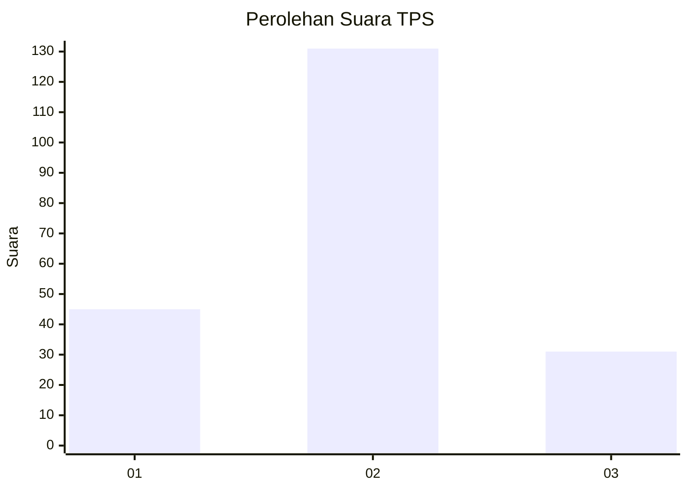
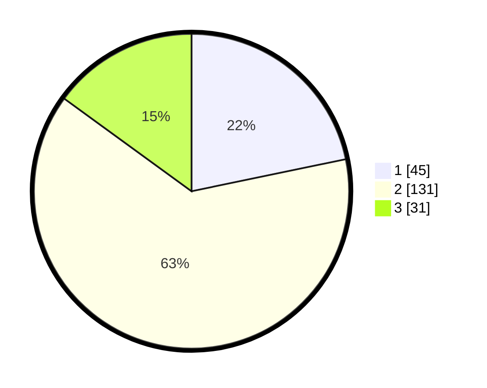

# Hasil

## Grafik

## Tabel

| No. | Nama Paslon    | Suara | Suara (raw) | Persentase |
|:--- |:-------------- | -----:| -----------:| ----------:|
| 1   | ANIES MUHAIMIN | 45    | [45][p-1]   | 21,74      |
| 2   | PRABOWO GIBRAN | 131   | [131][p-2]  | 63,29      |
| 3   | GANJAR MAHFUD  | 31    | [31][p-3]   | 14,98      |

[p-1]: https://github.com/gigit-pemilu/pemilu-2024-35-jawa-timur/blob/main/pilpres/hitung-suara/sub/35-jawa-timur/sub/04-tulungagung/sub/03-kedungwaru/sub/2012-ketanon/sub/004-tps/sub/paslon-1.txt
[p-2]: https://github.com/gigit-pemilu/pemilu-2024-35-jawa-timur/blob/main/pilpres/hitung-suara/sub/35-jawa-timur/sub/04-tulungagung/sub/03-kedungwaru/sub/2012-ketanon/sub/004-tps/sub/paslon-2.txt
[p-3]: https://github.com/gigit-pemilu/pemilu-2024-35-jawa-timur/blob/main/pilpres/hitung-suara/sub/35-jawa-timur/sub/04-tulungagung/sub/03-kedungwaru/sub/2012-ketanon/sub/004-tps/sub/paslon-3.txt

## Foto C Plano

https://sirekap-obj-formc.kpu.go.id/e48e/pemilu/ppwp/35/04/03/20/12/3504032012004-20240214-232413--ffe837de-807f-4e88-ae55-a434267da1cc.jpg

https://sirekap-obj-formc.kpu.go.id/e48e/pemilu/ppwp/35/04/03/20/12/3504032012004-20240214-233349--85227d38-c6cc-400c-a355-e58b24dfe3ec.jpg

https://sirekap-obj-formc.kpu.go.id/e48e/pemilu/ppwp/35/04/03/20/12/3504032012004-20240214-233435--fd777735-85d0-4542-b90a-b2d666d32113.jpg

## Metadata

| Key        | Value               |
| ---------- | ------------------- |
| Time Stamp | 2024-02-16 21:01:00 |

