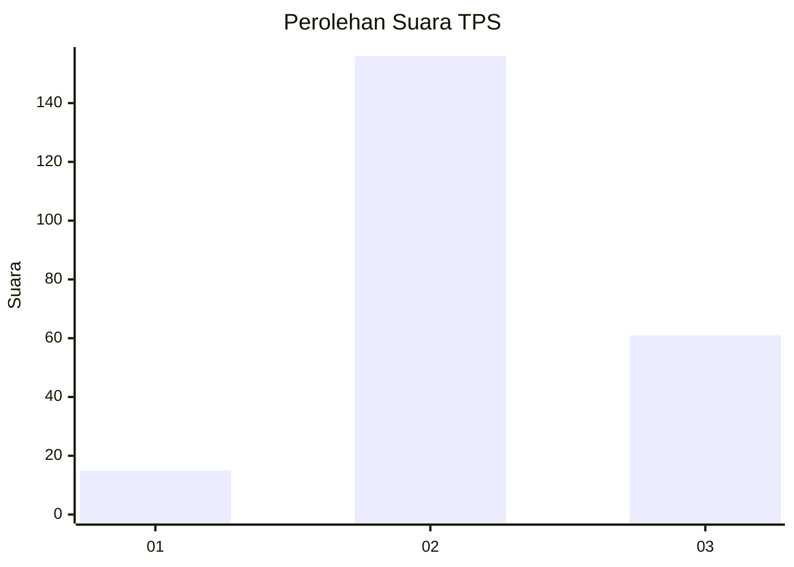

# Hasil

## Grafik

## Tabel

| No. | Nama Paslon    | Suara | Suara (raw) | Persentase |
|:--- |:-------------- | -----:| -----------:| ----------:|
| 1   | ANIES MUHAIMIN | 15    | [15][p-1]   | 6,47       |
| 2   | PRABOWO GIBRAN | 156   | [156][p-2]  | 67,24      |
| 3   | GANJAR MAHFUD  | 61    | [61][p-3]   | 26,29      |

[p-1]: https://github.com/gigit-pemilu/pemilu-2024/blob/main/pilpres/hitung-suara/sub/35-jawa-timur/sub/04-tulungagung/sub/03-kedungwaru/sub/2012-ketanon/sub/025-tps/sub/paslon-1.txt
[p-2]: https://github.com/gigit-pemilu/pemilu-2024/blob/main/pilpres/hitung-suara/sub/35-jawa-timur/sub/04-tulungagung/sub/03-kedungwaru/sub/2012-ketanon/sub/025-tps/sub/paslon-2.txt
[p-3]: https://github.com/gigit-pemilu/pemilu-2024/blob/main/pilpres/hitung-suara/sub/35-jawa-timur/sub/04-tulungagung/sub/03-kedungwaru/sub/2012-ketanon/sub/025-tps/sub/paslon-3.txt

## Foto C Plano

https://sirekap-obj-formc.kpu.go.id/4ce2/pemilu/ppwp/35/04/03/20/12/3504032012025-20240216-135409--78bc3168-b369-4d0e-95b4-6a236e1b6eba.jpg

https://sirekap-obj-formc.kpu.go.id/4ce2/pemilu/ppwp/35/04/03/20/12/3504032012025-20240216-135727--5a472a13-9d84-4f5e-9847-45fd39269fe4.jpg

https://sirekap-obj-formc.kpu.go.id/4ce2/pemilu/ppwp/35/04/03/20/12/3504032012025-20240216-140027--8bcf8d4b-9081-4ea6-90e8-edd61439c826.jpg

## Metadata

| Key        | Value               |
| ---------- | ------------------- |
| Time Stamp | 2024-02-16 21:01:00 |

## DATA PEMILIH TETAP

Jumlah pemilih dalam DPT: **294**.
 * L: **654**.
 * P: **149**.

## DATA PENGGUNA HAK PILIH

Jumlah pengguna hak pilih dalam DPT: **234**.
 * L: **820**.
 * P: **466**.

Jumlah pengguna hak pilih dalam DPTb: **884**.
 * L: **888**.
 * P: **884**.

Jumlah pengguna hak pilih dalam DPK: **888**.
 * L: **484**.
 * P: **888**.

Jumlah pengguna hak pilih: **288**.
 * L: **844**.
 * P: **846**.

## JUMLAH SUARA SAH DAN TIDAK SAH

JUMLAH SELURUH SUARA SAH: **232**.

JUMLAH SUARA TIDAK SAH: **6**.

JUMLAH SELURUH SUARA SAH DAN SUARA TIDAK SAH: **238**.

