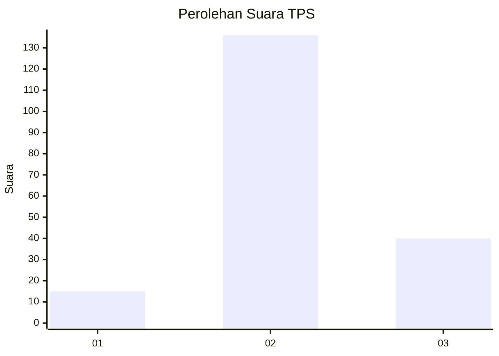
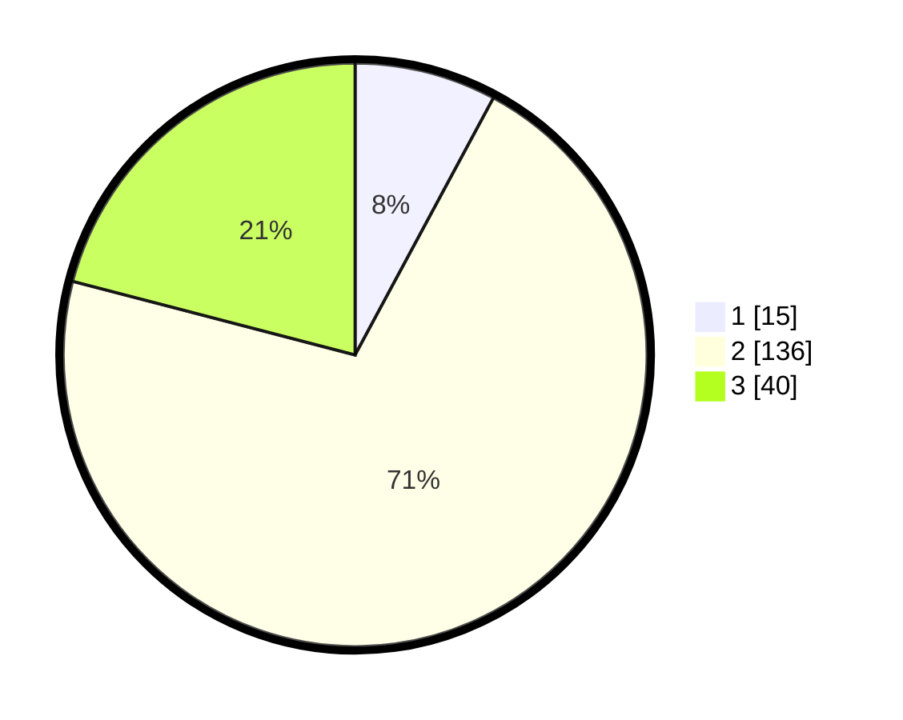

# Hasil

## Grafik

## Tabel

| No. | Nama Paslon    | Suara | Suara (raw) | Persentase |
|:--- |:-------------- | -----:| -----------:| ----------:|
| 1   | ANIES MUHAIMIN | 15    | [15][p-1]   | 7,85       |
| 2   | PRABOWO GIBRAN | 136   | [136][p-2]  | 71,20      |
| 3   | GANJAR MAHFUD  | 40    | [40][p-3]   | 20,94      |

[p-1]: https://github.com/gigit-pemilu/pemilu-2024-35-jawa-timur/blob/main/pilpres/hitung-suara/sub/35-jawa-timur/sub/04-tulungagung/sub/03-kedungwaru/sub/2015-winong/sub/003-tps/sub/paslon-1.txt
[p-2]: https://github.com/gigit-pemilu/pemilu-2024-35-jawa-timur/blob/main/pilpres/hitung-suara/sub/35-jawa-timur/sub/04-tulungagung/sub/03-kedungwaru/sub/2015-winong/sub/003-tps/sub/paslon-2.txt
[p-3]: https://github.com/gigit-pemilu/pemilu-2024-35-jawa-timur/blob/main/pilpres/hitung-suara/sub/35-jawa-timur/sub/04-tulungagung/sub/03-kedungwaru/sub/2015-winong/sub/003-tps/sub/paslon-3.txt

## Foto C Plano

https://sirekap-obj-formc.kpu.go.id/eb27/pemilu/ppwp/35/04/03/20/15/3504032015003-20240214-215756--e871cc82-ee2c-45db-b752-7cb74e0be46a.jpg

https://sirekap-obj-formc.kpu.go.id/eb27/pemilu/ppwp/35/04/03/20/15/3504032015003-20240216-143131--486c9bce-692b-4435-9fa7-4d7ea3b1b7bf.jpg

https://sirekap-obj-formc.kpu.go.id/eb27/pemilu/ppwp/35/04/03/20/15/3504032015003-20240214-220312--eb20e57c-abbe-47af-946a-7c31ddd935b8.jpg

## Metadata

| Key        | Value               |
| ---------- | ------------------- |
| Time Stamp | 2024-02-25 16:00:00 |

