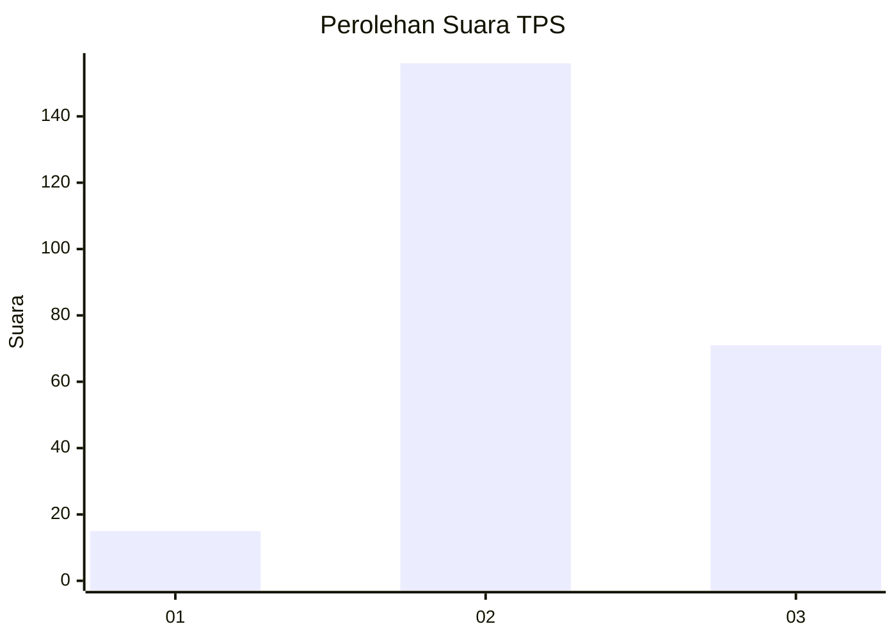
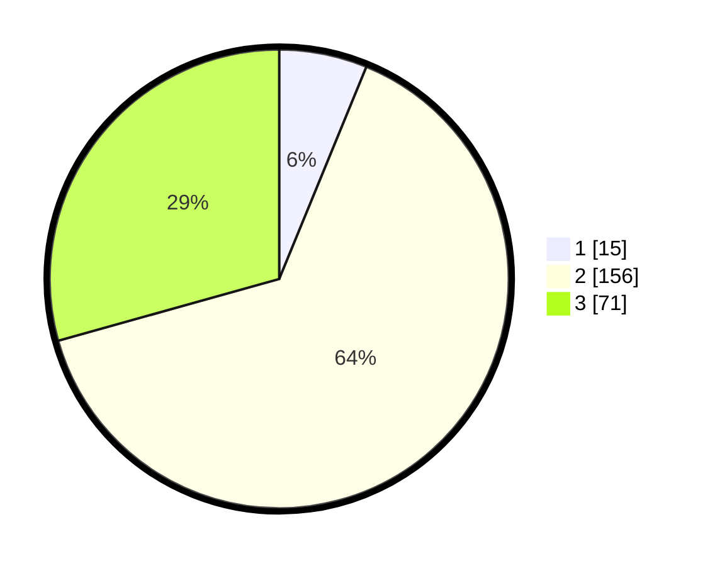

# Hasil

## Grafik

## Tabel

| No. | Nama Paslon    | Suara | Suara (raw) | Persentase |
|:--- |:-------------- | -----:| -----------:| ----------:|
| 1   | ANIES MUHAIMIN | 15    | [15][p-1]   | 6,20       |
| 2   | PRABOWO GIBRAN | 156   | [156][p-2]  | 64,46      |
| 3   | GANJAR MAHFUD  | 71    | [71][p-3]   | 29,34      |

[p-1]: https://github.com/gigit-pemilu/pemilu-2024-35-jawa-timur/blob/main/pilpres/hitung-suara/sub/35-jawa-timur/sub/04-tulungagung/sub/04-ngantru/sub/2001-pakel/sub/002-tps/sub/paslon-1.txt
[p-2]: https://github.com/gigit-pemilu/pemilu-2024-35-jawa-timur/blob/main/pilpres/hitung-suara/sub/35-jawa-timur/sub/04-tulungagung/sub/04-ngantru/sub/2001-pakel/sub/002-tps/sub/paslon-2.txt
[p-3]: https://github.com/gigit-pemilu/pemilu-2024-35-jawa-timur/blob/main/pilpres/hitung-suara/sub/35-jawa-timur/sub/04-tulungagung/sub/04-ngantru/sub/2001-pakel/sub/002-tps/sub/paslon-3.txt

## Foto C Plano

https://sirekap-obj-formc.kpu.go.id/4b16/pemilu/ppwp/35/04/04/20/01/3504042001002-20240214-230006--ccee07ac-6e5f-4b82-a6ec-4c57f7feccb6.jpg

https://sirekap-obj-formc.kpu.go.id/4b16/pemilu/ppwp/35/04/04/20/01/3504042001002-20240214-230227--a628d4ac-a882-42d5-8a77-14863a3c9bda.jpg

## Metadata

| Key        | Value               |
| ---------- | ------------------- |
| Time Stamp | 2024-02-25 12:00:00 |

