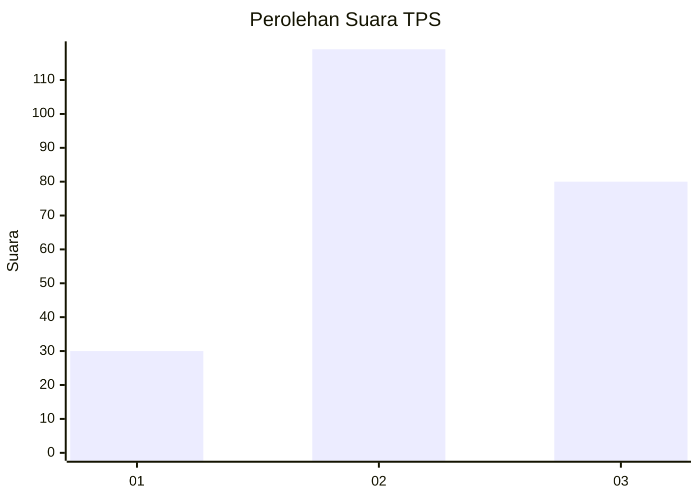
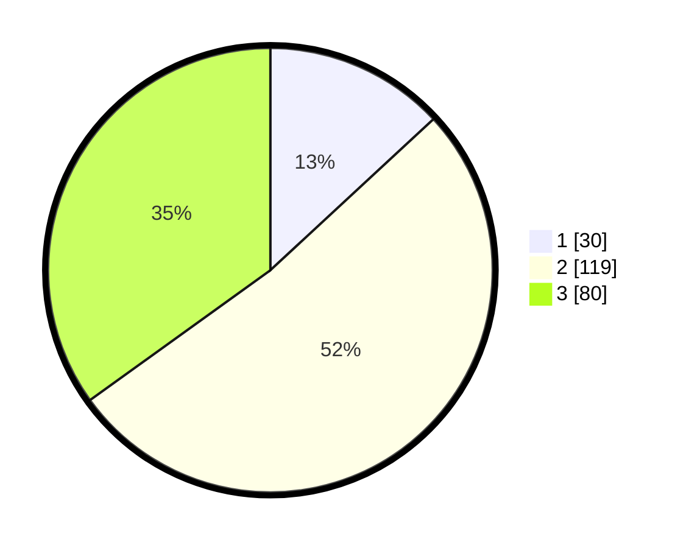

# Hasil

## Grafik

## Tabel

| No. | Nama Paslon    | Suara | Suara (raw) | Persentase |
|:--- |:-------------- | -----:| -----------:| ----------:|
| 1   | ANIES MUHAIMIN | 30    | [30][p-1]   | 13,10      |
| 2   | PRABOWO GIBRAN | 119   | [119][p-2]  | 51,97      |
| 3   | GANJAR MAHFUD  | 80    | [80][p-3]   | 34,93      |

[p-1]: https://github.com/gigit-pemilu/pemilu-2024/blob/main/pilpres/hitung-suara/sub/35-jawa-timur/sub/04-tulungagung/sub/04-ngantru/sub/2002-pucung-lor/sub/011-tps/sub/paslon-1.txt
[p-2]: https://github.com/gigit-pemilu/pemilu-2024/blob/main/pilpres/hitung-suara/sub/35-jawa-timur/sub/04-tulungagung/sub/04-ngantru/sub/2002-pucung-lor/sub/011-tps/sub/paslon-2.txt
[p-3]: https://github.com/gigit-pemilu/pemilu-2024/blob/main/pilpres/hitung-suara/sub/35-jawa-timur/sub/04-tulungagung/sub/04-ngantru/sub/2002-pucung-lor/sub/011-tps/sub/paslon-3.txt

## Foto C Plano

https://sirekap-obj-formc.kpu.go.id/b117/pemilu/ppwp/35/04/04/20/02/3504042002011-20240214-223904--8f210b18-f77b-490c-961b-ae2c6c5a7c72.jpg

https://sirekap-obj-formc.kpu.go.id/b117/pemilu/ppwp/35/04/04/20/02/3504042002011-20240214-223953--a10c75b3-fbf9-417a-b840-f17421387928.jpg

https://sirekap-obj-formc.kpu.go.id/b117/pemilu/ppwp/35/04/04/20/02/3504042002011-20240214-224040--57c57f01-1aff-48fa-b16a-a66c9ae81dd2.jpg

## Metadata

| Key        | Value               |
| ---------- | ------------------- |
| Time Stamp | 2024-02-26 16:00:00 |

