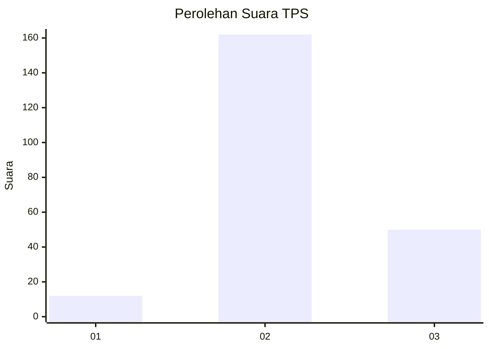
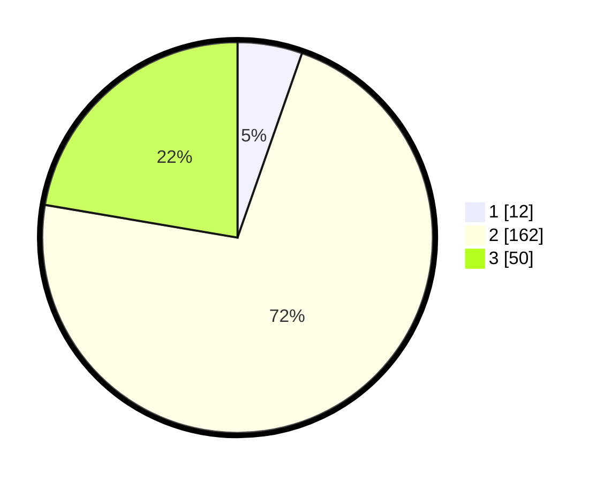

# Hasil

## Grafik

## Tabel

| No. | Nama Paslon    | Suara | Suara (raw) | Persentase |
|:--- |:-------------- | -----:| -----------:| ----------:|
| 1   | ANIES MUHAIMIN | 12    | [12][p-1]   | 5,36       |
| 2   | PRABOWO GIBRAN | 162   | [162][p-2]  | 72,32      |
| 3   | GANJAR MAHFUD  | 50    | [50][p-3]   | 22,32      |

[p-1]: https://github.com/gigit-pemilu/pemilu-2024-35-jawa-timur/blob/main/pilpres/hitung-suara/sub/35-jawa-timur/sub/04-tulungagung/sub/04-ngantru/sub/2003-srikaton/sub/006-tps/sub/paslon-1.txt
[p-2]: https://github.com/gigit-pemilu/pemilu-2024-35-jawa-timur/blob/main/pilpres/hitung-suara/sub/35-jawa-timur/sub/04-tulungagung/sub/04-ngantru/sub/2003-srikaton/sub/006-tps/sub/paslon-2.txt
[p-3]: https://github.com/gigit-pemilu/pemilu-2024-35-jawa-timur/blob/main/pilpres/hitung-suara/sub/35-jawa-timur/sub/04-tulungagung/sub/04-ngantru/sub/2003-srikaton/sub/006-tps/sub/paslon-3.txt

## Foto C Plano

https://sirekap-obj-formc.kpu.go.id/55b8/pemilu/ppwp/35/04/04/20/03/3504042003006-20240215-015507--849222eb-5af6-4a6b-ac22-2bb79df8f795.jpg

https://sirekap-obj-formc.kpu.go.id/55b8/pemilu/ppwp/35/04/04/20/03/3504042003006-20240215-015732--59b19cb3-6581-416f-b983-e68d6b014d9b.jpg

https://sirekap-obj-formc.kpu.go.id/55b8/pemilu/ppwp/35/04/04/20/03/3504042003006-20240215-015933--a69ed516-6be2-4cc5-a16e-f4d5253cf835.jpg

## Metadata

| Key        | Value               |
| ---------- | ------------------- |
| Time Stamp | 2024-02-24 22:31:28 |

