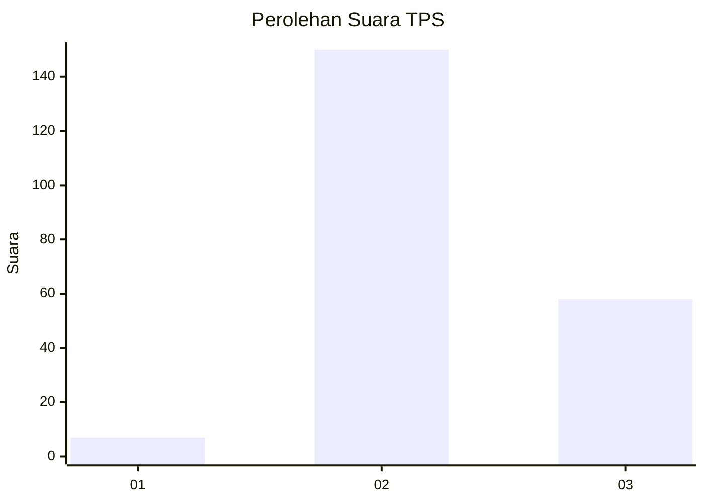
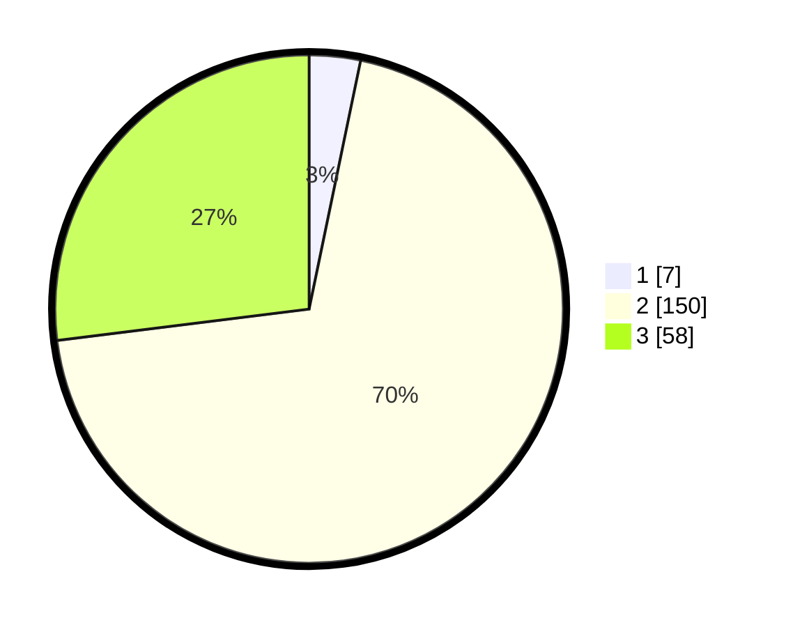

# Hasil

## Grafik

## Tabel

| No. | Nama Paslon    | Suara | Suara (raw) | Persentase |
|:--- |:-------------- | -----:| -----------:| ----------:|
| 1   | ANIES MUHAIMIN | 7     | [7][p-1]    | 3,26       |
| 2   | PRABOWO GIBRAN | 150   | [150][p-2]  | 69,77      |
| 3   | GANJAR MAHFUD  | 58    | [58][p-3]   | 26,98      |

[p-1]: https://github.com/gigit-pemilu/pemilu-2024-35-jawa-timur/blob/main/pilpres/hitung-suara/sub/35-jawa-timur/sub/04-tulungagung/sub/04-ngantru/sub/2003-srikaton/sub/010-tps/sub/paslon-1.txt
[p-2]: https://github.com/gigit-pemilu/pemilu-2024-35-jawa-timur/blob/main/pilpres/hitung-suara/sub/35-jawa-timur/sub/04-tulungagung/sub/04-ngantru/sub/2003-srikaton/sub/010-tps/sub/paslon-2.txt
[p-3]: https://github.com/gigit-pemilu/pemilu-2024-35-jawa-timur/blob/main/pilpres/hitung-suara/sub/35-jawa-timur/sub/04-tulungagung/sub/04-ngantru/sub/2003-srikaton/sub/010-tps/sub/paslon-3.txt

## Foto C Plano

https://sirekap-obj-formc.kpu.go.id/93f2/pemilu/ppwp/35/04/04/20/03/3504042003010-20240215-183253--0edc0aca-73dd-423f-90de-37ea695b9953.jpg

https://sirekap-obj-formc.kpu.go.id/93f2/pemilu/ppwp/35/04/04/20/03/3504042003010-20240215-183454--d75d4349-101d-4da1-9a0c-cdaa45992ef5.jpg

https://sirekap-obj-formc.kpu.go.id/93f2/pemilu/ppwp/35/04/04/20/03/3504042003010-20240214-185545--55f5e294-65d9-41b0-9d35-8a69520dfe34.jpg

## Metadata

| Key        | Value               |
| ---------- | ------------------- |
| Time Stamp | 2024-02-24 22:31:28 |

