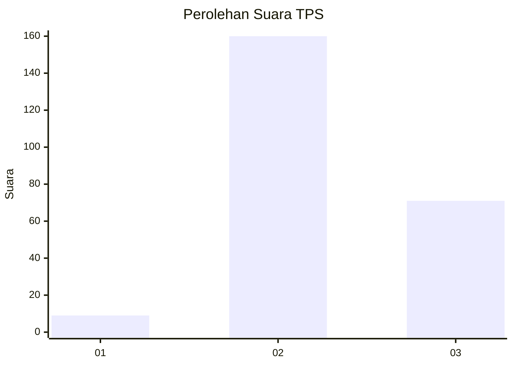

# Hasil

## Grafik

## Tabel

| No. | Nama Paslon    | Suara | Suara (raw) | Persentase |
|:--- |:-------------- | -----:| -----------:| ----------:|
| 1   | ANIES MUHAIMIN | 9     | [9][p-1]    | 3,75       |
| 2   | PRABOWO GIBRAN | 160   | [160][p-2]  | 66,67      |
| 3   | GANJAR MAHFUD  | 71    | [71][p-3]   | 29,58      |

[p-1]: https://github.com/gigit-pemilu/pemilu-2024-35-jawa-timur/blob/main/pilpres/hitung-suara/sub/35-jawa-timur/sub/04-tulungagung/sub/04-ngantru/sub/2003-srikaton/sub/014-tps/sub/paslon-1.txt
[p-2]: https://github.com/gigit-pemilu/pemilu-2024-35-jawa-timur/blob/main/pilpres/hitung-suara/sub/35-jawa-timur/sub/04-tulungagung/sub/04-ngantru/sub/2003-srikaton/sub/014-tps/sub/paslon-2.txt
[p-3]: https://github.com/gigit-pemilu/pemilu-2024-35-jawa-timur/blob/main/pilpres/hitung-suara/sub/35-jawa-timur/sub/04-tulungagung/sub/04-ngantru/sub/2003-srikaton/sub/014-tps/sub/paslon-3.txt

## Foto C Plano

https://sirekap-obj-formc.kpu.go.id/ea34/pemilu/ppwp/35/04/04/20/03/3504042003014-20240214-195826--575e473c-cefe-4cfd-b86a-0403eb7cd295.jpg

https://sirekap-obj-formc.kpu.go.id/ea34/pemilu/ppwp/35/04/04/20/03/3504042003014-20240214-195934--31ad2529-5ab5-4c47-a794-3f892c562629.jpg

https://sirekap-obj-formc.kpu.go.id/ea34/pemilu/ppwp/35/04/04/20/03/3504042003014-20240214-200019--5c7f82ef-30c7-4ce9-9edf-a27a59692506.jpg

## Metadata

| Key        | Value               |
| ---------- | ------------------- |
| Time Stamp | 2024-02-25 21:00:00 |

