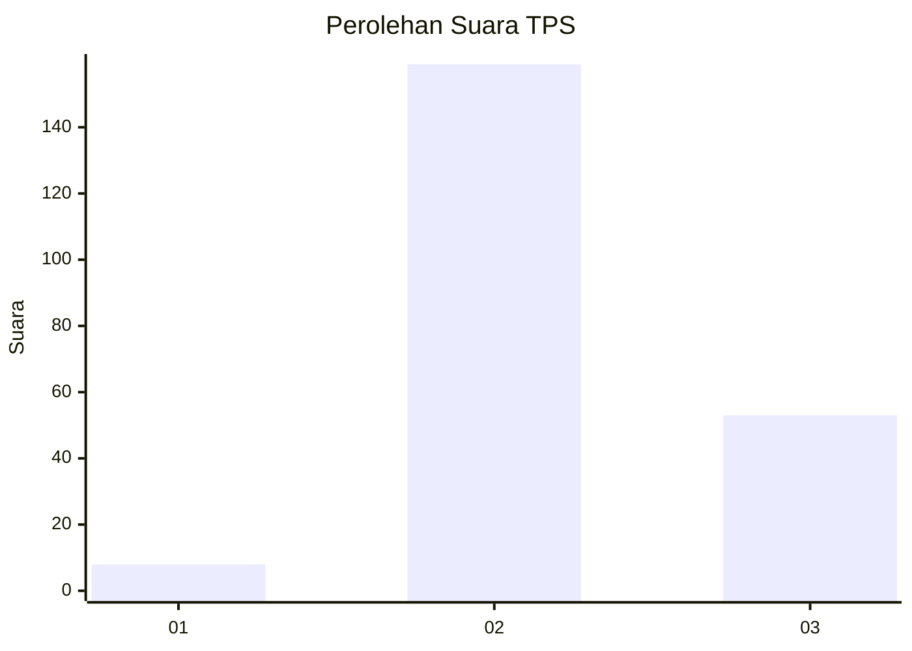
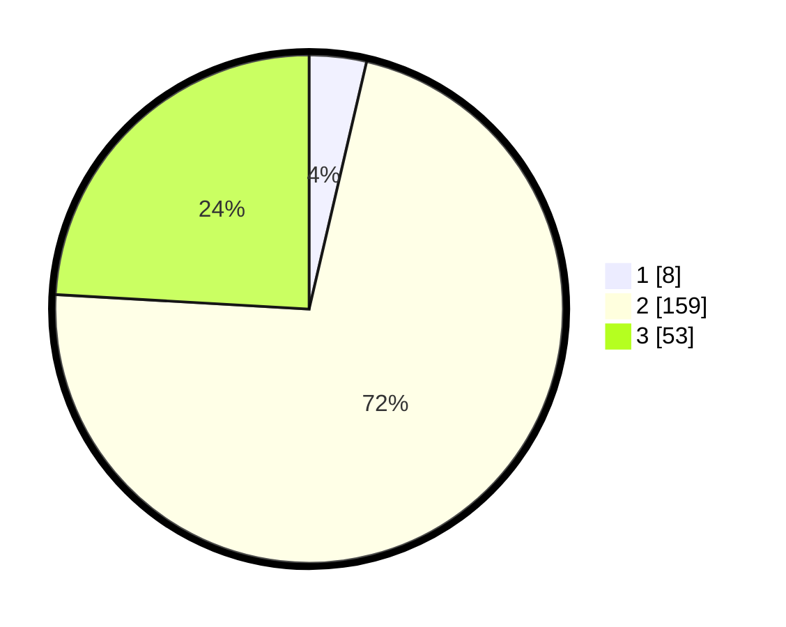

# Hasil

## Grafik

## Tabel

| No. | Nama Paslon    | Suara | Suara (raw) | Persentase |
|:--- |:-------------- | -----:| -----------:| ----------:|
| 1   | ANIES MUHAIMIN | 8     | [8][p-1]    | 3,64       |
| 2   | PRABOWO GIBRAN | 159   | [159][p-2]  | 72,27      |
| 3   | GANJAR MAHFUD  | 53    | [53][p-3]   | 24,09      |

[p-1]: https://github.com/gigit-pemilu/pemilu-2024-35-jawa-timur/blob/main/pilpres/hitung-suara/sub/35-jawa-timur/sub/04-tulungagung/sub/04-ngantru/sub/2004-padangan/sub/001-tps/sub/paslon-1.txt
[p-2]: https://github.com/gigit-pemilu/pemilu-2024-35-jawa-timur/blob/main/pilpres/hitung-suara/sub/35-jawa-timur/sub/04-tulungagung/sub/04-ngantru/sub/2004-padangan/sub/001-tps/sub/paslon-2.txt
[p-3]: https://github.com/gigit-pemilu/pemilu-2024-35-jawa-timur/blob/main/pilpres/hitung-suara/sub/35-jawa-timur/sub/04-tulungagung/sub/04-ngantru/sub/2004-padangan/sub/001-tps/sub/paslon-3.txt

## Foto C Plano

https://sirekap-obj-formc.kpu.go.id/1920/pemilu/ppwp/35/04/04/20/04/3504042004001-20240216-224405--1e406a99-d913-4180-9e33-c8abcf85acdc.jpg

https://sirekap-obj-formc.kpu.go.id/1920/pemilu/ppwp/35/04/04/20/04/3504042004001-20240216-221855--e98c994c-15c9-47f5-9801-dcaaa5321351.jpg

https://sirekap-obj-formc.kpu.go.id/1920/pemilu/ppwp/35/04/04/20/04/3504042004001-20240216-221831--e89edc37-429e-43ee-855d-b35803fd0f82.jpg

## Metadata

| Key        | Value               |
| ---------- | ------------------- |
| Time Stamp | 2024-02-21 17:00:00 |

