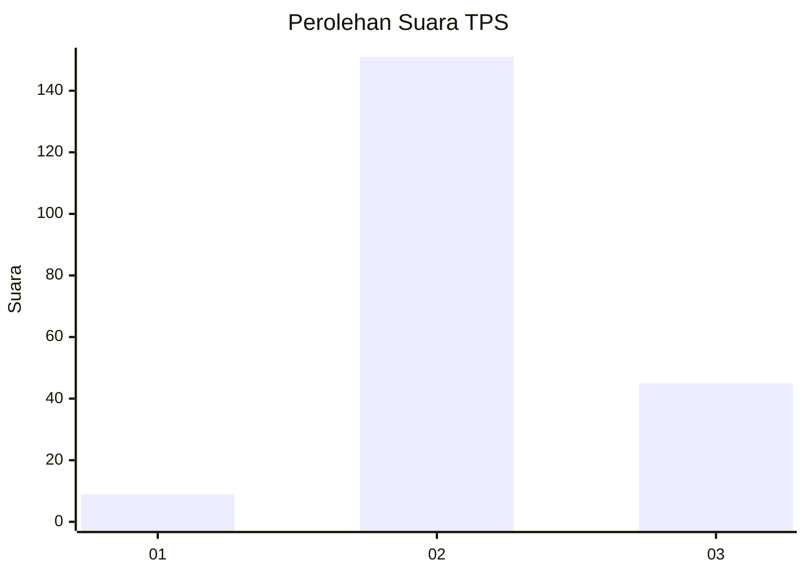

# Hasil

## Grafik

## Tabel

| No. | Nama Paslon    | Suara | Suara (raw) | Persentase |
|:--- |:-------------- | -----:| -----------:| ----------:|
| 1   | ANIES MUHAIMIN | 9     | [9][p-1]    | 4,39       |
| 2   | PRABOWO GIBRAN | 151   | [151][p-2]  | 73,66      |
| 3   | GANJAR MAHFUD  | 45    | [45][p-3]   | 21,95      |

[p-1]: https://github.com/gigit-pemilu/pemilu-2024/blob/main/pilpres/hitung-suara/sub/35-jawa-timur/sub/04-tulungagung/sub/04-ngantru/sub/2004-padangan/sub/006-tps/sub/paslon-1.txt
[p-2]: https://github.com/gigit-pemilu/pemilu-2024/blob/main/pilpres/hitung-suara/sub/35-jawa-timur/sub/04-tulungagung/sub/04-ngantru/sub/2004-padangan/sub/006-tps/sub/paslon-2.txt
[p-3]: https://github.com/gigit-pemilu/pemilu-2024/blob/main/pilpres/hitung-suara/sub/35-jawa-timur/sub/04-tulungagung/sub/04-ngantru/sub/2004-padangan/sub/006-tps/sub/paslon-3.txt

## Foto C Plano

https://sirekap-obj-formc.kpu.go.id/1677/pemilu/ppwp/35/04/04/20/04/3504042004006-20240214-204422--af57ee44-1e5d-4b8d-8f79-094c923b92d6.jpg

https://sirekap-obj-formc.kpu.go.id/1677/pemilu/ppwp/35/04/04/20/04/3504042004006-20240214-204703--53b707af-35ce-4db6-8094-72df5fa6768f.jpg

https://sirekap-obj-formc.kpu.go.id/1677/pemilu/ppwp/35/04/04/20/04/3504042004006-20240214-204845--5096bac7-67c4-473c-bee7-08a597f04bb4.jpg

## Metadata

| Key        | Value               |
| ---------- | ------------------- |
| Time Stamp | 2024-02-24 22:31:28 |

