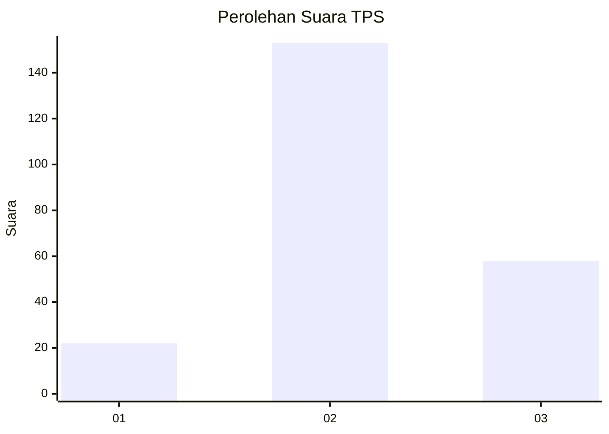
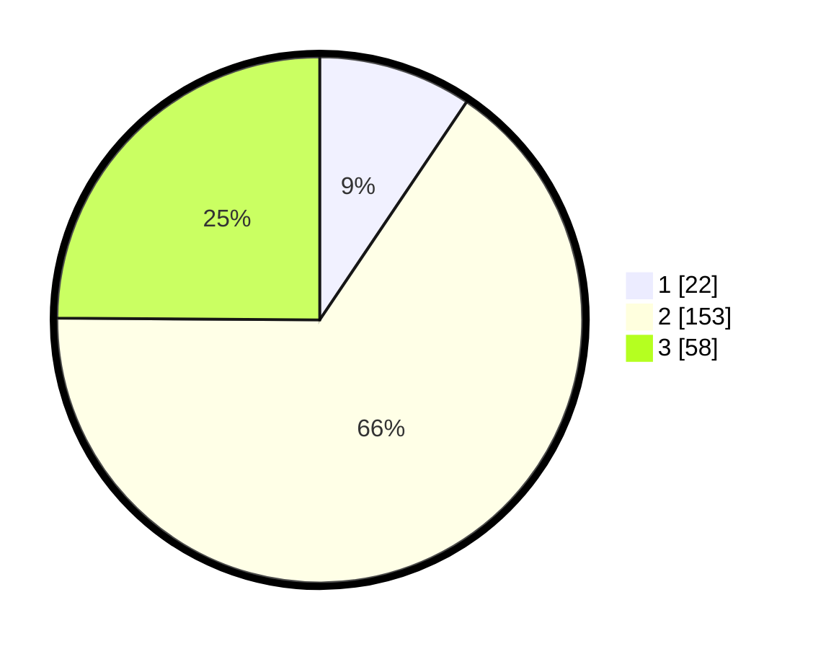

# Hasil

## Grafik

## Tabel

| No. | Nama Paslon    | Suara | Suara (raw) | Persentase |
|:--- |:-------------- | -----:| -----------:| ----------:|
| 1   | ANIES MUHAIMIN | 22    | [22][p-1]   | 9,44       |
| 2   | PRABOWO GIBRAN | 153   | [153][p-2]  | 65,67      |
| 3   | GANJAR MAHFUD  | 58    | [58][p-3]   | 24,89      |

[p-1]: https://github.com/gigit-pemilu/pemilu-2024/blob/main/pilpres/hitung-suara/sub/35-jawa-timur/sub/04-tulungagung/sub/04-ngantru/sub/2005-banjarsari/sub/008-tps/sub/paslon-1.txt
[p-2]: https://github.com/gigit-pemilu/pemilu-2024/blob/main/pilpres/hitung-suara/sub/35-jawa-timur/sub/04-tulungagung/sub/04-ngantru/sub/2005-banjarsari/sub/008-tps/sub/paslon-2.txt
[p-3]: https://github.com/gigit-pemilu/pemilu-2024/blob/main/pilpres/hitung-suara/sub/35-jawa-timur/sub/04-tulungagung/sub/04-ngantru/sub/2005-banjarsari/sub/008-tps/sub/paslon-3.txt

## Foto C Plano

https://sirekap-obj-formc.kpu.go.id/d69a/pemilu/ppwp/35/04/04/20/05/3504042005008-20240215-063740--512167bd-bb56-4949-87b8-1f6c8855178f.jpg

https://sirekap-obj-formc.kpu.go.id/d69a/pemilu/ppwp/35/04/04/20/05/3504042005008-20240215-063753--56d8a722-bf03-49e0-889b-30a5ff3cde26.jpg

https://sirekap-obj-formc.kpu.go.id/d69a/pemilu/ppwp/35/04/04/20/05/3504042005008-20240215-063802--cf8e3ee5-eb1a-4899-94a5-dbf6d5c46c72.jpg

## Metadata

| Key        | Value               |
| ---------- | ------------------- |
| Time Stamp | 2024-02-24 22:31:28 |

