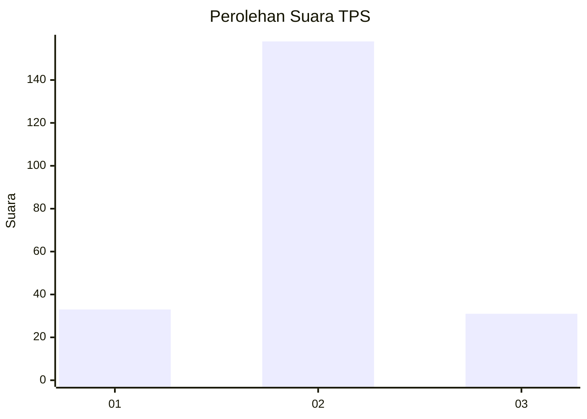

# Hasil

## Grafik

## Tabel

| No. | Nama Paslon    | Suara | Suara (raw) | Persentase |
|:--- |:-------------- | -----:| -----------:| ----------:|
| 1   | ANIES MUHAIMIN | 33    | [33][p-1]   | 14,86      |
| 2   | PRABOWO GIBRAN | 158   | [158][p-2]  | 71,17      |
| 3   | GANJAR MAHFUD  | 31    | [31][p-3]   | 13,96      |

[p-1]: https://github.com/gigit-pemilu/pemilu-2024/blob/main/pilpres/hitung-suara/sub/35-jawa-timur/sub/04-tulungagung/sub/04-ngantru/sub/2006-pulerejo/sub/009-tps/sub/paslon-1.txt
[p-2]: https://github.com/gigit-pemilu/pemilu-2024/blob/main/pilpres/hitung-suara/sub/35-jawa-timur/sub/04-tulungagung/sub/04-ngantru/sub/2006-pulerejo/sub/009-tps/sub/paslon-2.txt
[p-3]: https://github.com/gigit-pemilu/pemilu-2024/blob/main/pilpres/hitung-suara/sub/35-jawa-timur/sub/04-tulungagung/sub/04-ngantru/sub/2006-pulerejo/sub/009-tps/sub/paslon-3.txt

## Foto C Plano

https://sirekap-obj-formc.kpu.go.id/d3f0/pemilu/ppwp/35/04/04/20/06/3504042006009-20240214-194605--78e117b0-d203-4e93-b528-6d9545e8d613.jpg

https://sirekap-obj-formc.kpu.go.id/d3f0/pemilu/ppwp/35/04/04/20/06/3504042006009-20240214-200410--db63894c-0f6f-4d0e-91f5-89f9d219051f.jpg

https://sirekap-obj-formc.kpu.go.id/d3f0/pemilu/ppwp/35/04/04/20/06/3504042006009-20240214-200507--7ef1e181-7b80-4e4e-84b8-4f0270c61521.jpg

## Metadata

| Key        | Value               |
| ---------- | ------------------- |
| Time Stamp | 2024-02-15 21:01:18 |

