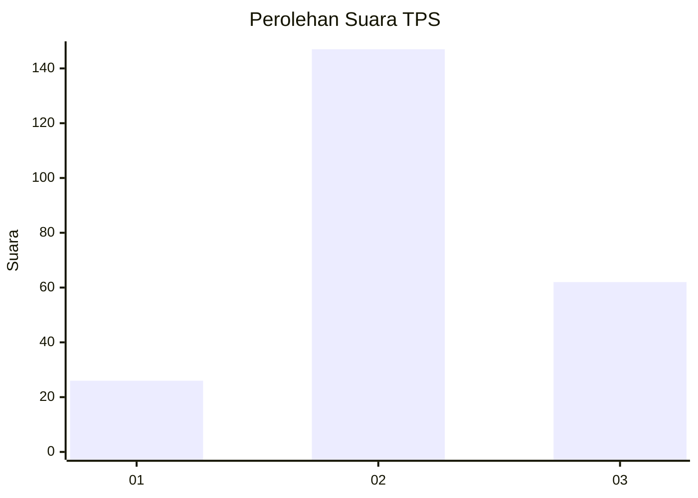
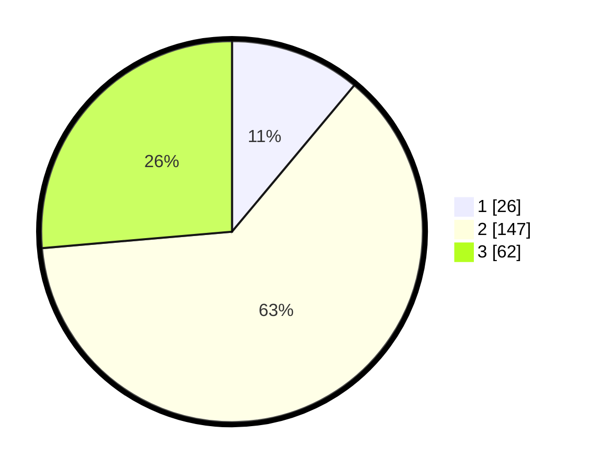

# Hasil

## Grafik

## Tabel

| No. | Nama Paslon    | Suara | Suara (raw) | Persentase |
|:--- |:-------------- | -----:| -----------:| ----------:|
| 1   | ANIES MUHAIMIN | 26    | [26][p-1]   | 11,06      |
| 2   | PRABOWO GIBRAN | 147   | [147][p-2]  | 62,55      |
| 3   | GANJAR MAHFUD  | 62    | [62][p-3]   | 26,38      |

[p-1]: https://github.com/gigit-pemilu/pemilu-2024/blob/main/pilpres/hitung-suara/sub/35-jawa-timur/sub/04-tulungagung/sub/04-ngantru/sub/2007-bendosari/sub/009-tps/sub/paslon-1.txt
[p-2]: https://github.com/gigit-pemilu/pemilu-2024/blob/main/pilpres/hitung-suara/sub/35-jawa-timur/sub/04-tulungagung/sub/04-ngantru/sub/2007-bendosari/sub/009-tps/sub/paslon-2.txt
[p-3]: https://github.com/gigit-pemilu/pemilu-2024/blob/main/pilpres/hitung-suara/sub/35-jawa-timur/sub/04-tulungagung/sub/04-ngantru/sub/2007-bendosari/sub/009-tps/sub/paslon-3.txt

## Foto C Plano

https://sirekap-obj-formc.kpu.go.id/873d/pemilu/ppwp/35/04/04/20/07/3504042007009-20240214-203544--b9f67cc6-9167-4cc7-91ca-4a21b58dbb15.jpg

https://sirekap-obj-formc.kpu.go.id/873d/pemilu/ppwp/35/04/04/20/07/3504042007009-20240214-203653--cbed6620-6d16-42b0-8fa5-40fdb33df5ba.jpg

https://sirekap-obj-formc.kpu.go.id/873d/pemilu/ppwp/35/04/04/20/07/3504042007009-20240214-203858--7fd4633d-0d2a-437e-bdc2-d92755714741.jpg

## Metadata

| Key        | Value               |
| ---------- | ------------------- |
| Time Stamp | 2024-02-26 01:00:00 |

