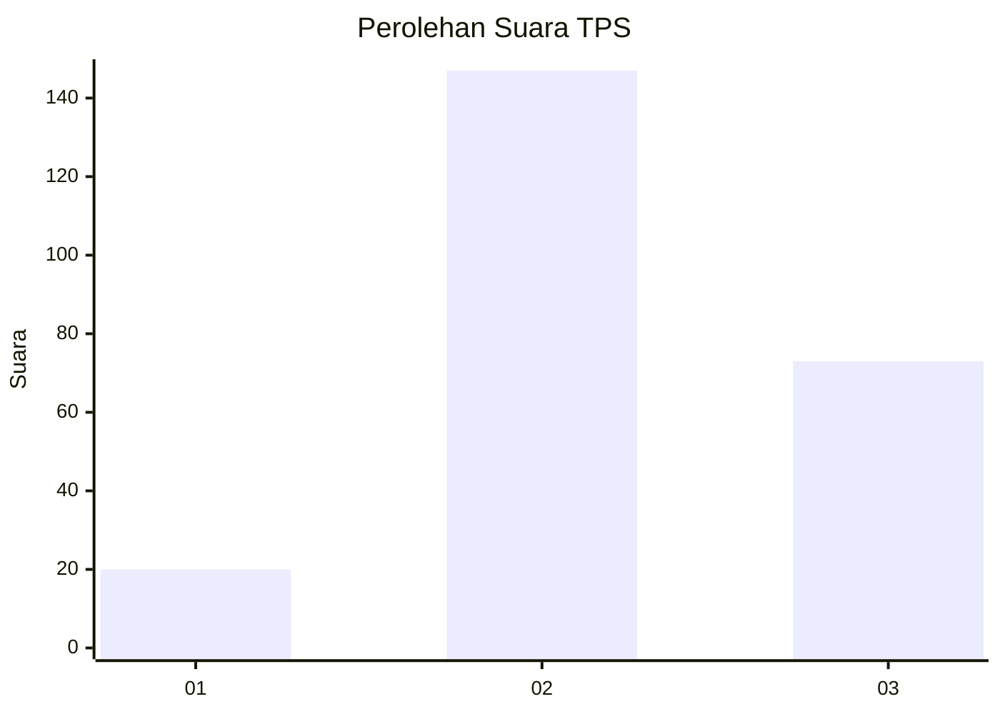
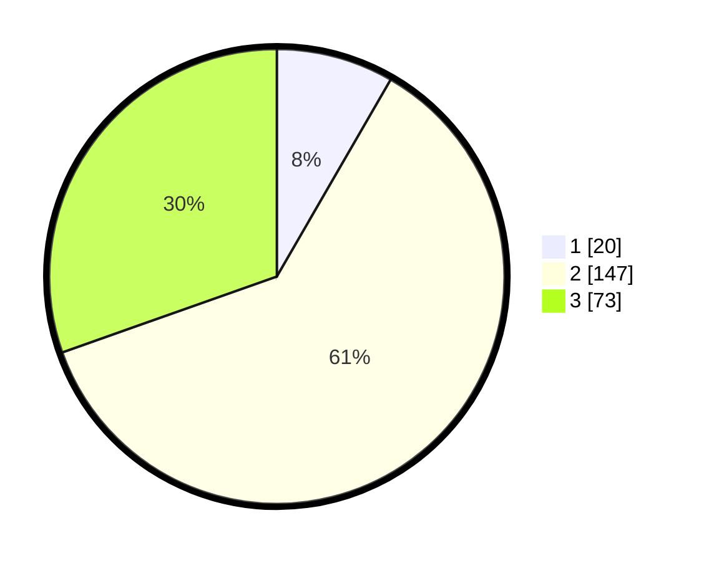

# Hasil

## Grafik

## Tabel

| No. | Nama Paslon    | Suara | Suara (raw) | Persentase |
|:--- |:-------------- | -----:| -----------:| ----------:|
| 1   | ANIES MUHAIMIN | 20    | [20][p-1]   | 8,33       |
| 2   | PRABOWO GIBRAN | 147   | [147][p-2]  | 61,25      |
| 3   | GANJAR MAHFUD  | 73    | [73][p-3]   | 30,42      |

[p-1]: https://github.com/gigit-pemilu/pemilu-2024-35-jawa-timur/blob/main/pilpres/hitung-suara/sub/35-jawa-timur/sub/04-tulungagung/sub/04-ngantru/sub/2009-mojoagung/sub/001-tps/sub/paslon-1.txt
[p-2]: https://github.com/gigit-pemilu/pemilu-2024-35-jawa-timur/blob/main/pilpres/hitung-suara/sub/35-jawa-timur/sub/04-tulungagung/sub/04-ngantru/sub/2009-mojoagung/sub/001-tps/sub/paslon-2.txt
[p-3]: https://github.com/gigit-pemilu/pemilu-2024-35-jawa-timur/blob/main/pilpres/hitung-suara/sub/35-jawa-timur/sub/04-tulungagung/sub/04-ngantru/sub/2009-mojoagung/sub/001-tps/sub/paslon-3.txt

## Foto C Plano

https://sirekap-obj-formc.kpu.go.id/69da/pemilu/ppwp/35/04/04/20/09/3504042009001-20240215-000746--e2699c10-8f18-4b9d-86cd-2257f85e8498.jpg

https://sirekap-obj-formc.kpu.go.id/69da/pemilu/ppwp/35/04/04/20/09/3504042009001-20240214-210422--30f53113-4a9e-4f1a-a380-a96d6b6a2abb.jpg

https://sirekap-obj-formc.kpu.go.id/69da/pemilu/ppwp/35/04/04/20/09/3504042009001-20240214-210653--08e5bf0d-6c07-42d9-9478-4399219b28d5.jpg

## Metadata

| Key        | Value               |
| ---------- | ------------------- |
| Time Stamp | 2024-02-15 15:00:29 |

