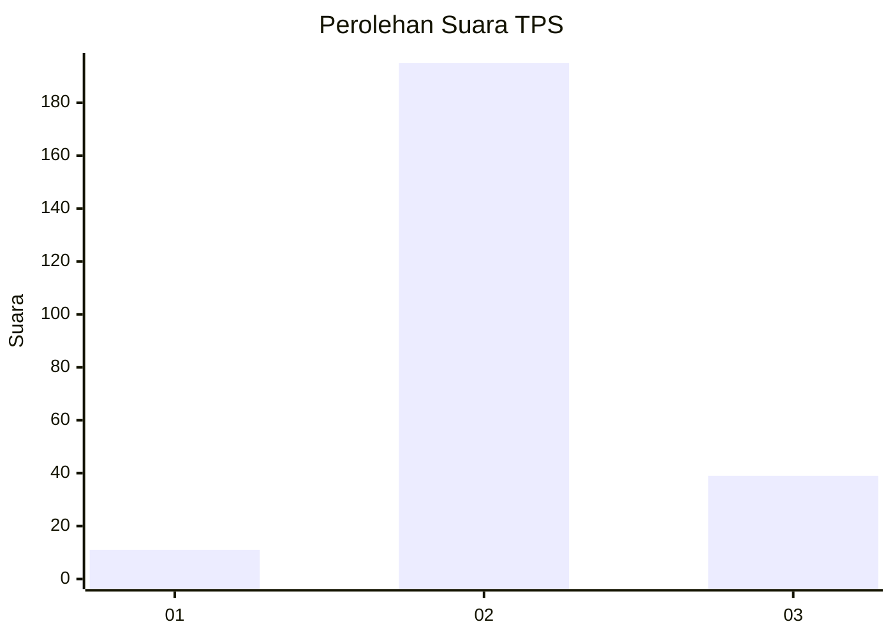
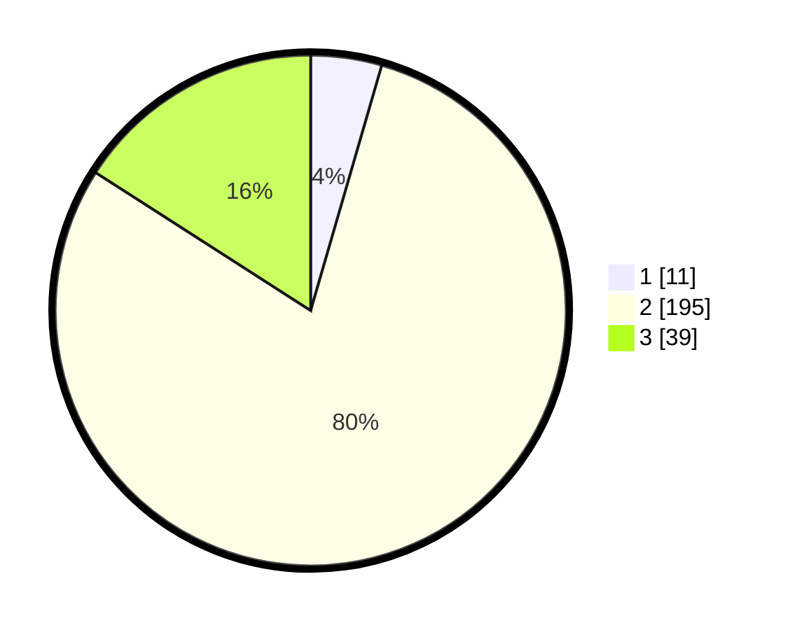

# Hasil

## Grafik

## Tabel

| No. | Nama Paslon    | Suara | Suara (raw) | Persentase |
|:--- |:-------------- | -----:| -----------:| ----------:|
| 1   | ANIES MUHAIMIN | 11    | [11][p-1]   | 4,49       |
| 2   | PRABOWO GIBRAN | 195   | [195][p-2]  | 79,59      |
| 3   | GANJAR MAHFUD  | 39    | [39][p-3]   | 15,92      |

[p-1]: https://github.com/gigit-pemilu/pemilu-2024-35-jawa-timur/blob/main/pilpres/hitung-suara/sub/35-jawa-timur/sub/04-tulungagung/sub/04-ngantru/sub/2009-mojoagung/sub/005-tps/sub/paslon-1.txt
[p-2]: https://github.com/gigit-pemilu/pemilu-2024-35-jawa-timur/blob/main/pilpres/hitung-suara/sub/35-jawa-timur/sub/04-tulungagung/sub/04-ngantru/sub/2009-mojoagung/sub/005-tps/sub/paslon-2.txt
[p-3]: https://github.com/gigit-pemilu/pemilu-2024-35-jawa-timur/blob/main/pilpres/hitung-suara/sub/35-jawa-timur/sub/04-tulungagung/sub/04-ngantru/sub/2009-mojoagung/sub/005-tps/sub/paslon-3.txt

## Foto C Plano

https://sirekap-obj-formc.kpu.go.id/5bf4/pemilu/ppwp/35/04/04/20/09/3504042009005-20240214-211925--b4728e4a-4863-4481-adc7-6015b82f0e0e.jpg

https://sirekap-obj-formc.kpu.go.id/5bf4/pemilu/ppwp/35/04/04/20/09/3504042009005-20240214-212142--865cbbd1-e79c-4808-b40d-41d5734d2de3.jpg

https://sirekap-obj-formc.kpu.go.id/5bf4/pemilu/ppwp/35/04/04/20/09/3504042009005-20240214-212508--25f75b00-9a72-4392-98a3-e17f33bc6dec.jpg

## Metadata

| Key        | Value               |
| ---------- | ------------------- |
| Time Stamp | 2024-02-27 17:00:00 |

