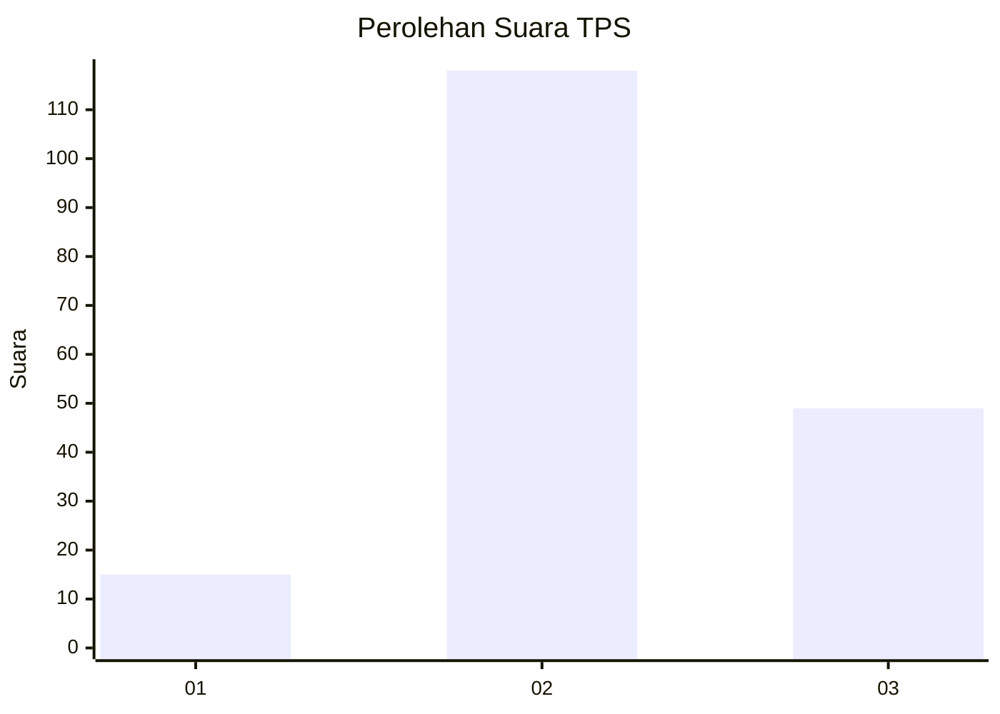

# Hasil

## Grafik

## Tabel

| No. | Nama Paslon    | Suara | Suara (raw) | Persentase |
|:--- |:-------------- | -----:| -----------:| ----------:|
| 1   | ANIES MUHAIMIN | 15    | [15][p-1]   | 8,24       |
| 2   | PRABOWO GIBRAN | 118   | [118][p-2]  | 64,84      |
| 3   | GANJAR MAHFUD  | 49    | [49][p-3]   | 26,92      |

[p-1]: https://github.com/gigit-pemilu/pemilu-2024/blob/main/pilpres/hitung-suara/sub/35-jawa-timur/sub/04-tulungagung/sub/04-ngantru/sub/2011-kepuhrejo/sub/006-tps/sub/paslon-1.txt
[p-2]: https://github.com/gigit-pemilu/pemilu-2024/blob/main/pilpres/hitung-suara/sub/35-jawa-timur/sub/04-tulungagung/sub/04-ngantru/sub/2011-kepuhrejo/sub/006-tps/sub/paslon-2.txt
[p-3]: https://github.com/gigit-pemilu/pemilu-2024/blob/main/pilpres/hitung-suara/sub/35-jawa-timur/sub/04-tulungagung/sub/04-ngantru/sub/2011-kepuhrejo/sub/006-tps/sub/paslon-3.txt

## Foto C Plano

https://sirekap-obj-formc.kpu.go.id/0832/pemilu/ppwp/35/04/04/20/11/3504042011006-20240214-214519--0168d439-4608-4f3a-a506-be85cc0f34a5.jpg

https://sirekap-obj-formc.kpu.go.id/0832/pemilu/ppwp/35/04/04/20/11/3504042011006-20240214-214717--fc1857d1-3f67-4a85-939a-1c757a397027.jpg

https://sirekap-obj-formc.kpu.go.id/0832/pemilu/ppwp/35/04/04/20/11/3504042011006-20240214-214818--faea1f82-dc1e-4526-a384-26cbc6348eb1.jpg

## Metadata

| Key        | Value               |
| ---------- | ------------------- |
| Time Stamp | 2024-02-24 22:31:28 |

