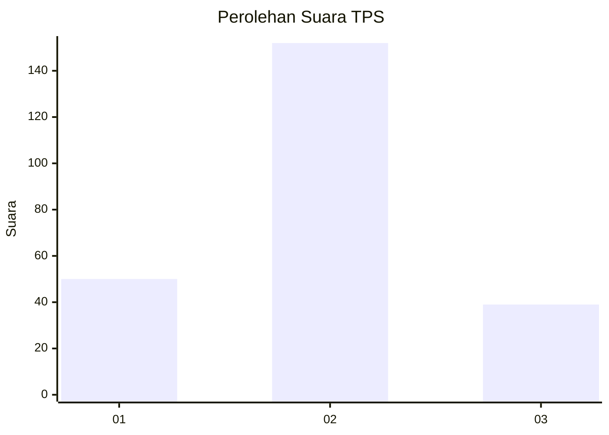

# Hasil

## Grafik

## Tabel

| No. | Nama Paslon    | Suara | Suara (raw) | Persentase |
|:--- |:-------------- | -----:| -----------:| ----------:|
| 1   | ANIES MUHAIMIN | 50    | [50][p-1]   | 20,75      |
| 2   | PRABOWO GIBRAN | 152   | [152][p-2]  | 63,07      |
| 3   | GANJAR MAHFUD  | 39    | [39][p-3]   | 16,18      |

[p-1]: https://github.com/gigit-pemilu/pemilu-2024/blob/main/pilpres/hitung-suara/sub/35-jawa-timur/sub/04-tulungagung/sub/04-ngantru/sub/2012-pojok/sub/005-tps/sub/paslon-1.txt
[p-2]: https://github.com/gigit-pemilu/pemilu-2024/blob/main/pilpres/hitung-suara/sub/35-jawa-timur/sub/04-tulungagung/sub/04-ngantru/sub/2012-pojok/sub/005-tps/sub/paslon-2.txt
[p-3]: https://github.com/gigit-pemilu/pemilu-2024/blob/main/pilpres/hitung-suara/sub/35-jawa-timur/sub/04-tulungagung/sub/04-ngantru/sub/2012-pojok/sub/005-tps/sub/paslon-3.txt

## Foto C Plano

https://sirekap-obj-formc.kpu.go.id/227c/pemilu/ppwp/35/04/04/20/12/3504042012005-20240214-215411--54528d1a-4ad1-49cd-90ce-b853d949cc53.jpg

https://sirekap-obj-formc.kpu.go.id/227c/pemilu/ppwp/35/04/04/20/12/3504042012005-20240214-224532--9705a19d-0c37-4929-bc6f-85b3a6a7bd9d.jpg

https://sirekap-obj-formc.kpu.go.id/227c/pemilu/ppwp/35/04/04/20/12/3504042012005-20240214-215718--d78cca32-2584-497b-ad6d-e5167362bc19.jpg

## Metadata

| Key        | Value               |
| ---------- | ------------------- |
| Time Stamp | 2024-02-15 21:30:27 |

