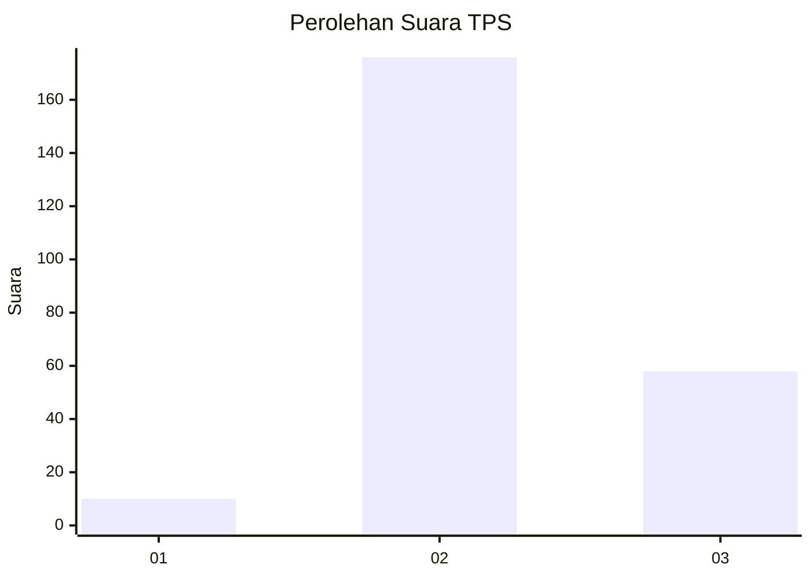
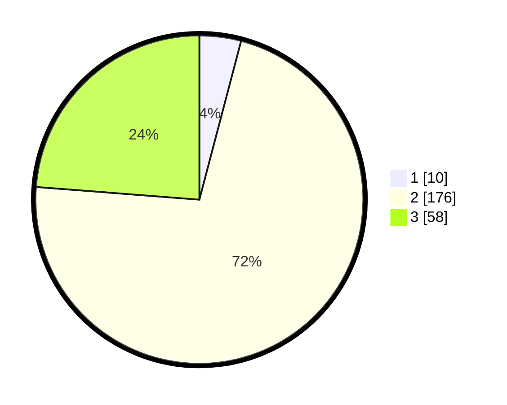

# Hasil

## Grafik

## Tabel

| No. | Nama Paslon    | Suara | Suara (raw) | Persentase |
|:--- |:-------------- | -----:| -----------:| ----------:|
| 1   | ANIES MUHAIMIN | 10    | [10][p-1]   | 4,10       |
| 2   | PRABOWO GIBRAN | 176   | [176][p-2]  | 72,13      |
| 3   | GANJAR MAHFUD  | 58    | [58][p-3]   | 23,77      |

[p-1]: https://github.com/gigit-pemilu/pemilu-2024-35-jawa-timur/blob/main/pilpres/hitung-suara/sub/35-jawa-timur/sub/04-tulungagung/sub/04-ngantru/sub/2013-pinggirsari/sub/004-tps/sub/paslon-1.txt
[p-2]: https://github.com/gigit-pemilu/pemilu-2024-35-jawa-timur/blob/main/pilpres/hitung-suara/sub/35-jawa-timur/sub/04-tulungagung/sub/04-ngantru/sub/2013-pinggirsari/sub/004-tps/sub/paslon-2.txt
[p-3]: https://github.com/gigit-pemilu/pemilu-2024-35-jawa-timur/blob/main/pilpres/hitung-suara/sub/35-jawa-timur/sub/04-tulungagung/sub/04-ngantru/sub/2013-pinggirsari/sub/004-tps/sub/paslon-3.txt

## Foto C Plano

https://sirekap-obj-formc.kpu.go.id/8daa/pemilu/ppwp/35/04/04/20/13/3504042013004-20240214-221030--e4b1c6af-b302-4246-904c-4444c8d34bad.jpg

https://sirekap-obj-formc.kpu.go.id/8daa/pemilu/ppwp/35/04/04/20/13/3504042013004-20240214-224858--7d82048e-0f2d-4361-b29b-7d81eee21efe.jpg

https://sirekap-obj-formc.kpu.go.id/8daa/pemilu/ppwp/35/04/04/20/13/3504042013004-20240214-205929--58d133ca-39c8-4add-98a9-4df220e938ee.jpg

## Metadata

| Key        | Value               |
| ---------- | ------------------- |
| Time Stamp | 2024-02-15 12:00:28 |

