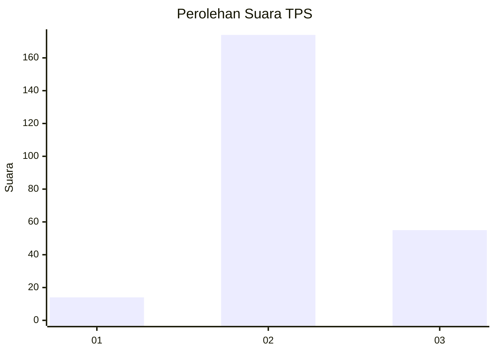
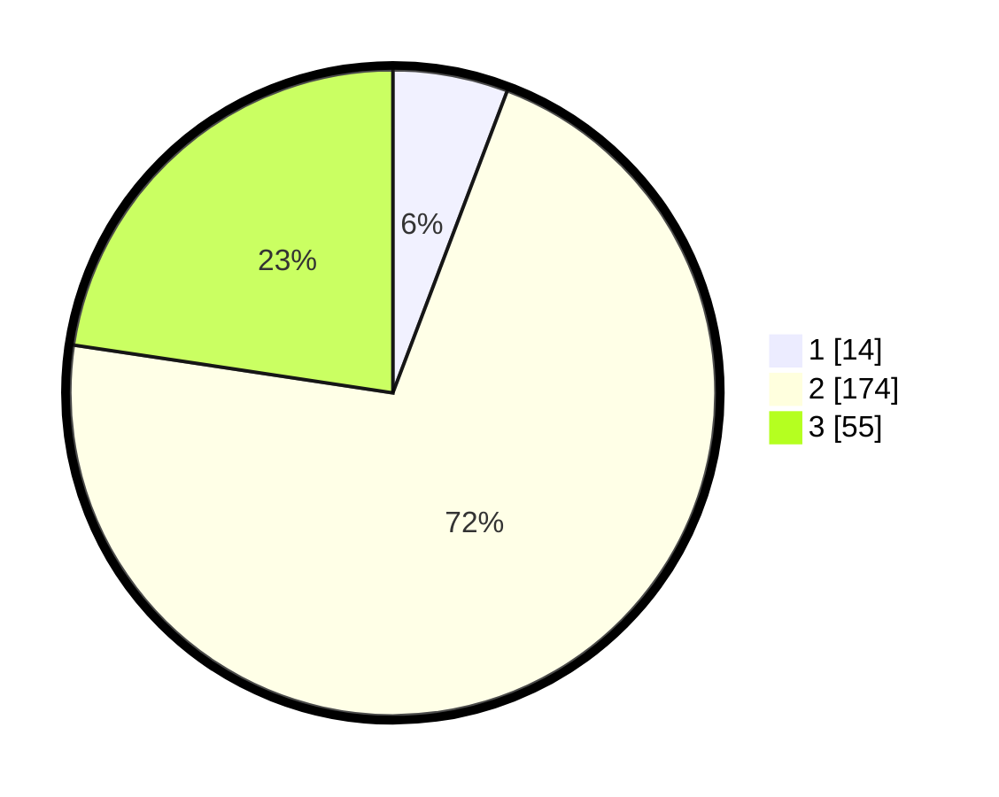

# Hasil

## Grafik

## Tabel

| No. | Nama Paslon    | Suara | Suara (raw) | Persentase |
|:--- |:-------------- | -----:| -----------:| ----------:|
| 1   | ANIES MUHAIMIN | 14    | [14][p-1]   | 5,76       |
| 2   | PRABOWO GIBRAN | 174   | [174][p-2]  | 71,60      |
| 3   | GANJAR MAHFUD  | 55    | [55][p-3]   | 22,63      |

[p-1]: https://github.com/gigit-pemilu/pemilu-2024-35-jawa-timur/blob/main/pilpres/hitung-suara/sub/35-jawa-timur/sub/04-tulungagung/sub/05-kauman/sub/2003-balerejo/sub/005-tps/sub/paslon-1.txt
[p-2]: https://github.com/gigit-pemilu/pemilu-2024-35-jawa-timur/blob/main/pilpres/hitung-suara/sub/35-jawa-timur/sub/04-tulungagung/sub/05-kauman/sub/2003-balerejo/sub/005-tps/sub/paslon-2.txt
[p-3]: https://github.com/gigit-pemilu/pemilu-2024-35-jawa-timur/blob/main/pilpres/hitung-suara/sub/35-jawa-timur/sub/04-tulungagung/sub/05-kauman/sub/2003-balerejo/sub/005-tps/sub/paslon-3.txt

## Foto C Plano

https://sirekap-obj-formc.kpu.go.id/02fe/pemilu/ppwp/35/04/05/20/03/3504052003005-20240216-144933--0d56110f-559e-4949-8782-b8ed9dca098f.jpg

https://sirekap-obj-formc.kpu.go.id/02fe/pemilu/ppwp/35/04/05/20/03/3504052003005-20240216-184907--71c7e56f-0a6a-4381-b3d8-25c01f8655e8.jpg

https://sirekap-obj-formc.kpu.go.id/02fe/pemilu/ppwp/35/04/05/20/03/3504052003005-20240216-185044--8d802e07-3593-4ab0-ae0b-9d88050350d5.jpg

## Metadata

| Key        | Value               |
| ---------- | ------------------- |
| Time Stamp | 2024-02-16 21:01:00 |

## DATA PEMILIH TETAP

Jumlah pemilih dalam DPT: **284**.
 * L: **847**.
 * P: **137**.

## DATA PENGGUNA HAK PILIH

Jumlah pengguna hak pilih dalam DPT: **245**.
 * L: **220**.
 * P: **25**.

Jumlah pengguna hak pilih dalam DPTb: **2**.
 * L: **802**.
 * P: **0**.

Jumlah pengguna hak pilih dalam DPK: **0**.
 * L: **0**.
 * P: **0**.

Jumlah pengguna hak pilih: **246**.
 * L: **821**.
 * P: **25**.

## JUMLAH SUARA SAH DAN TIDAK SAH

JUMLAH SELURUH SUARA SAH: **243**.

JUMLAH SUARA TIDAK SAH: **3**.

JUMLAH SELURUH SUARA SAH DAN SUARA TIDAK SAH: **246**.

