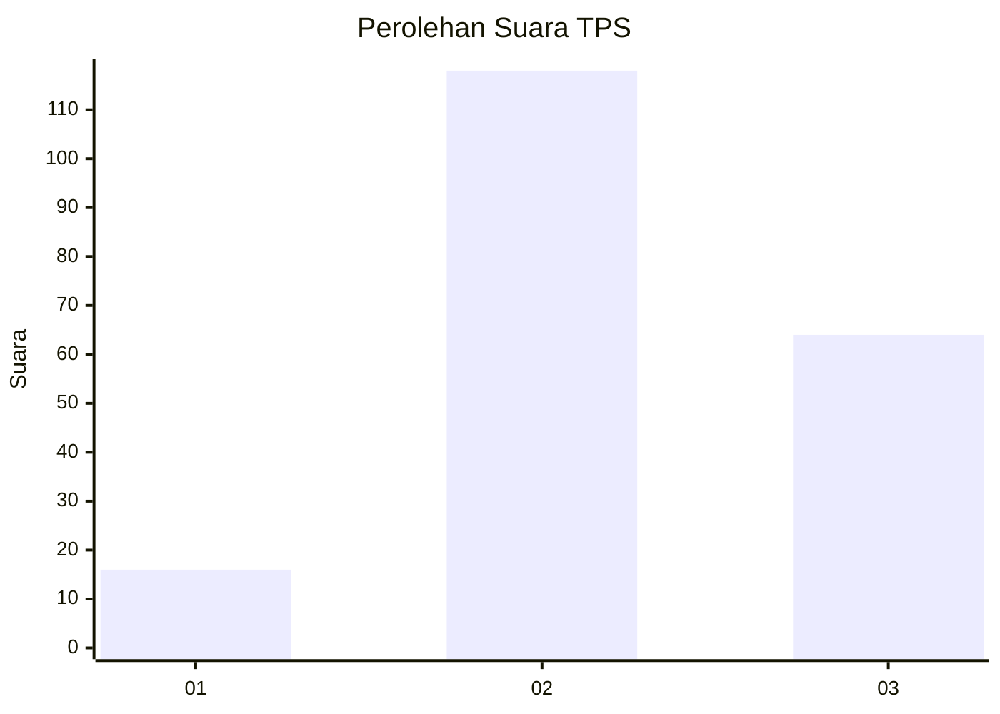
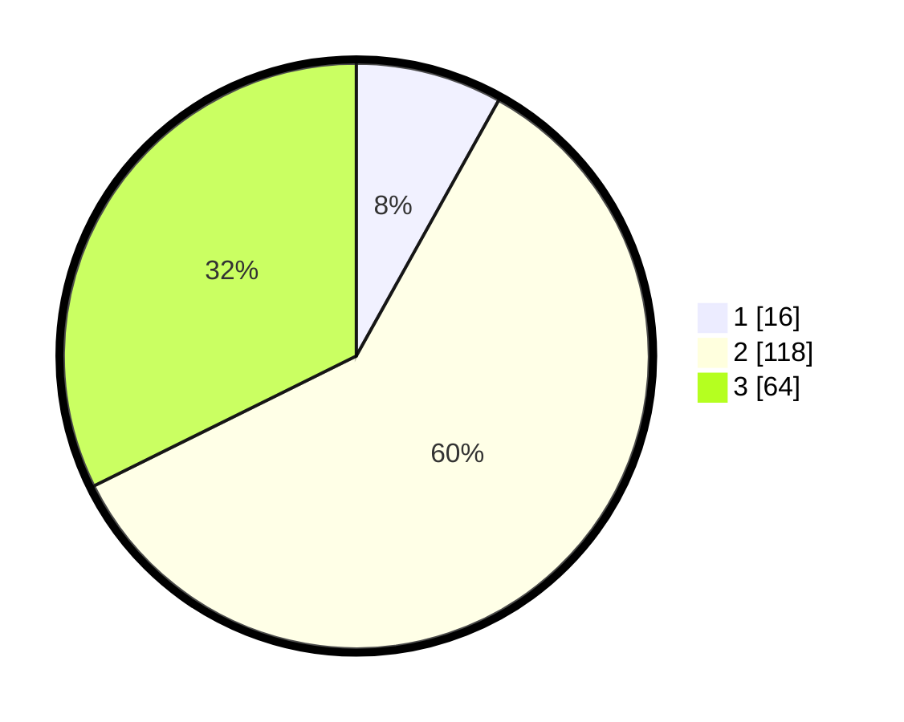

# Hasil

## Grafik

## Tabel

| No. | Nama Paslon    | Suara | Suara (raw) | Persentase |
|:--- |:-------------- | -----:| -----------:| ----------:|
| 1   | ANIES MUHAIMIN | 16    | [16][p-1]   | 8,08       |
| 2   | PRABOWO GIBRAN | 118   | [118][p-2]  | 59,60      |
| 3   | GANJAR MAHFUD  | 64    | [64][p-3]   | 32,32      |

[p-1]: https://github.com/gigit-pemilu/pemilu-2024/blob/main/pilpres/hitung-suara/sub/35-jawa-timur/sub/04-tulungagung/sub/05-kauman/sub/2004-batangsaren/sub/012-tps/sub/paslon-1.txt
[p-2]: https://github.com/gigit-pemilu/pemilu-2024/blob/main/pilpres/hitung-suara/sub/35-jawa-timur/sub/04-tulungagung/sub/05-kauman/sub/2004-batangsaren/sub/012-tps/sub/paslon-2.txt
[p-3]: https://github.com/gigit-pemilu/pemilu-2024/blob/main/pilpres/hitung-suara/sub/35-jawa-timur/sub/04-tulungagung/sub/05-kauman/sub/2004-batangsaren/sub/012-tps/sub/paslon-3.txt

## Foto C Plano

https://sirekap-obj-formc.kpu.go.id/82f1/pemilu/ppwp/35/04/05/20/04/3504052004012-20240216-160659--51a29df7-ef00-4626-a489-912a42cd90e9.jpg

https://sirekap-obj-formc.kpu.go.id/82f1/pemilu/ppwp/35/04/05/20/04/3504052004012-20240214-211356--74850297-1d33-40aa-9ee0-90703fe09248.jpg

https://sirekap-obj-formc.kpu.go.id/82f1/pemilu/ppwp/35/04/05/20/04/3504052004012-20240214-211448--8f006ce9-c94b-4519-b6a1-15c84c068d1c.jpg

## Metadata

| Key        | Value               |
| ---------- | ------------------- |
| Time Stamp | 2024-02-16 16:25:10 |

