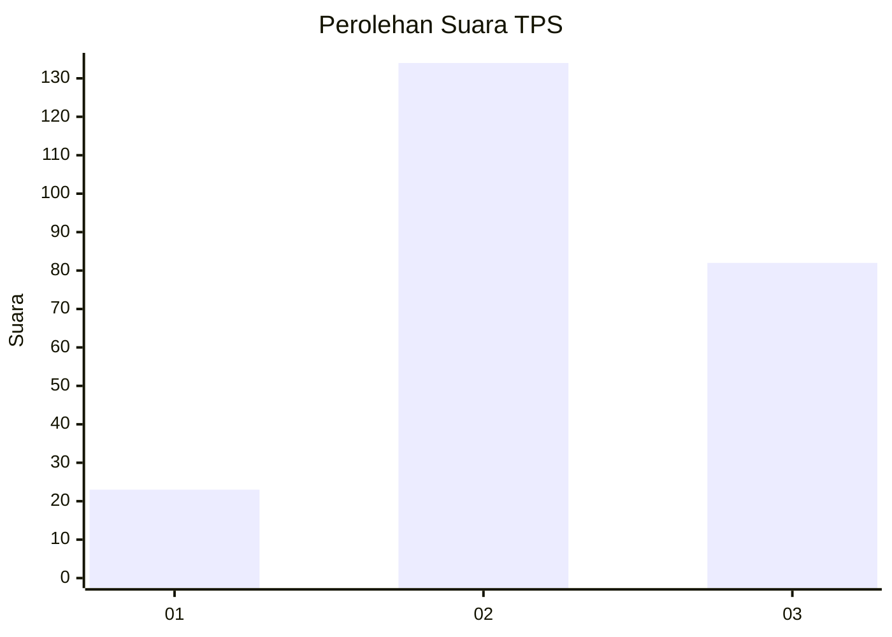
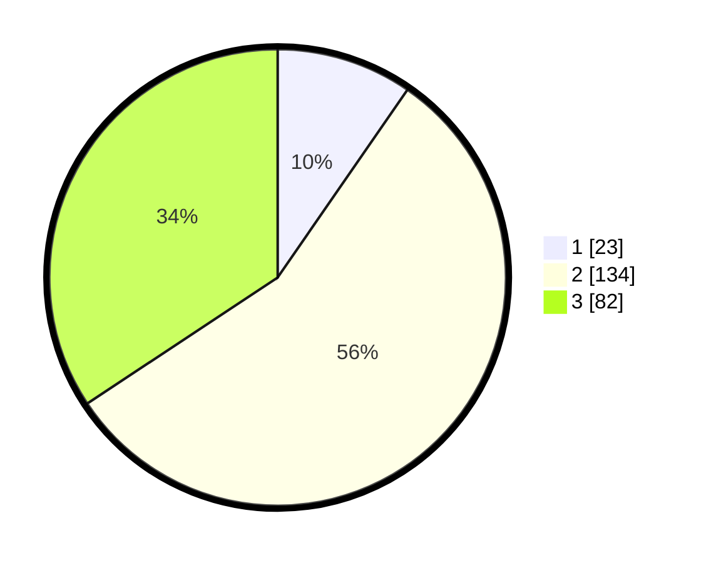

# Hasil

## Grafik

## Tabel

| No. | Nama Paslon    | Suara | Suara (raw) | Persentase |
|:--- |:-------------- | -----:| -----------:| ----------:|
| 1   | ANIES MUHAIMIN | 23    | [23][p-1]   | 9,62       |
| 2   | PRABOWO GIBRAN | 134   | [134][p-2]  | 56,07      |
| 3   | GANJAR MAHFUD  | 82    | [82][p-3]   | 34,31      |

[p-1]: https://github.com/gigit-pemilu/pemilu-2024/blob/main/pilpres/hitung-suara/sub/35-jawa-timur/sub/04-tulungagung/sub/05-kauman/sub/2008-mojosari/sub/010-tps/sub/paslon-1.txt
[p-2]: https://github.com/gigit-pemilu/pemilu-2024/blob/main/pilpres/hitung-suara/sub/35-jawa-timur/sub/04-tulungagung/sub/05-kauman/sub/2008-mojosari/sub/010-tps/sub/paslon-2.txt
[p-3]: https://github.com/gigit-pemilu/pemilu-2024/blob/main/pilpres/hitung-suara/sub/35-jawa-timur/sub/04-tulungagung/sub/05-kauman/sub/2008-mojosari/sub/010-tps/sub/paslon-3.txt

## Foto C Plano

https://sirekap-obj-formc.kpu.go.id/0680/pemilu/ppwp/35/04/05/20/08/3504052008010-20240216-200515--f062618b-95a9-4c71-b012-fae3e777fd41.jpg

https://sirekap-obj-formc.kpu.go.id/0680/pemilu/ppwp/35/04/05/20/08/3504052008010-20240216-200859--51a2b1c8-fa0f-4f08-9435-2ac0c71aa2df.jpg

https://sirekap-obj-formc.kpu.go.id/0680/pemilu/ppwp/35/04/05/20/08/3504052008010-20240216-232247--d0499994-7553-4197-b8cc-a19a1a0a8649.jpg

## Metadata

| Key        | Value               |
| ---------- | ------------------- |
| Time Stamp | 2024-02-21 18:00:00 |

